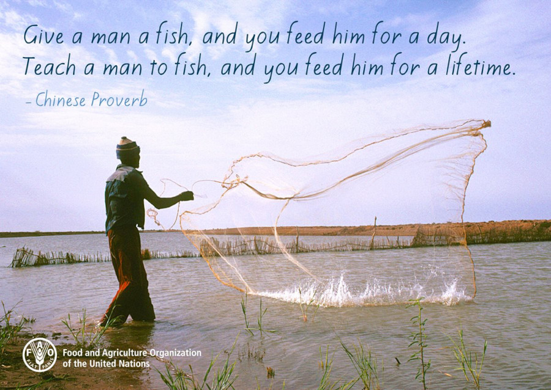

L'article controversé de Peter Singer de 1972, _"Famine, Affluence, and Morality"_, tente de montrer que nous sommes tous mauvais.

<!-- truncate -->

## Introduction : Peter Singer et son article de 1972

J'ai regardé [cette vidéo de Jeffrey Kaplan](https://www.youtube.com/watch?v=KVl5kMXz1vA) sur Peter Singer et je voulais partager mes réflexions.

Peter Singer, philosophe australien connu pour ses travaux en éthique appliquée et en utilitarisme, a marqué la philosophie morale avec son article **"Famine, Affluence, and Morality"**, publié en 1972 dans la revue *Philosophy & Public Affairs*.

Cet article, écrit en pleine crise humanitaire au Bangladesh (alors Pakistan oriental), interroge la responsabilité morale des individus riches face à la souffrance des plus démunis.

Singer y défend une thèse radicale : nous avons **l’obligation morale** de donner une partie significative de nos ressources pour soulager la famine et la pauvreté extrême, sous peine d’être complices de la mort de millions de personnes.

Son argument, inspiré par l’utilitarisme, a suscité de vifs débats et reste aujourd’hui une référence incontournable en éthique pratique.

---

## L’argument de Singer : une obligation morale de donner

Singer part d’un constat simple : des millions de personnes meurent de faim ou de maladies évitables, tandis que d’autres vivent dans l’opulence. Face à cette inégalité, il propose une thèse en trois temps :

1. **Le principe de secours** : Si nous pouvons prévenir quelque chose de mauvais (comme la mort d’un enfant) sans sacrifier quelque chose d’aussi important moralement, nous devons le faire. 

Par exemple, sauver un enfant qui se noie dans une mare, même si cela salit nos vêtements, est une obligation morale évidente.

2. **L’extension de ce principe à la pauvreté mondiale** : Singer soutient que la distance géographique ou la nationalité ne changent rien à notre responsabilité. Refuser d’aider un enfant mourant de faim à l’autre bout du monde, alors que nous en avons les moyens, est moralement équivalent à laisser se noyer un enfant sous nos yeux.

3. **La critique de l’intuition commune** : Pour Singer, nos pratiques de don (comme donner 5 % de nos revenus) sont arbitraires et insuffisantes. Il estime que nous devrions donner jusqu’à ce que donner davantage nous place, nous-mêmes, dans une situation de pauvreté relative. 

Autrement dit, tant que nous dépensons de l’argent pour des **biens non essentiels** (loisirs, luxe), **nous agissons de manière immorale**.

Singer rejette l’idée que la charité est une vertu optionnelle : pour lui, c’est un devoir strict, fondé sur la capacité à sauver des vies sans nous appauvrir gravement.

---

## Une critique depuis la solidarité fondée sur la réciprocité

D’un point de vue fondé sur la **solidarité réciproque** (où l’aide s’inscrit dans un échange ou une relation mutuelle), l’argument de Singer peut sembler à la fois séduisant et problématique.

### Points forts :

- **L’universalisme moral** : Singer rappelle que la souffrance humaine n’a pas de frontières. Cela résonne avec l’idée que la solidarité doit dépasser les cercles restreints (famille, nation) pour embrasser une communauté humaine élargie.
- **L’urgence pratique** : Son appel à l’action est un antidote à l’indifférence. Il force à reconnaître que nos choix de consommation ont des conséquences directes sur la vie d’autrui.

### Limites et objections :

1. **L’absence de réciprocité** : La solidarité réciproque suppose un lien entre donneur et receveur, une relation qui peut être source de dignité et de reconnaissance mutuelle. Singer, en réduisant l’aide à un calcul utilitariste (maximiser le bien-être global), ignore la dimension relationnelle de la solidarité. 

Donner sans attente de retour est noble, mais une société où l’aide est à sens unique risque de créer des dynamiques de dépendance ou de mépris.

2. **La charge individuelle vs. responsabilité collective** : Singer place le fardeau sur les individus, alors que les causes de la pauvreté (injustices structurelles, colonialisme, politiques économiques) sont souvent collectives. 

Une approche réciproque exigerait de repenser les systèmes qui produisent ces inégalités, plutôt que de se contenter de dons individuels.

3. **Le risque de déshumanisation** : En traitant les bénéficiaires comme des "vies à sauver" plutôt que comme des partenaires, Singer pourrait encourager une charité paternaliste, où les donateurs décident unilatéralement ce qui est bon pour les autres.

4. **La durabilité** : Donner jusqu’à la limite de sa propre pauvreté est difficilement tenable. Une solidarité réciproque cherche à créer des conditions où chacun peut contribuer selon ses moyens, dans un équilibre qui préserve l’autonomie des deux parties.

### Une alternative ?

Une éthique de la réciprocité pourrait proposer :

- Des mécanismes de redistribution **justes et institutionnels** (impôts progressifs, commerce équitable) plutôt que des dons individuels.
- Des formes d’aide qui renforcent l’autonomie des bénéficiaires (microcrédit, éducation) plutôt que de les placer en position de dépendance.
- Une reconnaissance que la solidarité n’est pas seulement un devoir, mais aussi un **bien commun** qui enrichit les deux parties.

## Mon opinion : entre radicalité et pragmatisme

L’article de Singer a le mérite de secouer nos consciences et de rappeler que la prospérité des uns ne peut ignorer la misère des autres. Son argument, dans sa radicalité, est un appel nécessaire à l’humilité et à l’action.

Cependant, son approche utilitariste pure néglige la complexité des relations humaines. La solidarité réciproque, en insistant sur la **relation** et la **justice structurelle**, offre une voie plus équilibrée. 

Elle reconnaît que l’aide ne doit pas être un sacrifice unilatéral, mais un engagement mutuel vers un monde plus juste. Plutôt que de donner jusqu’à l’épuisement, il s’agit de construire des systèmes où la réciprocité est possible : par exemple, en soutenant des projets qui permettent aux communautés de s’émanciper, ou en militant pour des politiques publiques plus équitables.

En somme, Singer nous pousse à agir, mais une éthique de la réciprocité nous invite à le faire **avec** les autres, et non seulement **pour** eux.

## Vidéo de Jeffrey Kaplan sur Peter Singer

<iframe width="560" height="315" src="https://www.youtube.com/embed/KVl5kMXz1vA?si=7rv-TaKKvtFZjE1H" title="YouTube video player" frameborder="0" allow="accelerometer; autoplay; clipboard-write; encrypted-media; gyroscope; picture-in-picture; web-share" referrerpolicy="strict-origin-when-cross-origin" allowfullscreen></iframe>

## Resources

- [Peter Singer (1972): _Famine, Affluence, and Morality_.](https://rintintin.colorado.edu/~vancecd/phil308/Singer2.pdf)  
- [Wikipedia sur "Famine, Affluence, and Morality"](https://en.wikipedia.org/wiki/Famine,_Affluence,_and_Morality)

<!-- 
Peux-tu faire un résumé de l'article controversé de Peter Singer de 1972, _"Famine, Affluence, and Morality"_, d'un point de vue de quelqu'un qui embrasse la solidarité fondée sur la réciprocité ?

Fais :

- une courte introduction pour situer Singer et son article ;

- explique ensuite l'argument ;

- donne ton opinion concernant cet argument.

Limite le tout à 800 mots.
-->