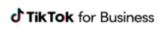

<!-- TODO: hier kommt eine Zusammenfassung für das gesammte Kapitel mit Querverweisen -->
## Hier kommt eine zu kurze Zusammenfassung des gesammten Tutorials zum Kritischen Denken 

## Was ist Kritisches Denken ?

- Wie man richtig und kritisch denken lernen kann

## Wie es geht richtig?

- "Richtig" geht so:
- du solltest eine paar Fähigkeiten haben:

### Logisch denken

- Logisch denken können: von wahren Voraussetzungen auf andere wahre Sätze schliessen können.

### Argumentieren 

- Wissen, wie Leute argumentieren und wie man argumentieren sollte

- Wissen wie guten und schlechte Argumente aussehen.

### Sprachverhexung

- Sprachfallen aufdecken und umgehen (schiefe Definitionen, geladene sprache)

  - Geladene Sprache: Unser unterbelichteter Präsident hat gesagt ...
  - Unsinn: Wie spät ist es eigentlich auf dem Mond gerade?
  - Definitionen: Der Mensch ist ein federloser Zweibeiner

### Quellenprüfung

- Quellen überprüfen können. (Textquellen, Erzählungen, eigene und anderer Erfahrungen einordnen)
- "Die beste Art schnell reich zu werden ist, mein Buch zu kaufen" 
<!--  -->
- "Rauchen ist cool und nicht schädlich für die Gesundheit!", gezeichnet Dr. Marlboro 
  <!--   -->
- "Die Mehrheit der Amerikaner geht davon aus, dass Kennedy Opfer einer Verschwörung wurde". (Wikipedia) 
- "Der Einfluss des Menschen auf das Klima ist eindeutig“ Weltklimarat (IPCC) 

### Klassische Fehlschlüsse

- Sich nicht von Fehlschlüssen verhexen lassen

### Kognitive Verzerrungen (Biaises) 

- Sich nicht von kognitive Verzerrungen täuschen lassen

### Paradoxien und Dilemmas 

- Paradoxien und Dilemmas erkennen und richtig reagieren

## Wie geht es kritisch

- Das heisst ja nicht umsonst "Kritisches Denken". "Kritisch" ist hier eine unabdingbare Einstellung zu sich selbst, zu jeder Art von Behauptung, Hypothese, Theorie, zu Quellen aller Art, zur Wissenschaft und Kultur und selbst zu Werten.
- Das soll nicht heissen, dass wir immer überall und alles hinterfragen sollten. Oh nein, bitte nicht. Da würden wir schlicht verrückt werden.
- Etablierte Theorien oder in meiner Kultur verwurzelte Werte sollte man nur in Frage stellen, wenn sich **Widersprüche** mit meinem Leben oder meiner Forschung auftun. Widersprüche sind das Treibmittel des Fortschritts.

### Selbstkritik

- Meistens wissen wir schon, wo wir hinwollen, wofür oder wogegen wir sind, weil wir eben immer schon Teil einer Kultur oder Subkultur sind. Wir sind voller Überzeugungen. Und ich bin mir ganz sicher ... 
  - Es gibt a) nur einen Gott und das ist zufällig der, an den ich glaube. Gott sei dank. Oder b) an Gott kann man glauben wie man will, es ist nur kein wissenschaftlicher Ausdruck. 
  - Die Erde ist a) ungefähr. Oder b) flach oder eckig.
  - Nichts kann sich schneller als das Licht bewegen ausser schlechte Nachrichten.
  - Corona19 war a) eine schwere Epidemie, b) eine Verschwörung der Weltregierung.
  - Homosexualität ist a) ein natürliches Phänomen und moralisch neutral, b) eine Krankheit und Gott nicht gefällig.
  - Wir konstatieren a) eine menschengemachte Klimakrise oder b) bestreiten dies.
  - usw, usw.

- Wir haben meistens eine Meinung und öfter keine Ahnung.
- Bitte 50 mal nachsagen: "Ich kann mich irren, ich habe mich geirrt, ich werde mich irren."
- Ist das schlimm? Nein. Wir müssen einfach offen sein für Fehlersuche, konstruktive Kritik, Hinterfragung.

- Bei Examen in der Schule sagte die Lehrerin: überprüfe deine Resultate bevor du abgibst.
- In der Technik nennen wir es Testen.
- In der Produktion heisst es Qualitätskontrolle.
- In der Wissenschaft fragen wir andere nach "Peer-reviews".

### Zuhören und Offenheit

- Wir sollten mehr zuhören ohne immer gleich zu urteilen. Das ist die Basis einer offenen Gesellschaft. 
- Nicht alle Rechten sind Nazis, nicht alle Linken sind Chaoten.
- Offen sein für die Erfahrung anderer.
- Oft hören wir nicht einmal den Satz zu ende und haben schon geurteilt.
- Andere Menschen haben andere Prioritäten und wir haben schräge Meinungen dazu:
  - das Kind will ein neues Spielzeug (was für ein Unsinn, braucht nicht noch eins)
  - der Jugentliche träumt davon, ein Musikstar zu sein (das wird ja eh nix, hast du dich mal singen gehört)
  - jemand will eine neuen neuen Sportwagen (wozu das denn, das ist teuer und verpestet die Umwelt)
  - jemand isst seit Jahren kein Fleisch mehr (das ideologisch hirnverbrannt und gesundheitsschädlich)

- Wir sind offen für Gegenargumente, hören andere Meinungen.

### Zurückhaltung meines Urteils

### 
  -
- Einige Beobachtungen der wirklichen Welt

- Wir kennen und hinterfagen unsere eigenen (expliziten und impliziten) Prämissen
- 