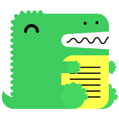

# Markdown Features

Docusaurus supports **[Markdown](https://daringfireball.net/projects/markdown/syntax)** and a few **additional features**.

## Front Matter

Markdown documents have metadata at the top called [Front Matter](https://jekyllrb.com/docs/front-matter/):

```text title="my-doc.md"
// highlight-start
---
id: my-doc-id
title: My document title
description: My document description
slug: /my-custom-url
---
// highlight-end

## Markdown heading

Markdown text with [links](./hello.md)
```

## Links

Regular Markdown links are supported, using url paths or relative file paths.

```md
Let's see how to [Create a page](/create-a-page).
```

```md
Let's see how to [Create a page](./create-a-page.md).
```

**Result:** Let's see how to [Create a page](./create-a-page.md).

## Images

Regular Markdown images are supported.

You can use absolute paths to reference images in the static directory (`/static/img/docusaurus.png`):

```md

```

You can reference images relative to the current file as well. This is particularly useful to colocate images close to the Markdown files using them:

```md

```

You can also specify image dimensions:

```md

```


Or just the width (height will be adjusted automatically to maintain aspect ratio):

```md

```

You can reference images relative to the current file as well. This is particularly useful to colocate images close to the Markdown files using them:

```md

```
:::tip

## Code Blocks

Markdown code blocks are **supported** with Syntax highlighting.

````md
```jsx title="src/components/HelloDocusaurus.js"
function HelloDocusaurus() {
  return <h1>Hello, Docusaurus!</h1>;
}
```
````

```jsx title="src/components/HelloDocusaurus.js"
function HelloDocusaurus() {
  return <h1>Hello, Docusaurus!</h1>;
}
```

## Admonitions

note, tip, info, warning, danger

Docusaurus has a special syntax to create admonitions and callouts:

```md
:::tip My tip 

Use this awesome feature option

:::

:::danger Take care

This action is dangerous

:::

```

<!-- :::tip -->
:::tip Mein

Use this awesome feature option

:::

:::danger Take care

This action is dangerous

:::

### mdx admonitions

import Admonition from '@theme/Admonition';

<Admonition type="tip" icon="💡" title="Did you know...">
  Use plugins to introduce shorter syntax for the most commonly used JSX
  elements in your project.
</Admonition>
<Admonition type="note" icon="💬" title="">
  Use plugins to introduce shorter syntax for the most commonly used JSX
  elements in your project.

  <p class="text--right">Sokrates</p> 
</Admonition>

<Admonition type="note" icon="🌊🌊🌊💭" title="">
  Use plugins to introduce shorter syntax for the most commonly used JSX
  elements in your project.
</Admonition>


<Admonition type="note" icon="💬" title="Zitat">

  „**Ich weiß, dass ich nichts weiß**“  
  wörtlich: „Denn von mir selbst wusste ich, dass ich gar nichts weiß ...“ 

  <p class="text--right">Sokrates in Platon: _Apologie des Sokrates_ 22d</p> 
</Admonition>


## Markdown Emoji

You can use emojis

```markdown
:heart:
```

:heart: oder :lion: or :spades:

## Checkboxes

Adds support for Github's - [ ] and - [x] check box syntax to VS Code's built-in markdown preview.

- [x]

## Footnotes

Footnotes allow you to add notes and references without cluttering the main content.

```md
Here's a sentence with a footnote[^1].

[^1]: This is the footnote.
```

Here's a sentence with a footnote[^1].

[^1]: This is the footnote.

You can also use named footnotes:

```md
Here's another sentence[^note].

[^note]: This is a named footnote.
```

## Shortcuts
Here is the github of [vscode-markdown-shortcuts](https://github.com/mdickin/vscode-markdown-shortcuts).

- Ctrl-B for **bold**  
- Ctrl-I for _italic_  
- Ctrl-L for toggle [link](www.example.org) to resource.  

## Math

$$
I = \int_0^{2\pi} \sin(x)\,dx
$$

## Details - Collapse

<details>
  <summary>Hier kannst du mehr Quellen finden</summary>

  - Quelle 1
  - Quelle 2 
  - Quelle 3
</details>

## Browser window
import BrowserWindow from '@site/src/components/BrowserWindow';

<BrowserWindow>
toto
</BrowserWindow>

this is working

## tooltip
import Tooltip from "@site/src/components/Tooltip/Tooltip";

This is a <Tooltip type="subject-area" content="topic">Tooltip</Tooltip> and this is another  <Tooltip type="another-subject-area" content="different-topic">Tooltip</Tooltip>

## tabs

import Tabs from '@theme/Tabs';
import TabItem from '@theme/TabItem';

<Tabs>
  <TabItem value="apple" label="Apple" default>
    This is an apple 🍎
  </TabItem>
  <TabItem value="orange" label="Orange">
    This is an orange 🍊
  </TabItem>
  <TabItem value="banana" label="Banana">
    This is a banana 🍌
  </TabItem>
</Tabs>

## highlight

import Highlight from '@site/src/components/Highlight/Highlight';

<Highlight color="#25c2a0">Docusaurus green</Highlight> option


## SVG
<svg
  xmlns="http://www.w3.org/2000/svg"
  viewBox="0 0 48 48"
  width="48"
  height="48">
  <path fill="#FF6D00" d="M42 42H6V6h36v36z" />
  <path fill="#FFF" d="M8 8v32h32V8H8zm30 30H10V10h28v28z" />
  <path
    fill="#FFF"
    d="M23 32h2v-6l5.5-10h-2.1L24 24.1 19.6 16h-2.1L23 26z"
  />
</svg>

