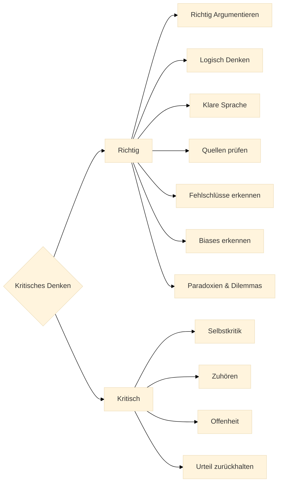

 Hier geben wir eine sehr kurze Zusammenfassung des gesamten Tutorials zum Kritischen Denken.

## Was ist Kritisches Denken ?

Wir sind Wesen mit Zielen, Werten und Überzeugungen. Um unsere **Ziele** zu erreichen und unsere **Werte** zu leben, handeln wir und dazu müssen wir **Entscheidungen** treffen. 
Wir entscheiden uns jeden Tag, oft automatisch oder unbewusst, für das eine oder das andere auf der Grundlage von Behauptungen oder Meinungen über die Welt.

Als **kritisch denkender** Mensch **hinterfragst** du alle Behauptungen, Meinungen und Überzeugungen: von Dir selbst, von Freunden und Mitmenschen, von Organisationen und von Firmen, die dir sagen wollen, was gut für dich ist.  
Um deine kurz- oder längerfristigen Ziele zu erreichen, musst du **gut informierte Entscheidungen** treffen, für dich, deine Mitmenschen und deine Umwelt.

Entscheidungen treffen wir, um **zu handeln**.

**Richtige Entscheidungen** zu treffen, um **'richtig' zu handeln**, ist eine Kunst und eine Wissenschaft zugleich.

:::info Handeln

**Handeln** = **Begehren** + **Wissen**

&mdash; David Hume [^1]
:::

[^1]: Hume erklärt, dass Handlungen durch unser" Begierden oder Ziele motiviert sind und dass Wissen uns hilft diese Ziele zu erreichen. "A Treatise of Human Nature", Buch II, Teil 3, Abschnitt 3, "Of the Influencing Motives of the Will" (1739–40).

Jedes Handeln, jede Entscheidung, die wir treffen, basiert auf zwei fundamentalen Fragen:

1. **Wo willst du hin? = Ziele / Begehren**.  
  Das sind die Ziele die wir anstreben oder begehren. Diese hängen zum einen von unserer **menschlichen Konstitution** ab. 
  Wir brauchen Nahrung, Wärme, Sicherheit, soziale Kontakte, Sexualität, usw.  
  Zum anderen werden unsere Ziele von unseren familiären und **kulturellen Werten** bestimmt, die wir als soziale Wesen in unserer Kultur gelernt haben. Das sind Werte und Normen wie: Freiheit, Gerechtigkeit, Gleichheit, Toleranz, Respekt, Mitgefühl, Solidarität, Ehrlichkeit oder das Gegenteil davon. 

2. **Wie kommst du da hin? = Wissen**.  
  Der zweite Aspekt, ist das Wissen, das wir brauchen, um unsere Ziele zu erreichen. Du brauchst Wissen von der Welt.
  Gute Entscheidungen sind die, die auf **Wahrheit** (in einem pragmatischen Sinne) basieren und nicht auf **Irrtum**.

## Kriterien für "richtige Entscheidungen" und "richtiges" Handeln

Die Frage aller Fragen ist natürlich: wie unterscheide ich "richtige" von "falschen" Entscheidungen? Das ist ganz konkret in vielen Situationen wichtig:

- Soll ich den Job wechseln oder nicht?
- Soll ich kurzfristig planen und mit Kohle heizen oder langfristig ökologisch planen?
- Soll ich das Auto nehmen oder das Fahrrad?
- Soll ich ein Haus kaufen oder mieten?

Es gibt keine allgemeingültige Antwort auf diese Fragen, denn sie hängen von deinen individuellen Zielen und Werten ab. 
Aber Philosophen denken seit tausenden von Jahren darüber nach und haben einige Kriterien entwickelt, die dir helfen können, "richtige Entscheidungen" zu treffen.

Wir werden viele dieser Kriterien im Laufe des Tutorials noch genauer besprechen. Hier eine kurze Übersicht:

- **Wahrheit**: Überzeugungen sollten mit den Fakten übereinstimmen (Fehler = ineffiziente oder schädliche Mittel).
- **Konsistenz und Kohärenz**: Ziele dürfen sich nicht gegenseiting widersprechen und Mittel sollten zu allen relevanten Zielen passen.
- **Klarheit**: Es ist besser, wenn du deine Ziele explizit formulierst (Bedürfnisse, Begierden bewusst machen). Und auch beim Mittelwissen ist Klarheit wichtig (Was weiss ich genau, was nicht?).
- **Proportionalität**: Wir müssen oft in Situationen entscheiden, in denen wir nicht alle Informationen haben. Deswegen sollte die Stärke deines Handelns proportional zur Stärke der gerechtfertigten Gründe sein.
- **Revisionierbarkeit**: Du kannst und solltest sowohl deine Ziele und Grundüberzeugungen gelegentlich hinterfagen, als auch das Mittelwissen (bei neuer Evidenz) an die Realität anpassen. Werde fähig, deine Meinung mit guten Gründen zu ändern.

## Warum ist Kritisches Denken wichtig?

**Die Methode des Kritischen Denkens hilft dir dabei, richtig zu handeln.**
&nbsp;

:::info Zitat
 "_Aufklärung ist der Ausgang des Menschen aus seiner selbstverschuldeten Unmündigkeit._"

 &mdash; Immanuel Kant: _Was ist Aufklärung_[^2]
:::

[^2]: Einleitung in Kants berühmten Aufsatz ("[Was ist Aufklärung](https://de.wikisource.org/wiki/Beantwortung_der_Frage:_Was_ist_Aufkl%C3%A4rung%3F)")  
**Aufklärung ist der Ausgang des Menschen aus seiner selbst verschuldeten Unmündigkeit. Unmündigkeit** ist das Unvermögen, sich seines Verstandes ohne Leitung eines anderen zu bedienen. **Selbstverschuldet** ist diese Unmündigkeit, wenn die Ursache derselben nicht am Mangel des Verstandes, sondern der Entschließung und des Muthes liegt, sich seiner ohne Leitung eines andern zu bedienen. **Sapere aude!** Habe Muth dich deines **eigenen** Verstandes zu bedienen! ist also der Wahlspruch der Aufklärung.

&nbsp;
Kritisches Denken hat zwei Hemisphären.

:::tip 

**Kritisches Denken** = **Richtig** + **Kritisch** 

:::

Das kritische Denken has zwei wesentliche Aspekte:  

1. Wie denkt man **richtig**?  
  Die Antwort darauf ist eine **Fähigkeit**, wie "Fahrrad fahren" oder "einen Apfelstrudel backen".

2. Wie denkt man **kritisch**?  
  Die Antwort darauf ist eine **Einstellung**, wie "auf der Hut sein", die wir bei Gelegenheit einnehmen.

Wenn du dir unsicher bist, ob du das eine oder das andere beherrschst, keine Sorge: **beides kann man lernen**.

Beide Aspekte werden wir im Folgenden kurz vorstellen.

## Wie denkst Du richtig?

Zuerst einmal, kannst du dich fragen, was ist **richtig** zu denken und kann ich das lernen?
Du kannst es natürlich lernen, indem du ein paar Fähigkeiten trainierst:
logisch denken, argumentieren, Sprachverhexung vermeiden, Quellen prüfen, Fehlschlüsse und Biases erkennen und Paradoxien verstehen.

### Logisch denken

Was heisst "_logisch denken_"? Wir können doch alle immer schon denken.

:::tip Definition
**Logisch denken** können heisst : von **wahren Voraussetzungen** auf **wahre Schlussfolgerungen** schliessen können.
:::

Die **Logik** ist eine riesiges Fach, aber zum Glück für uns Laien, brauchen wir im Alltag nur ganz wenig davon, die wesentlichen Grundlagen.

Die **wesentlichen Grundlagen** der Logik solltest Du aber beherrschen, sonst versteht du nur Bahnhof.

### Argumentieren

Argumentieren hat etwas mit Logik zu tun. Aber nicht alle guten Argumente sind formal logisch gültig.

Du musst also verstehen lernen, **wie man richtig argumentiert** und wie Leute tatsächlich argumentieren.

Du musst verstehen, **wie gute Argumente funktionieren** und warum schlechte Argumente fehlerhaft sind.

### Sprachverhexung

Um klar und kritisch zu denken, müssen wir lernen **Sprachfallen und Sprachverhexungen aufzudecken** und sie zu umgehen.

Sprache ist kein starres System, sie lebt, wandelt sich und entzieht sich oft jeder Kontrolle. Sehr oft spielt uns die Sprache selbst einen Streich. 
Hier sind ein paar Beispiele:

- **Geladene Sprache**, z. B.: "Unser unterbelichteter Präsident hat gesagt ..."
Da hat jemand eine Meinung über den Präsidenten, die er uns unterschieben will.
- **Unsinn**, z. B.: "Wie spät ist es eigentlich auf dem Mond gerade?" 
Da wird eine absurde Frage aufgeworfen, die lustig sein kann, uns aber auch vorgaukelt, dass es eine sinnvolle Antwort darauf gibt.
- **Schiefe Definitionen**, z. B.: "Der Mensch ist ein federloser Zweibeiner, mit platten Fingernägeln und Vernunft." 
Das ist eine klassische Definition, die vielleicht zutrifft, aber nicht so richtig überzeugend ist.

**Exakte Sprache** mit präzisen Begriffen, das brauchen wir im Recht, auf der Arbeit, in der Wissenschaft und Technik. In der Politik wäre es auch mal ganz gut.

Im Alltag dagegen, in der Kommunikation, in der Musik, etc, da hilft exakte Sprache auch, aber oft suchen wir nach mehr Spiel in der Sprache. Auf Grill-parties oder beim Flirten, da ist Präzision nicht gefragt. Da ist es besser, wenn die Sprache feiert.

### Quellenprüfung

Eine der wichtigsten Fähigkeit die wir lernen oder beherrschen sollten ist die, unsere **Quellen überprüfen** zu können.
Alle unsere Überzeugungen stützen sich auf Quellen ganz verschiedener Art: Textquellen, Erzählungen, eigene Erfahrungen oder die Erzählungen Anderer.
Die Qualität unserer Quellen ist dabei sehr unterschiedlich.
Hier ein paar Beispiele:

- "Die beste Art schnell reich zu werden ist, mein Buch zu kaufen" 
<!--  -->
- "Rauchen ist cool und nicht schädlich für die Gesundheit!", gezeichnet Dr. Marlboro 
  <!--   -->
- "Die Mehrheit der Amerikaner geht davon aus, dass Kennedy Opfer einer Verschwörung wurde". (Wikipedia) 
- "Der Einfluss des Menschen auf das Klima ist eindeutig“ Weltklimarat (IPCC) 

Ich lasse Dich entscheiden, wem Du lieber vertraust.

### Klassische Fehlschlüsse (Fallacy)

Eine weitere wichtige Fähigkeit, ist die, sich nicht von Fehlschlüssen in die Irre leiten zu lassen.
Einige der Besten Bücher zum Thema "Kritisches Denken" beschäftigen sich fast ausschließlich mit Fehlschlüssen oder den Verzerrungen, die unser Denken beeinflussen.  
Bekannte Bespiele für klassische Fehlschlüsse sind:

- **Ad Hominem**: Angriff auf die Person statt auf das Argument.
- **Strohmann**: Das Argument des Gegners wird verzerrt, um es leichter angreifen zu können.
- **Falsches Dilemma**: Es werden nur zwei Möglichkeiten dargestellt, obwohl es mehr gibt.
- **Zirkelschluss**: Die Behauptung wird durch sich selbst begründet.
- **Autoritätsargument**: Etwas wird für wahr gehalten, weil eine Autorität es sagt.

Es gibt einen ganzen Zoo von bekannten Fehlschlüssen. Wir werden die wichtigsten im Detail besprechen.

### Kognitive Verzerrungen (Biases)

Nicht nur Fehlschlüsse, sondern auch kognitive Verzerrungen, stehen unserer Rationalität auf den Füßen.
Diese Verzerrungen (Biases) sind oft tief in unserem Gehirn verankert und können uns blind für die Realität machen.
Bekannte Bespiele für kognitive Verzerrungen sind:

- **Konfirmationsbias**: Wir suchen nur, oder akzeptieren nur Informationen, die unsere Meinung bestätigen.
- **Anker-Effekt**: Unsere Meinung wird durch den ersten Eindruck beeinflusst.
- **Halo-Effekt**: Ein gutes Gesamtbild führt zu positiven Urteilen in allen Bereichen.
- **Selbstüberbewertung**: Wir sind oft zu optimistisch über unsere Fähigkeiten und Leistungen.

Auch hier gibt es dutzende Beispiele: lustige, überraschende, besorgniserregende und beinahe gefährliche, die wir später im Detail besprechen werden.
Wir sehen als Menschen dabei so dumm und bemitleidenswert aus, dass wir uns fragen: wieso lernen wir das nicht in der Schule?

### Paradoxien und Dilemmas

Was richtiges Denken von fehlerhaftem Denken unterscheidet, kann man gut in Extremsituationen erkennen.  
**Wir lernen Denken da, wo unser Denken an den Rand des Denkbaren gerät: an den Steilhängen der Paradoxien und Dilemmas, da wo die Widersprüche hausen.**  
Da finden wir uns nicht mehr zurecht und sind ratlos. Da müssen wir überlegen, ob wir unsere üblichen Denkweisen anwenden können, oder ob wir neue Denkweisen entwickeln müssen, um die Situation zu meistern.

Typische Beispiele für Paradoxien und Dilemmas sind:

#### Logische Paradoxien

- **Paradoxien des Unendlichen**: das unendlich kleine und das unendlich große. Es gibt mächtigere Unendlichkeiten als die unendliche Menge der natürlichen Zahlen.
- **Zenonsche Paradoxien** der Bewegung (Achilles und die Schildkröte): Wenn Achilles schneller läuft als eine Schildkröte, wie kann er sie jemals einholen, wenn sie einen Vorsprung hat?
- **Paradoxon von Theseus**: Wenn man alle Planken eines alten Schiffes wechselt, ist es noch dasselbe Schiff?
- **Paradoxon des Epimenides**: Epimenides der Kreter sagt, dass alle Kreter lügen. Lügt er?
- **Paradoxon von Russell**: Die Menge M aller Mengen, die sich nicht selbst enthalten. Enthält M sich selbst oder nicht?

#### Ethische Dilemmas

- **Das Theodizee-Problem**: Warum gibt es so viel Leid in der Welt, wenn es einen allmächtigen, allwissenden und allgütigen Gott gibt?
- **Trolley-Problem**: Wenn du eine Schienenweiche umstellst, dann stirbt eine Person. Wenn du nichts tust, fährt der Zug in einen Kinderbus. Was tust du?
- **Das Gefangenendilemma**: Zwei Gefangene müssen entscheiden, ob sie gestehen oder schweigen, vom Verrat profitieren oder von der Solidarität. Was ist die beste Strategie?
- **Das Dilemma der Meinungsfreiheit**: Wenn es absolute Meinungsfreiheit gibt, müssen wir dann Intoleranz tolerieren und in kauf nehmen, dass man uns der Meinungsfreiheit beraubt?

Das alles gehört zum richtigen Denken dazu. Was aber ist das "Kritische" am kritischen Denken?

## Wie denkst du kritisch?

Jetzt kommen wir zum kritischen Teil. "**Kritisch**" ist hier **eine unabdingbare Einstellung zu sich selbst**, zu jeder Art von Behauptung, Hypothese, Theorie, zu Quellen aller Art, zur Wissenschaft und Kultur und selbst zu Werten.

- **Nicht immer**: Das soll nicht heissen, dass wir immer überall und alles hinterfragen sollten. Oh nein, bitte nicht, da würdest du verrückt werden.
- **Wenn es weh tut**:  Etablierte Theorien oder in deiner Kultur verwurzelte Werte kann man nicht ständig in Frage stellen.
Manchmal aber schon. Eben dann, wenn sich **Widersprüche** mit dem Leben oder den Wissenschaften auftun. Widersprüche sind das Treibmittel des Fortschritts.

### Selbstkritik

Die meisten von uns sind totale Egozentriker. Meistens wissen wir schon, wo wir hinwollen, wofür oder wogegen wir sind. Wir sind eben immer schon **Teil einer Kultur** oder Subkultur.

Wir sind voller **Überzeugungen** und sind uns oft **ganz sicher**.

Die meiste Energie unseres Denken benutzen wir nicht, um ein angemessene oder "richtige" Lösungen auf gegebene Probleme zu finden, sondern um unsere **Vorurteile zu bestätigen**.  

Unsere Gesellschaft ist voller **gegensätzlicher Überzeugungen**:

- Es gibt
  - a) nur einen Gott und dieser ist zufällig der, an den ich glaube. Gott sei Dank!
  - b) an Gott kann man glauben wie man will, es ist nur kein wissenschaftlicher Ausdruck.
- Die Erde ist
  - a) ungefähr rund. 
  - b) flach oder eckig.
- Corona19 war
  - a) eine schwere Epidemie, 
  - b) eine Verschwörung der Weltregierung.
- Homosexualität ist 
  - a) ein natürliches Phänomen, gibt's bei Tieren und ist moralisch neutral, 
  - b) eine Krankheit und Gott nicht gefällig.
- Wir konstatieren
  - a) eine menschengemachte Klimakrise 
  - b) bestreiten dies.

Bei vielen Themen haben wir:

  1. sehr oft **keine Ahnung** von der Materie
  2. trotzdem meistens **eine feste Überzeugung**.

&nbsp;

:::tip Übung
Bitte 10 mal nachsagen: 

**"Ich kann mich irren, ich habe mich schon oft geirrt, ich werde mich wieder irren."**
:::

### Fehlersuche

Ist es schlimm, dass wir uns irren? 

Nein. Wenn wir uns verbessern wollen, dann müssen wir offen sein für **Fehlersuche**, konstruktive Kritik, **Hinterfragung**.

Solange es uns nicht persönlich weh tut, sind wir oft bereit, Fehler zu suchen.

- Bei Examen in der Schule sagte die Lehrerin: **überprüfe** deine Resultate bevor du abgibst.
- In der Technik nennen wir es **Testen**.
- In der Produktion heisst es **Qualitätskontrolle**.
- In der Wissenschaft fragen wir andere nach "**Peer-reviews**".

### Zuhören und Offenheit

Ein anderer wichtiger Punkt des kritischen Denkens ist das **Zuhören** und die **Offenheit** für andere Meinungen.

- Wir sollten **mehr zuhören** ohne immer gleich zu urteilen. Das ist die Basis einer offenen Gesellschaft.
- Offen sein für die Erfahrung Anderer.
- Oft hören wir nicht einmal den Satz zu ende und haben schon geurteilt.
- Andere Menschen haben andere Prioritäten und wir haben schräge Meinungen dazu:
 
- das Kind will ein neues Spielzeug (was für ein Unsinn, braucht nicht noch eins)
- der Jugendliche träumt davon, ein Musikstar zu sein (das wird ja eh nix, hast du den mal singen gehört)
- jemand will eine neuen Sportwagen (wozu das denn, das ist teuer und verpestet die Umwelt)
- jemand isst seit Jahren kein Fleisch mehr (das ideologisch hirnverbrannt und gesundheitsschädlich)

Hier brauchen wir eine Änderung der Einstellung. Wir sollten mehr offen sein für Gegenargumente und andere Meinungen im Allgemeinen.

### Zurückhaltung meines Urteils

Im kritischen Denken ist die **Zurückhaltung des Urteils** ein zentraler Punkt. Das haben wir gerade schon angesprochen.

Nicht alle Rechten sind Nazis, nicht alle Linken sind Chaoten.

Schon in der Antike ist die Zurückhaltung des Urteils, als [_Epoché_ (ἐποχή)](https://de.wikipedia.org/wiki/Epoche_(Philosophie)) bezeichnet, ein wichtiger Punkt in der Philosophie und wurde von Philosophen wie Pyrrhon und Sextus Empiricus hervorgehoben.  
Auch im Zen-Buddhismus wird die Zurückhaltung des Urteils durch das Prinzip des **Nicht-Anhaftens** (Non-Attachment, 無執着, Mu-shūjaku)[^3] verkörpert. Es bedeutet, sich nicht an festen Meinungen oder Überzeugungen festzuhalten.

[^3]: Zen lehrt, sich nicht an Ansichten, Emotionen oder Wahrnehmungen zu klammern. Das entspricht der pyrrhonischen Enthaltung, aber mit einem entscheidenden Unterschied:  
**Epoché** sagt: „Ich halte mich nicht fest, um Ruhe zu finden.“  
**Zen** sagt: „Ich halte mich nicht fest, weil Festhalten selbst die Ursache des Leidens ist.“

#### Vorteile der Zurückhaltung des Urteils

- **Offenheit für neue Informationen**: Zurückhaltung des Urteils ermöglicht es, neue Informationen und Perspektiven zu berücksichtigen, ohne voreilige Schlüsse zu ziehen.
- **Vermeidung von Voreingenommenheit**: Durch das Zurückhalten des Urteils kann man vermeiden, dass vorgefasste Meinungen und Vorurteile die Analyse beeinflussen.
- **Gründliche Analyse**: Es erlaubt uns eine gründlichere und objektivere Analyse der vorliegenden Informationen und Argumente.
- **Flexibilität im Denken**: Zurückhaltung des Urteils fördert die Flexibilität im Denken und ermöglicht es, verschiedene Sichtweisen zu berücksichtigen.

## Ein Diagramm zur Zusammenfassung

  

&nbsp;

Nach diesem sehr kondensierten Überblick über das kritische Denken, kommen wir nun zu den Details!
