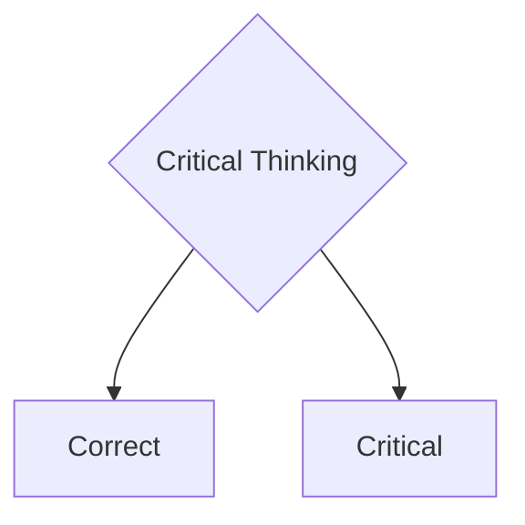

import React from 'react';
import ReactPlayer from 'react-player';


Docusaurus supports **[Markdown](https://daringfireball.net/projects/markdown/syntax)** and a few **additional features**.

## Front Matter

Markdown documents have metadata at the top called [Front Matter](https://jekyllrb.com/docs/front-matter/):

```text title="my-doc.md"
// highlight-start
---
id: my-doc-id
title: My document title
description: My document description
slug: /my-custom-url
---
// highlight-end

## Markdown heading

Markdown text with [links](./hello.md)
```

## Links

Regular Markdown links are supported, using url paths or relative file paths.

```md
Let's see how to [Create a page](/create-a-page).
```

```md
Let's see how to [Create a page](./create-a-page.md).
```

**Result:** Let's go to the [Introduction](./000-kritisches-denken-kurzgesagt.md).

## Images

Regular Markdown images are supported.

You can use absolute paths to reference images in the static directory (`/static/img/docusaurus.png`):

```md

```

You can reference images relative to the current file as well. This is particularly useful to colocate images close to the Markdown files using them:

```md

```

You can also specify image dimensions ??:

```md

```


You can use **img** tags

```html

```


## Code Blocks

Markdown code blocks are **supported** with Syntax highlighting.

````md
```text title="Beispiel für ein Beispieltext"
Hier kommt mein Beispiel
Zwei Zeilen sind gut
```
````

```text title="Beispiel für ein Beispieltext"
Hier kommt mein Beispiel
Zwei Zeilen sind gut
```

````md
```jsx title="src/components/HelloDocusaurus.js"
function HelloDocusaurus() {
  return <h1>Hello, Docusaurus!</h1>;
}
```
````

```jsx title="src/components/HelloDocusaurus.js"
function HelloDocusaurus() {
  return <h1>Hello, Docusaurus!</h1>;
}
```

## Admonitions

note, tip, info, warning, danger

Docusaurus has a special syntax to create admonitions and callouts:

```md

:::note Notiz
Hier ist eine Notiz 
:::

:::tip Mein Tipp
Hier ist ein Tipp 
:::

:::info Information
Hier ist eine Information 
:::

:::warning Achtung
Hier ist eine Warnung 
:::

:::danger Gefahr
This action is dangerous
:::

```

:::note Notiz
Hier ist eine Notiz
:::

:::tip Mein Tipp
Hier ist ein Tipp
:::

:::info Information
Hier ist eine Information
:::

:::warning Achtung
Hier ist eine Warnung
:::

:::danger Gefahr
This action is dangerous
:::

## MDX admonitions

import Admonition from '@theme/Admonition';

<Admonition type="tip" icon="💡" title="Did you know...">
  Use plugins to introduce shorter syntax for the most commonly used JSX
  elements in your project.
</Admonition>
<Admonition type="note" icon="💬" title="">
  Use plugins to introduce shorter syntax for the most commonly used JSX
  elements in your project.

  <p class="text--right">Sokrates</p>
</Admonition>

<Admonition type="note" icon="🌊🌊🌊💭" title="">
  Use plugins to introduce shorter syntax for the most commonly used JSX
  elements in your project.
</Admonition>

<Admonition type="note" icon="💬" title="Zitat">

  "**Ich weiß, dass ich nichts weiß**"  
  wörtlich: "Denn von mir selbst wusste ich, dass ich gar nichts weiß ..."

  <p class="text--right">Sokrates in Platon: _Apologie des Sokrates_ 22d</p>
</Admonition>

## Markdown Emoji

You can use emojis

```markdown
:heart:
```

:heart: | :lion: | :spades:

## Checkboxes

Adds support for Github's - [ ] and - [x] check box syntax to VS Code's built-in markdown preview.

- [ ]

## Fussnoten

Fussnoten erlauben es Anmerkungen ...

```md
Here's a sentence with a footnote[^1].

[^1]: This is the footnote.
```

Here's a sentence with a footnote[^1].

[^1]: This is the footnote.

You can also use named footnotes:

```md
Here's another sentence[^namedNote].

[^namedNote]: This is a named footnote.

```

Here's another sentence[^namedNote].

[^namedNote]: This is a named footnote.

## Mermaid



## Shortcuts

Here is the github of [vscode-markdown-shortcuts](https://github.com/mdickin/vscode-markdown-shortcuts).

- Ctrl-B for **bold**  
- Ctrl-I for _italic_  
- Ctrl-L for toggle [link](www.example.org) to resource.  

## Math

$$
I = \int_0^{2\pi} \sin(x)\,dx
$$

## Details - Collapse

```md
<details>
  <summary>Hier kannst du mehr Quellen finden</summary>

  - Quelle 1
  - Quelle 2 
  - Quelle 3
</details>
```

<details>
  <summary>Hier kannst du mehr Quellen finden</summary>

- Quelle 1
- Quelle 2
- Quelle 3

</details>

## Browser window
<!-- import BrowserWindow from '@site/src/components/BrowserWindow'; -->
```md
<BrowserWindow>
toto
</BrowserWindow>
```

<BrowserWindow>
toto
</BrowserWindow>

<!-- ## Tooltip old 
This is a <Tooltip type="subject-area" content="topic">Tooltip</Tooltip> and this is another  
<Tooltip type="another-subject-area" content="different-topic">Tooltip</Tooltip> 
-->
## Html Tooltip
```
<a title="This is a tooltip">Hover over me</a>
```
<a title="This is a tooltip">Hover over me</a>

## Extended Tooltip

### Standard tooltip (closes on mouse leave)

```md
<Tooltip text="Text Tooltip" model="text">
  Brief explanation
</Tooltip>
```

<Tooltip text="Text Tooltip" model="text">
  Eine Text Nachricht in grau
</Tooltip> 

<Tooltip text="Info Tooltip" model="info">
  Brief explanation
</Tooltip> 

<Tooltip text="Success Tooltip" model="success">
  ## Success message.  
  Das war der totale Erfolg :heart: 
  Hier kommt eine lange Zeile um zu sehen wann das aufhört, oder ob das immer weitergeht.
</Tooltip>

<Tooltip text="Warning Tooltip" model="warning">
  Warning message
</Tooltip>

<Tooltip text="Error Tooltip" model="error">
  Error message
</Tooltip>

### Persistent tooltip (stays open until click outside/escape)

```md
<Tooltip text="Complex Term" model="teacher" persistent={true}>
  This is a longer explanation that users might want to 
  keep open while reading other content on the page.
</Tooltip>
```

<Tooltip text="Complex Term" model="teacher" persistent={true}>
  This is a longer explanation that users might want to 
  keep open while reading other content on the page.
</Tooltip>

### Persistent tooltip with Video

```
<Tooltip text="Here is a video" model="video" persistent={true} >
  ## How to sync files.
  <ReactPlayer style={{ maxWidth: '560px', width: 'calc(100vw - 60px)', height: 'auto', aspectRatio: '16/9' }} controls src='https://www.youtube.com/watch?v=Bse3QVU1yfY' />
</Tooltip>

```

<Tooltip text="Here is a video" model="video" persistent={true} >
  ## How to sync files.
  <ReactPlayer style={{ maxWidth: '560px', width: 'calc(100vw - 60px)', height: 'auto', aspectRatio: '16/9' }} controls src='https://www.youtube.com/watch?v=Bse3QVU1yfY' />
</Tooltip>

### Persistent tooltip with Video iframe

```
<Tooltip text="Here is a video" model="video" persistent={true} >
  <iframe width="560" height="315"
    style={{ maxWidth: '560px', width: 'calc(100vw - 60px)', height: 'auto', aspectRatio: '16/9' }}
    src="https://www.youtube.com/embed/lHu02MWIPUY"
    frameborder="0" allow="autoplay; encrypted-media" allowfullscreen>
  </iframe>
</Tooltip>
```

<Tooltip text="Here is a video" model="video" persistent={true} >
  <iframe width="560" height="315"
    style={{ maxWidth: '560px', width: 'calc(100vw - 60px)', height: 'auto', aspectRatio: '16/9' }}
    src="https://www.youtube.com/embed/lHu02MWIPUY"
    frameborder="0" allow="autoplay; encrypted-media" allowfullscreen>
  </iframe>
</Tooltip>

## Cards

<Columns>
  <Column className="col--6">
    <Card shadow='md'>
      <CardHeader >
          <h3>Lorem Ipsum</h3>
      </CardHeader>
      <CardBody>
          Lorem ipsum dolor sit amet, consectetur adipiscing elit, sed do eiusmod tempor
          incididunt ut labore et dolore magna aliqua. Quis ipsum suspendisse ultrices
          gravida.
      </CardBody>
      <CardFooter>
        <button className="button button--secondary button--block">See All</button>
      </CardFooter>
    </Card>
  </Column>

  <Column className="col--6">
  ```html
  <!-- low (lw), medium (md), tall (tl) -->
  <Card shadow='md'>
    <CardHeader >
        <h3>Lorem Ipsum</h3>
    </CardHeader>
    <CardBody>
        Lorem ipsum dolor sit amet, consectetur adipiscing elit, sed do eiusmod tempor
        incididunt ut labore et dolore magna aliqua. Quis ipsum suspendisse ultrices
        gravida.
    </CardBody>
    <CardFooter>
      <button className="button button--secondary button--block">See All</button>
    </CardFooter>
  </Card>
  ```
  </Column>
</Columns>

## Columns

Classnames can be: 'text--left', 'text--center', 'text--right', 'text-justify'
And column width as 1/12 : 'col--4', 'col--8', etc.

```
<Columns>
  <Column className='col--4'>
    Hier ist die linke Seite
  </Column>
  <Column>
    Lorem ipsum dolor sit amet, consectetur adipiscing elit. Sed do eiusmod tempor incididunt ut labore et dolore magna aliqua.
  </Column>
</Columns>

```

<Columns>
  <Column className='col--4'>
    Hier ist die linke Seite
  </Column>
  <Column className='col--8'>
    Lorem ipsum dolor sit amet, consectetur adipiscing elit. Sed do eiusmod tempor incididunt ut labore et dolore magna aliqua.
  </Column>
</Columns>

## Tabs

import Tabs from '@theme/Tabs';
import TabItem from '@theme/TabItem';

<Tabs>
  <TabItem value="apple" label="Apple" default>
    This is an apple 🍎
  </TabItem>
  <TabItem value="orange" label="Orange">
    This is an orange 🍊
  </TabItem>
  <TabItem value="banana" label="Banana">
    This is a banana 🍌
  </TabItem>
</Tabs>

## highlight

<Highlight color="hsl(267, 100%, 81%)">Docusaurus lila</Highlight> option

## SVG

<svg
  xmlns="http://www.w3.org/2000/svg"
  viewBox="0 0 48 48"
  width="48"
  height="48">
  <path fill="#FF6D00" d="M42 42H6V6h36v36z" />
  <path fill="#FFF" d="M8 8v32h32V8H8zm30 30H10V10h28v28z" />
  <path
    fill="#FFF"
    d="M23 32h2v-6l5.5-10h-2.1L24 24.1 19.6 16h-2.1L23 26z"
  />
</svg>

## React Video

https://www.npmjs.com/package/react-player

```
import React from 'react';
import ReactPlayer from 'react-player';
<ReactPlayer style={{ width: '100%', height: 'auto', aspectRatio: '16/9' }} controls src='https://www.youtube.com/watch?v=Bse3QVU1yfY' />

```

<ReactPlayer style={{ width: '100%', height: 'auto', aspectRatio: '16/9' }} controls src='https://www.youtube.com/watch?v=Bse3QVU1yfY' />

## Iframe video

```
<iframe
  width="560" height="315"
  src="https://www.youtube.com/embed/lHu02MWIPUY"
  frameborder="0" allow="autoplay; encrypted-media" allowfullscreen>
</iframe>
```

<iframe
  width="560" height="315"
  src="https://www.youtube.com/embed/lHu02MWIPUY"
  frameborder="0" allow="autoplay; encrypted-media" allowfullscreen>
</iframe>
