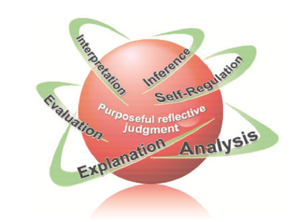

import Admonition from '@theme/Admonition';

## Worüber reden wir, wenn wir von kritischem Denken reden?

:::tip kurz
Kritisches Denken ist die Antwort auf die Frage:

**Warum soll ich das glauben?**
:::

Kritisches Denken ist einerseits die Fähigkeit, reflektiert und unabhängig zu denken sowie klar und rational Gedanken zu formulieren.
Es ist ein aktiver und systematischer Prozess, der darauf abzielt, Informationen zu analysieren, zu bewerten und zu interpretieren.

Das Ziel: **gut informierte Entscheidungen** zu treffen für uns, unsere Mitmenschen und unsere Umwelt.[^1]

Im Kern bedeutet kritisches Denken, **selbstständig zu denken**. Es geht darum:

- Ideen und Argumente zu **analysieren**
- Argumente und Behauptungen zu **bewerten**.
- Behauptungen zu **hinterfragen**
- **Schlüsse ziehen** und Alternativen zu finden
- einen **offenen Geist** zu bewahren (ohne in Naivität zu verfallen)
- konstruktiv zu **zweifeln**
- selbst nachzudenken, um **eigene Meinungen** zu bilden und **eigene Entscheidungen** zu treffen

  
Die Herkunft (Etymologie) des Kritischen Denkens

  Von Kants _Kritik der reinen Vernunft_, über einen _kritischen Punkt_ bis zu den _kritschen Zeiten_ in denen wir leben, "kritisch" ist überall und vielgesichtig.  
  Es kommt zu uns zum teil über das französische "_critique_", welches uns "_kritisch_" und "_Kritik_" gibt.  
  Ursprünglich aus dem Lateinischen "_criticus_".  Die Römer haben es, wie so oft, von den Griechen und da heisst es: "_κριτικός_" (kritikos) und bedeutet: "**fähig zur Unterscheidung**" oder "**urteilsfähig**". Es ist verwand mit _κρίσις_ (crisis) und abgeleitet vom Verb "_krinein_", was soviel heisst wie: "unterscheiden", "auswählen", "entscheiden", "aussieben".

  Ein anderer wichtiger Denker in der Geschichte des Kritischen Denkens war John Dewey (1910), ein pragmatischer amerikanischer Philosoph, der es "reflective thinking" nannte. Für Dewey ist reflektives oder kritisches Denken die: 
  > aktive, beharrliche und sorgfältige Betrachtung jeder Überzeugung oder vermeintlichen Form von Wissen im Lichte der Gründe, die sie stützen, und der weiteren Schlussfolgerungen, zu denen sie führt.\
  >(__active, persistent and careful consideration of any belief or supposed form of knowledge in the light of the grounds that support it, and the further conclusions to which it tends.__)[^2]

## Kritisches Denken als Metakognition

Metakognition? Meta wie bitte? Das klingt jetzt sehr schick und akademisch, ist aber ganz einfach das Denken über das Denken. Die Philosphen nennen das "die Metaebene einnehmen" und da wir über Kongnition reden eben **Meta-kognition**.  

Wir sollten uns einfach öfter fragen, wann wir gut denken und wann wir in die Irre gehen und warum.

Einer der weisesten alten Philosophen, **Sokrates** - schon wieder ein alter Grieche und der Held unserer Geschichte - hat es vorgemacht mit seinen Dialogen, die sein Schüler Platon aufgeschrieben hat.

<Admonition type="note" icon="💬" title="Zitat">

  „**Ich weiß, dass ich nichts weiß**“  
  wörtlich: „Denn von mir selbst wusste ich, dass ich gar nichts weiß ...“ 

  
Sokrates in Platon: _Apologie des Sokrates_ 22d
 
</Admonition>

Sokrates wollte natürlich nicht sagen, dass er ein Dussel ist, sondern einfach, dass er sich bewusst ist, **dass sein Wissen begrenzt ist**.
Sokrates hat sich selbst und andere immer wieder hinterfragt, um zu verstehen, was sie wirklich wissen und was nur Meinung oder Vorurteil ist.

Das ständige Hinterfragen der Überzeugungen seiner Mitmenschen hat ihm tiefe Freundschaften gegeben aber auch viele Feinde gemacht, die ihn am Ende zum Tode verurteilten. 

## Fähigkeiten und Einstellungen des Kritischen Denkens

In der Moderne wurde das Kritische Denken unter anderem durch Peter Facione wieder bekannt gemacht. Er hat in seinem bekannten "Delphi Report" [^3], den vielen beteiligten Experten folgend, vor allem zwei Dinge unterschieden: 

:::info Unterscheidung

**kognitive Fähigkeiten** vs. **affektive Einstellungen**
 
:::

Zu den kognitiven Fähigkeiten gehören:
1. **Interpretation**: Die Fähigkeit, Informationen, Aussagen oder Daten zu verstehen und deren Bedeutung im jeweiligen Kontext zu erfassen.
2. **Analyse**: Die Fähigkeit, Argumente, Behauptungen oder Probleme in ihre Bestandteile zu zerlegen und deren Struktur sowie Zusammenhänge zu erkennen.
3. **Evaluation (Bewertung)**: Die Fähigkeit, die Glaubwürdigkeit von Aussagen, Argumenten oder Quellen kritisch zu prüfen und zu beurteilen.
4. **Inference (Schlussfolgern)**: Die Fähigkeit, aus verfügbaren Informationen logische Schlussfolgerungen zu ziehen und Hypothesen abzuleiten.
5. **Erklärung**: Die Fähigkeit, die eigenen Überlegungen, Argumente und Schlussfolgerungen klar und nachvollziehbar darzustellen und zu begründen.
6. **Selbstregulation**: Die Fähigkeit, das eigene Denken zu überwachen, Fehler zu erkennen und den Denkprozess bei Bedarf zu korrigieren.

## Einstellungen (affektive Seite)

Neben den kognitiven Fähigkeiten betont Facione die affektiven Einstellungen (_affective dispositions_) als zweite wichtige Seite des kritischen Denkens.
Dazu gehören Haltungen wie:

- intellektuelle Neugier,
- Aufgeschlossenheit,
- **Fairness**,
- intellektuelle **Bescheidenheit**,
- Mut zur Wahrheit,
- Ausdauer 
- die Bereitschaft, **eigene Vorurteile zu hinterfragen**[^4]

[^4]: "The  ideal  critical  thinker  is habitually inquisitive, well-informed, trustful of reason, open-minded, flexible, fair-minded  in  evaluation,  honest  in  facing  personal  biases,  prudent  in  making judgments, willing to  reconsider, clear about  issues, orderly in complex  matters, diligent  in  seeking  relevant  information,  reasonable  in  the  selection  of  criteria, focused in inquiry, and persistent  in seeking results which are as precise  as the subject  and  the circumstances  of  inquiry permit."

Ich habe mal die Punkte hervorgehoben, die selten genannt werden, die aber am wichtigsten sind.

Wer kennst nicht sehr **intelligente Menschen**, mit allen kognitiven Fähigkeiten (Wissenschaftler, Philosophen, Wirtschaftführer), **die aber scheitern**, weil sie nicht in der Lage sind, ihre eigenen Wahrheiten in Frage zu stellen.

  
Diese Einstellungen fördern eine konstruktive, selbstkritische und offene Denkweise.

**Diese Einstellungen helfen Dir:**

- Orientierung: Sie helfen Dir nicht blind in die Irre zu gehen.
- Zusammenarbeit: Sie helfen Dir mit Leuten die anderer Meinung sind zusammen zu arbeiten.
- Selbstkorrektur: Sie helfen Dir, zu sagen: "Hoppla, da hab ich mich geirrt.".
- Veränderung: Sie helfen Dir, Dich weiter zu entwickeln.

Kritisches Denken ist **keine angeborene Fähigkeit**, sondern muss **erlernt** und kontinuierlich entwickelt werden.

Es erfordert Übung, Selbstreflexion und die Bereitschaft, die eigenen Denkprozesse zu hinterfragen.

Los geht's !

[^1]: Du merkst, es geht nicht nur um dich, sondern auch um andere und unsere Umwelt. Kritisches Denken ist eine soziale Fähigkeit.
[^2]: John Dewey, 1910, [_How We Think_](https://archive.org/details/howwethink000838mbp)
[^3]: Peter A. Facione: [_Critical Thinking: A Statement of Expert Consensus for Purposes of Educational Assessment and Instruction._, ERIC, Institute of Education Sciences, 1990, pp.1-112](https://eric.ed.gov/?id=ED315423), Santa Clara University 1990.
[^4]: In Faciones Artikel: "The  ideal  critical  thinker  is habitually inquisitive, well-informed, trustful of reason, open-minded, flexible, fair-minded  in  evaluation,  honest  in  facing  personal  biases,  prudent  in  making judgments, willing to  reconsider, clear about  issues, orderly in complex  matters, diligent  in  seeking  relevant  information,  reasonable  in  the  selection  of  criteria, focused in inquiry, and persistent  in seeking results which are as precise  as the subject  and  the circumstances  of  inquiry permit."

