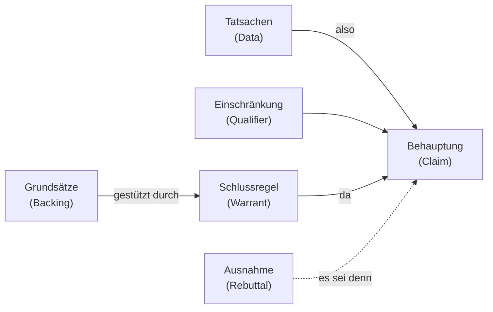

<!-- # Einführung -->

In den vorherigen Kapiteln haben wir die Grundlagen des kritischen Denkens kennengelernt. Nun wenden wir uns einer zentralen Frage zu: **Was ist ein gutes Argument?**

Im nächsten Teil werden wir dann die wichtigsten logischen Elemente kennenlernen.

## Argument und Argumentation

- Wir benutzen Argumente im Alltag oder in Diskussionen, um unsere **Ansichten zu begründen**, um unsere Standpunkte zu untermauern und andere Menschen zu überzeugen.

- **Argumentationen** sind meistens Dialoge, bei denen wir Gründe (Argumente) anführen, um eine Behauptung zu stützen.
- **Prämissen** : Die Aussagen (Ansichten, Meinungen) die wir anführen, um unsere Konklusion zu stützen sind unsere Gründe, unsere Argumente, oder Prämissen unserer Argumentation.
  - Die Dialogpartner sollten die Prämissen für wahr halten.
  - Alle Gründe (Prämissen) können akzeptiert oder zurückgewiesen werden.
- **Konklusion** : Die Behauptung, die wir zu stützen versuchen, die wir für wahr halten und die im Prinzip strittig ist. Sie wird die **Konklusion** unserer Argumentation.

## Toulmin Schema. Eine universelle Form Argumente zu beschreiben

Der britische Philosoph Stephen Toulmin entwickelte ein Modell, das den inneren Bau eines Arguments sichtbar macht. Im Zentrum steht die **Behauptung/Schlussfolgerung (Claim/Conclusion)**, die strittige Aussage, die wir stützen wollen. Sie ruht auf den **Daten, Tatsachen (Data)**, den unbestrittenen Belegen. Die Brücke zwischen Daten und Behauptung bildet die **Schlussregel (Warrant)**: eine meist unausgesprochene Regel, die erklärt, _warum_ die Daten die Behauptung tragen. Die Schlussregel selbst stützt sich auf die **Grundsätze (Backing)**, also auf Erfahrungswissen, Gesetze oder Theorien. Die **Einschränkung (Qualifier)** gibt an, wie sicher die Behauptung gilt ("vermutlich", "in der Regel"). Schliesslich nennt die **Ausnahme, Gegenrede (Rebuttal)** Bedingungen, unter denen das Argument nicht greift. So macht das Schema verborgene Annahmen und Schwachstellen einer Argumentation explizit.

## Beispiele von Argumentationen

- Manchmal argumentieren wir **kooperativ**, um gemeinsam die beste Lösung zu finden.

:::info Beispiel
_Beispiel einer kooperativen Argumentation_

- _Hans_: Bei welchem Telefonanbieter bist du denn?
- _Lotte_: Bei Billig-Tel
- _Hans_: Und bist du zufrieden mit dem Service? (_Was sind deine Gründe?_)
- _Lotte_: Die haben freie SMS und ausreichend Mobildaten für einen guten Preis. (_Grund eins und zwei etc.._)
  :::

- Manchmal wollen wir jemanden **überreden**, indem wir ihre Meinung ändern und ihr zeigen, dass es besser geht.

:::info Beispiel
_Beispiel einer überredenden Argumentation mit Gründen_

- _Hans_: Bist du immer noch bei Schmutz-Energie GmbH?
- _Lotte_: Ja klar, schon seit Jahren, werd ich auch bleiben.
- _Hans_: Aber jetzt gibt's doch EasyGreen. Die sind günstig, benutzen nur erneuerbare Energien und sind eine lokale Kooperative. (_Grund eins, Grund zwei, ..._)
- _Lotte_: Die Umwelt ist mir egal, aber günstig und lokal klingt gut, zeig mal her. (_Gründe werden abgewiesen oder akzeptiert_)
  :::

- Oft benutzen wir aber eher Emotionen wie Angst oder Hoffnung um Menschen zu überreden oder überzeugen.

:::info Beispiel
_Beispiel einer überredenden Argumentation mit Emotionen_

- _Hans_: Wir müssen mehr für Verteidigung ausgeben.
- _Lotte_: Warum?
- _Hans_: Sonst ist bald die Armee von Putin in Europa.
  :::

- Manchmal argumentieren wir **gegeneinander**, wie oft in der Politik.

:::info Beispiel
_Beispiel einer gegeneinander gerichteten Argumentation_

- _Hans_: Die Regierung will die Erbschaftssteuer erhöhen. Ist das nicht schrecklich.
- _Lotte_: Dass Dir das nicht gefällt, mit dein drei Häusern, kann ich verstehen, aber ich finde das richtig.
- _Hans_: Wieso das denn. Immer werden die bestraft, die viel arbeiten. Ich will meinen Kindern was vererben und das nicht an die Schmarotzer verschenken.
- _Lotte_: Steuern sind Umverteilung, ohne sie gäbe es keine soziale Gerechtigkeit.
- _Hans_: Zu viel Steuern, töten die Steuern. Wenn es so weitergeht, dann zieh ich in die USA.
  :::

- Meisten wollen wir zeigen, dass wir nicht hirnlos irgendetwas tun oder entscheiden, sondern dass wir **mit guten Gründen** unterwegs sind. Wir sind doch nicht blöd.
- Wir haben also immer etwas was wir glauben und begründen wollen und das nenne wir die Schlussfolgerung oder Konklusion.

## Überblick des Kapitels

### Gute und schlechte Argumente

Die Fähigkeit, **gute von schlechten Argumenten zu unterscheiden**, ist eine Kernkompetenz des kritischen Denkens und hilft uns, fundierte Entscheidungen zu treffen und uns vor Manipulation zu schützen.

Wir klären Kriterien wie **Relevanz** der Gründe, **Wahrheit** oder **Vertretbarkeit** der Prämissen sowie die logische Stützkraft in Richtung der Konklusion.\
Du lernst typische Fehlschlüsse zu erkennen und solide Argumente systematisch zu prüfen. \
Kurze Beispiele zeigen, wie du im Alltag bessere Entscheidungen triffst und dich gegen Manipulation schützt.

### Rhetorik vs Argumentation

Dieses Kapitel unterscheidet zwischen **rhetorischer Überzeugung** und **argumentativer Begründung**. Wir zeigen, wie Emotionen, Stilmittel und Framing wirken und wann sie Argumente stützen oder ersetzen. \
Du lernst, **persuasive Techniken** kritisch zu erkennen und in fairen Debatten den Vorrang guter Gründe zu wahren. Hinweise zur ethischen Kommunikation helfen, überzeugend und zugleich transparent zu argumentieren.

### Formales und informelles Argumentieren

Wir klären den Unterschied zwischen **formalen Schlussregeln** der Logik und **informellem Argumentieren** in natürlicher Sprache. \
Du erfährst, wann formale Strukturen nötig sind und wann pragmatische Plausibilitätsprüfungen genügen. Stärken und Schwächen beider Ansätze werden gegenübergestellt, inklusive typischer Fehlerquellen. Ziel ist, situationsgerecht die jeweils passende Prüfstrategie zu wählen.

### Muster gültiger Argumente

Hier lernst du klassische gültige Schlussmuster kennen, etwa **Modus Ponens**, **Modus Tollens**, hypothetische Ketten und disjunktive Schlüsse. \
Wir üben, diese Muster in Alltagsargumenten zu erkennen und eigene Begründungen darauf aufzubauen.
Außerdem zeigen wir häufige ungültige Muster und wie du sie vermeidest. Kurze Übungen festigen das Erkennen und Anwenden der Strukturen.

### Versteckte Annahmen

Viele Argumente enthalten **implizite Prämissen**, **Hintergrundannahmen** oder **stillschweigende Voraussetzungen**. \
Dieses Kapitel zeigt Fragetechniken, mit denen du solche Annahmen sichtbar machst und prüfst. Du lernst, Lücken in der Begründung zu schließen oder problematische Annahmen zu revidieren. So erhöhst du die Transparenz und Qualität deiner Argumentation.

### Etwas exakter: Definitionen

Zum Abschluss präzisieren wir zentrale Begriffe: **Argument**, **Prämisse**, **Konklusion**, **Gültigkeit** und **Tragfähigkeit (Solidität)**. \
Wir erläutern, warum saubere Definitionen Missverständnisse vermeiden und klare Prüfmaßstäbe liefern. Beispiele zeigen, wie diese Begriffe in Analysen und Debatten praktisch angewendet werden. Das Kapitel schafft ein gemeinsames Vokabular für die folgenden Teile.
