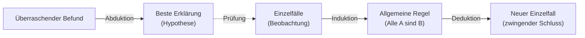

<!-- # Arten des Schließens -->

Bevor wir einzelne Argumentmuster betrachten, lohnt ein Blick auf die **grundlegenden Schlussformen**. Charles S. Peirce unterschied drei, die sich darin unterscheiden, **was wir voraussetzen und was wir gewinnen wollen**: eine Regel, einen Einzelfall oder eine Erklärung.

## Deduktion: von der Regel zum Fall

Bei der **Deduktion** schliessen wir von einer allgemeinen Regel auf einen Einzelfall. Sind die Prämissen wahr, ist die Schlussfolgerung **zwingend wahr**: Die Deduktion ist _wahrheitserhaltend_, schafft aber kein neues Wissen über die Welt, sondern macht nur explizit, was in den Prämissen schon steckt.

1. **Regel:** Alle Menschen sind sterblich.
2. **Fall:** Sokrates ist ein Mensch.
3. **Ergebnis:** Also ist Sokrates sterblich.

## Induktion: vom Fall zur Regel

Bei der **Induktion** verallgemeinern wir von beobachteten Einzelfällen zu einer Regel. Der Schluss ist **nicht zwingend**, sondern nur mehr oder weniger wahrscheinlich: Eine einzige Ausnahme kann die Regel kippen. Dafür liefert die Induktion _neues_ Wissen, das über die Beobachtungen hinausgeht.

1. **Fall:** Sokrates, Platon, Aristoteles … sind gestorben.
2. **Ergebnis (Regel):** Also sind vermutlich alle Menschen sterblich.

## Abduktion: vom Befund zur besten Erklärung

Bei der **Abduktion** suchen wir zu einer überraschenden Beobachtung die **plausibelste Erklärung** (Hypothese). Auch sie ist nicht zwingend, sondern eine begründete Vermutung, die sich später bestätigen oder widerlegen lässt.

1. **Befund:** Der Rasen ist nass.
2. **Regel:** Wenn es geregnet hat, ist der Rasen nass.
3. **Beste Erklärung:** Vermutlich hat es geregnet.

## Wie sie zusammenspielen

Die drei Formen greifen ineinander. Die **Deduktion lebt von Allaussagen** ("Alle A sind B"), doch solche universellen Sätze können wir streng genommen nie durch Beobachtung beweisen. Wir gewinnen sie meist **induktiv**, indem wir aus vielen Einzelfällen verallgemeinern. Die Deduktion ist also nur so sicher wie die induktiv erworbenen Regeln, auf denen sie aufbaut: Ihre Strenge erbt sie aus Prämissen, die selbst nur wahrscheinlich sind. Die **Abduktion** wiederum erzeugt die Hypothesen, die wir anschliessend induktiv prüfen und deduktiv weiterverwenden.

:::note Merksatz
**Deduktion** sichert, **Induktion** verallgemeinert, **Abduktion** erklärt. Nur die Deduktion ist wahrheitserhaltend; Induktion und Abduktion erweitern unser Wissen, bleiben aber unsicher.
:::

> Weiterführend: [Abduktion, Induktion, Deduktion (arbeitsblaetter.stangl-taller.at)](https://arbeitsblaetter.stangl-taller.at/DENKENTWICKLUNG/Abduktion-Induktion-Deduktion.shtml)
