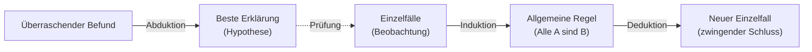

<!-- # Muster gültiger Argumente

https://www.youtube.com/watch?v=ZdkxigKjVI8
TODO: In eigenes File
 -->

Wie wir bereits im vorherigen Kapitel gesehen haben, gibt es bestimmte Argumentationsmuster, die immer gültig sind. Diese Muster bilden die Grundlage für logisch korrektes Schließen und können in verschiedenen Kontexten angewendet werden. Hier betrachten wir einige weitere wichtige Argumentationsmuster und ihre Anwendung.

## Deduktion, Induktion, Abduktion

Charles S. Peirce unterschied drei grundlegende Schlussformen, die sich darin unterscheiden, **was wir voraussetzen und was wir gewinnen wollen**: eine Regel, einen Einzelfall oder eine Erklärung.

### Deduktion: von der Regel zum Fall

Bei der **Deduktion** schliessen wir von einer allgemeinen Regel auf einen Einzelfall. Sind die Prämissen wahr, ist die Schlussfolgerung **zwingend wahr**: Die Deduktion ist _wahrheitserhaltend_, schafft aber kein neues Wissen über die Welt, sondern macht nur explizit, was in den Prämissen schon steckt.

1. **Regel:** Alle Menschen sind sterblich.
2. **Fall:** Sokrates ist ein Mensch.
3. **Ergebnis:** Also ist Sokrates sterblich.

### Induktion: vom Fall zur Regel

Bei der **Induktion** verallgemeinern wir von beobachteten Einzelfällen zu einer Regel. Der Schluss ist **nicht zwingend**, sondern nur mehr oder weniger wahrscheinlich: Eine einzige Ausnahme kann die Regel kippen. Dafür liefert die Induktion _neues_ Wissen, das über die Beobachtungen hinausgeht.

1. **Fall:** Sokrates, Platon, Aristoteles … sind gestorben.
2. **Ergebnis (Regel):** Also sind vermutlich alle Menschen sterblich.

### Abduktion: vom Befund zur besten Erklärung

Bei der **Abduktion** suchen wir zu einer überraschenden Beobachtung die **plausibelste Erklärung** (Hypothese). Auch sie ist nicht zwingend, sondern eine begründete Vermutung, die sich später bestätigen oder widerlegen lässt.

1. **Befund:** Der Rasen ist nass.
2. **Regel:** Wenn es geregnet hat, ist der Rasen nass.
3. **Beste Erklärung:** Vermutlich hat es geregnet.

### Wie sie zusammenspielen

Die drei Formen greifen ineinander. Die **Deduktion lebt von Allaussagen** ("Alle A sind B"), doch solche universellen Sätze können wir streng genommen nie durch Beobachtung beweisen. Wir gewinnen sie meist **induktiv**, indem wir aus vielen Einzelfällen verallgemeinern. Die Deduktion ist also nur so sicher wie die induktiv erworbenen Regeln, auf denen sie aufbaut: Ihre Strenge erbt sie aus Prämissen, die selbst nur wahrscheinlich sind. Die **Abduktion** wiederum erzeugt die Hypothesen, die wir anschliessend induktiv prüfen und deduktiv weiterverwenden.

:::note Merksatz
**Deduktion** sichert, **Induktion** verallgemeinert, **Abduktion** erklärt. Nur die Deduktion ist wahrheitserhaltend; Induktion und Abduktion erweitern unser Wissen, bleiben aber unsicher.
:::

> Weiterführend: [Abduktion, Induktion, Deduktion (arbeitsblaetter.stangl-taller.at)](https://arbeitsblaetter.stangl-taller.at/DENKENTWICKLUNG/Abduktion-Induktion-Deduktion.shtml)

## Kategorischer Syllogismus

Ein **kategorischer Syllogismus** ist ein deduktives Argument, das aus drei kategorischen Aussagen besteht: zwei Prämissen und einer Schlussfolgerung.

**Form:**

1. Alle/Einige A sind/sind nicht B. (Obersatz)
2. Alle/Einige B sind/sind nicht C. (Untersatz)
3. Daher: Alle/Einige A sind/sind nicht C. (Schlussfolgerung)

**Beispiel:**

1. Alle Planeten sind Himmelskörper.
2. Einige Himmelskörper sind gasförmig.
3. Daher sind einige Planeten gasförmig.

**Achtung:** Nicht alle Formen des kategorischen Syllogismus sind gültig. Die Gültigkeit hängt von der spezifischen Kombination der Quantoren (alle, einige) und der Anordnung der Begriffe ab.

## Reductio ad Absurdum (Beweis durch Widerspruch)

**Reductio ad Absurdum** ist eine Argumentationsform, bei der man die Negation der zu beweisenden Aussage annimmt und zeigt, dass diese Annahme zu einem Widerspruch führt.

**Form:**

1. Annahme: Nicht-A ist wahr.
2. Wenn Nicht-A wahr ist, dann folgt B.
3. B führt zu einem Widerspruch.
4. Daher muss A wahr sein.

**Beispiel:**

1. Annahme: Es gibt keine unendlich vielen Primzahlen.
2. Wenn es nur endlich viele Primzahlen gibt, können wir sie alle multiplizieren und 1 addieren, um eine neue Zahl N zu erhalten.
3. N ist entweder selbst eine Primzahl oder durch eine Primzahl teilbar, die nicht in unserer ursprünglichen Liste enthalten ist.
4. Dies widerspricht unserer Annahme, dass wir alle Primzahlen aufgelistet haben.
5. Daher muss es unendlich viele Primzahlen geben.

## Analogieargument

Ein **Analogieargument** schließt von Ähnlichkeiten zwischen zwei Dingen auf weitere Ähnlichkeiten.

**Form:**

1. A hat die Eigenschaften X, Y und Z.
2. B hat die Eigenschaften X und Y.
3. Daher hat B wahrscheinlich auch die Eigenschaft Z.

**Beispiel:**

1. Der Planet Mars hat eine feste Oberfläche, eine Atmosphäre und Wassereis an den Polen.
2. Die Erde hat eine feste Oberfläche, eine Atmosphäre und Wassereis an den Polen.
3. Die Erde beherbergt Leben.
4. Daher könnte der Mars möglicherweise auch Leben beherbergen.

Analogieargumente sind induktiv und liefern keine Gewissheit, sondern nur Wahrscheinlichkeiten. Ihre Stärke hängt davon ab, wie relevant die gemeinsamen Eigenschaften für die Schlussfolgerung sind.

## Abduktion (Schluss auf die beste Erklärung)

**Abduktion** ist eine Form des Schließens, bei der man von einer Beobachtung auf die wahrscheinlichste Erklärung schließt.

**Form:**

1. Beobachtung: Phänomen P tritt auf.
2. Erklärung E würde P gut erklären.
3. Keine andere Erklärung erklärt P so gut wie E.
4. Daher ist E wahrscheinlich wahr.

**Beispiel:**

1. Beobachtung: Der Rasen ist nass.
2. Erklärung: Es hat geregnet.
3. Alternative Erklärungen (Sprinkleranlage, Tau) sind weniger wahrscheinlich, da es keine Sprinkleranlage gibt und die Nässe zu stark für Tau ist.
4. Daher hat es wahrscheinlich geregnet.

Abduktion ist eine wichtige Form des Schließens in der Wissenschaft, Medizin und im Alltag, aber sie liefert keine Gewissheit. Die Stärke einer abduktiven Schlussfolgerung hängt davon ab, wie gut die Erklärung das Phänomen erklärt und wie viel besser sie ist als alternative Erklärungen.

## Anwendung im kritischen Denken

Das Verständnis dieser Argumentationsmuster ist für das kritische Denken aus mehreren Gründen wichtig:

1. Es ermöglicht die Identifizierung und Bewertung von Argumenten in verschiedenen Kontexten.

2. Es hilft, eigene Argumente strukturierter und überzeugender zu gestalten.

3. Es erleichtert das Erkennen von Fehlschlüssen, die gültigen Argumentationsmustern ähneln, aber logische Fehler enthalten.

4. Es fördert ein tieferes Verständnis der verschiedenen Arten des Schließens (deduktiv, induktiv, abduktiv) und ihrer jeweiligen Stärken und Grenzen.
