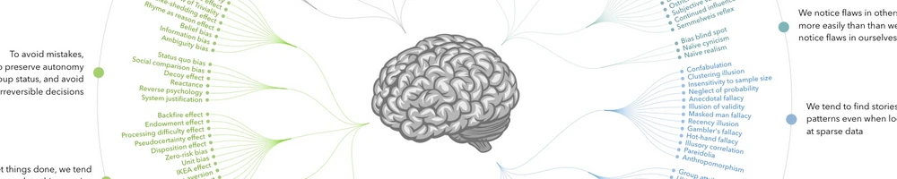

<!-- ## Einführung -->

&nbsp;

Haben Sie schon mal etwas gekauft, weil sie dachten, sie würden 50% sparen?

Oder bevorzugen sie auch die Herzklinik mit 90% Überlebensrate gegenüber der wo 10% sterben?

Willkommen im **Klub der Betrogenen und Getäuschten**!

Doch wer ist der Betrüger? Du selbst &mdash; dein Verstand !!

Unser Denken ist nicht so rational und objektiv, wie wir oft glauben. Selbst wenn wir uns bemühen, logisch und kritisch zu denken, können unbewusste mentale Prozesse unsere Urteile und Entscheidungen verzerren.\
Diese systematischen Abweichungen von Rationalität und gutem Urteilsvermögen werden als **kognitive Verzerrungen**, **Denkfehler**, oder **Wahrnehmungsfehler** (cognitive biases) bezeichnet.

In diesem Kapitel werden wir untersuchen, was kognitive Verzerrungen sind, wie sie entstehen und welche Auswirkungen sie auf unser Denken haben. Wir werden die wichtigsten dieser Denkfehler kennenlernen, mentale Heuristiken (Denkabkürzungen) untersuchen und Strategien entwickeln, um diese Denkfallen zu vermeiden.

## Unterkapitel

- [Was sind kognitive Verzerrungen?](./020-was-sind-kognitive-verzerrungen.md)
- [Wichtige kognitive Verzerrungen](./030-wichtige-kognitive-verzerrungen.md)
- [Mentale Heuristiken](./040-mentale-heuristiken.md)
- [Selbstüberschätzung und Dunning-Kruger-Effekt](./050-selbstueberschaetzung-und-dunning-kruger-effekt.md)
- [Strategien zur Überwindung kognitiver Verzerrungen](./060-strategien-zur-ueberwindung-kognitiver-verzerrungen.md)
- [Übung: Erkennen von kognitiven Verzerrungen in eigenen Denkprozessen](./070-uebung-erkennen-kognitiver-verzerrungen.md)
- [Zusammenfassung](./080-zusammenfassung.md)
- [Quiz: Kognitive Verzerrungen und mentale Heuristiken](./090-quiz.md)

