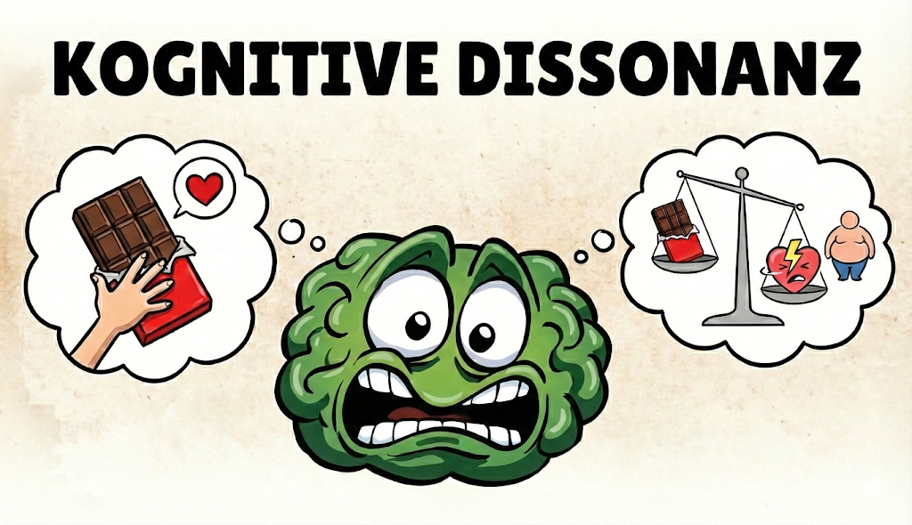

<!--  -->

:::tip Kurz
Widersprüche zwischen Überzeugungen und Verhalten erzeugen unbehagliche Spannungen, die wir schnell auflösen wollen.

_Ja, aber das ist etwas ganz anderes!_
:::

## Definition

**Kognitive Dissonanz** beschreibt den unangenehmen Zustand innerer Spannung, der entsteht, wenn Menschen gleichzeitig widersprüchliche Gedanken, Überzeugungen, Werte oder Verhaltensweisen haben.

Menschen sind motiviert, diese Spannung zu reduzieren, indem sie ihre **Einstellungen ändern**, **neue Informationen suchen** oder das **problematische Verhalten rationalisieren**.

EN: _Cognitive Dissonance_

## Verwandschaft

Kognitive Dissonanz hängt eng mit mehreren anderen Verzerrungen zusammen:

- **Bestätigungsfehler (Confirmation Bias):** Um Dissonanz zu vermeiden, suchen Menschen gezielt nach Informationen, die ihre bestehenden Überzeugungen stützen.
- **Rationalisierung:** Statt Verhalten zu ändern, werden nachträglich "gute Gründe" für problematisches Verhalten erfunden.
- **Selbstbetrug:** Die Realität wird verzerrt wahrgenommen, um Widersprüche zu vermeiden.
- **Sunk-Cost-Fallacy:** Bereits investierte Zeit oder Geld rechtfertigen irrationales Festhalten an schlechten Entscheidungen.
- **Status-quo-Bias:** Veränderungen werden vermieden, weil sie Dissonanz zwischen alten und neuen Überzeugungen schaffen könnten.
- **Motivated Reasoning:** Logik wird so eingesetzt, dass gewünschte Schlussfolgerungen entstehen, nicht objektive Wahrheiten.

## Beispiele

### Der Raucher

Ein Raucher weiß, dass Rauchen gesundheitsschädlich ist, raucht aber trotzdem weiter. Diese Dissonanz löst er auf, indem er sich einredet: "Mein Großvater hat auch geraucht und wurde 90 Jahre alt" oder "Das Leben ist sowieso gefährlich, da macht eine Zigarette auch nichts mehr aus."

Statt das Verhalten zu ändern, wird die Überzeugung angepasst.

### Der Umwelt-Aktivist mit SUV

Eine Person, die sich für Klimaschutz einsetzt, fährt gleichzeitig einen spritfressenden SUV. Die Dissonanz wird aufgelöst durch: "Ich brauche den SUV beruflich" oder "Mein individueller Beitrag ist eh unbedeutend, die Konzerne sind das Problem."

### Die teure Fehlentscheidung

Nach dem Kauf eines teuren, aber schlechten Produkts entsteht Dissonanz zwischen der Investition und der Enttäuschung. Statt den Fehler einzugestehen, wird das Produkt nachträglich schöngeredet: "Es hat zwar Schwächen, aber die Verarbeitung ist schon hochwertig."

### Der gestresste Workaholic

Jemand predigt Work-Life-Balance, arbeitet aber 70 Stunden pro Woche. Die Dissonanz wird aufgelöst durch: "Das ist nur vorübergehend" oder "Erfolgreiche Menschen müssen eben Opfer bringen."

## Auswirkungen

- Irrationale Rechtfertigungen für widersprüchliches Verhalten
- Widerstand gegen Verhaltensänderungen trotz besserer Einsicht
- Selbstbetrug und Realitätsverweigerung
- Verstärkung schädlicher Gewohnheiten durch nachträgliche Rationalisierung
- Eskalation von Fehlentscheidungen (Sunk-Cost-Effekt)

## Gegenstrategien

- **Selbstreflexion:** Regelmäßig nach Widersprüchen zwischen Werten und Verhalten suchen.
- **Fehler eingestehen:** Akzeptieren, dass Fehlentscheidungen menschlich sind, statt sie zu rechtfertigen.
- **Externe Perspektive:** Andere um ehrliches Feedback bitten, um blinde Flecken zu entdecken.
- **Kleine Schritte:** Verhalten schrittweise anpassen, statt nur Überzeugungen zu ändern.
- **Dissonanz aushalten:** Lernen, dass innere Spannungen normal sind und nicht sofort aufgelöst werden müssen.

## Quellen

- [Wikipedia: Kognitive Dissonanz](https://de.wikipedia.org/wiki/Kognitive_Dissonanz)
- Festinger, L. (1957). A Theory of Cognitive Dissonance. Stanford University Press.
- [Wissenschaftswelle - Kognitive Dissonanz](https://www.wissenschaftswelle.de/lexikon/kognitive-dissonanz)
- [YouTube: Was ist Kognitive Dissonanz?](https://www.youtube.com/watch?v=GH6KHa7ClE4)
- [YouTube: Sprouts Deutschland, Kognitive Dissonanz - Der Kampf der gegensätzlichen Glaubenssätze](https://www.youtube.com/watch?v=5wWqChGRWsM)
- [YouTube: Simon Josef Eckert, Kognitive Dissonanz - Ein Experiment von Festinger und Carlsmith von 1959](https://www.youtube.com/watch?v=xFrLNVnRfH4)
