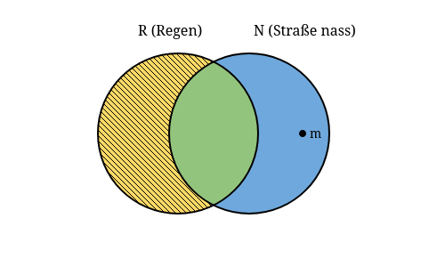

<!-- ## Formale Fehlschlüsse -->

Formale Fehlschlüsse verstoßen gegen die Regeln der formalen Logik. Sie sind strukturell fehlerhaft, unabhängig vom spezifischen Inhalt der Aussagen.

Alle formalen Fehlschlüsse sind spezielle Fälle von **Non sequitur** (lat. für "es folgt nicht")

## 1. Bestätigungsfehler des Nachsatzes (Affirming the Consequent)

Dieser Fehlschluss hat die folgende Form:

1. Wenn A, dann B.
2. B ist wahr.
3. Also ist A wahr.

### Beispiel:

1. Wenn es regnet, ist die Straße nass.
2. Die Straße ist nass.
3. Also regnet es.

### Warum ist das fehlerhaft?

Es gibt möglicherweise andere Gründe für eine nasse Straße (z.B. Straßenreinigung, ein geplatztes Wasserrohr). Der Fehlschluss besteht darin, von der Wahrheit des Nachsatzes (B) auf die Wahrheit des Vordersatzes (A) zu schließen.

### Venn-Diagram

<!-- 

  

 -->
<!-- https://freesvgeditor.com/fr/svg-editor-online -->
<svg width="500" height="300" xmlns="http://www.w3.org/2000/svg">
 <defs>
  <!-- Schraffur -->
  <!-- Clip für Schnittmenge -->
  <clipPath id="clipR">
   <circle cx="200" cy="150" r="90" id="svg_1"/>
  </clipPath>
  <!-- Maske für R \ N -->
  <mask id="maskN">
   <rect x="0" y="0" width="500" height="300" fill="white" id="svg_2"/>
   <circle cx="280" cy="150" r="90" fill="black" id="svg_3"/>
  </mask>
  <pattern id="hatch" patternUnits="userSpaceOnUse" width="6" height="6">
   <line x1="0" y1="0" x2="6" y2="6" stroke="black" id="svg_4"/>
  </pattern>
 </defs>
 <g>
  <title>Layer 1</title>
  <!-- Hintergrund -->
  <rect x="0" y="0" width="500" height="300" fill="white" id="svg_5"/>
  <!-- N (Straße nass) blau -->
  <circle cx="280" cy="150" r="90" fill="#6fa8dc" id="svg_6"/>
  <!-- R (Regen) gelb -->
  <circle cx="200" cy="150" r="90" fill="#ffd966" id="svg_7"/>
  <!-- Überschneidung R ∩ N grün -->
  <circle cx="280" cy="150" r="90" fill="#93c47d" clip-path="url(#clipR)" id="svg_8"/>
  <!-- Verbotener Bereich R \ N -->
  <circle cx="200" cy="150" r="90" fill="url(#hatch)" mask="url(#maskN)" id="svg_9"/>
  <!-- Umrisse -->
  <circle cx="200" cy="150" r="90" fill="none" stroke="black" stroke-width="2" id="svg_10"/>
  <circle cx="280" cy="150" r="90" fill="none" stroke="black" stroke-width="2" id="svg_11"/>
  <!-- Punkt m: nass, aber kein Regen -->
  <circle cx="320" cy="150" r="4" fill="black" id="svg_12"/>
  <!-- Labels -->
  <text x="328" y="155" font-size="14" id="svg_13">m</text>
  <text x="155" y="40" font-size="16" id="svg_14">R (Regen)</text>
  <text x="285" y="40" font-size="16" id="svg_15">N (Straße nass)</text>
 </g>
</svg>

## 2. Verneinung des Vordersatzes (Denying the Antecedent)

Dieser Fehlschluss hat die folgende Form:

1. Wenn A, dann B.
2. A ist nicht wahr.
3. Also ist B nicht wahr.

### Beispiel:

1. Wenn jemand Fieber hat, ist er krank.
2. Max hat kein Fieber.
3. Also ist Max nicht krank.

### Warum ist das fehlerhaft?

Es gibt möglicherweise andere Gründe, warum jemand krank sein könnte, auch ohne Fieber zu haben. Der Fehlschluss besteht darin, von der Falschheit des Vordersatzes (A) auf die Falschheit des Nachsatzes (B) zu schließen.

### Venn-Diagram

Das Venn-Diagram hat die gleiche Form wie im letzten Beispiel.

<!-- 

  

 -->

<svg width="500" height="300" xmlns="http://www.w3.org/2000/svg">
 <defs>
  <!-- Schraffur -->
  <!-- Clip für Schnittmenge -->
  <clipPath id="clipR">
   <circle cx="200" cy="150" r="90" id="svg_1"/>
  </clipPath>
  <!-- Maske für R \ N -->
  <mask id="maskN">
   <rect x="0" y="0" width="500" height="300" fill="white" id="svg_2"/>
   <circle cx="280" cy="150" r="90" fill="black" id="svg_3"/>
  </mask>
  <pattern id="hatch" patternUnits="userSpaceOnUse" width="6" height="6">
   <line x1="0" y1="0" x2="6" y2="6" stroke="black" id="svg_4"/>
  </pattern>
 </defs>
 <g>
  <title>Layer 1</title>
  <!-- Hintergrund -->
  <rect x="0" y="0" width="500" height="300" fill="white" id="svg_5"/>
  <!-- N (Straße nass) blau -->
  <circle cx="280" cy="150" r="90" fill="#6fa8dc" id="svg_6"/>
  <!-- R (Regen) gelb -->
  <circle cx="200" cy="150" r="90" fill="#ffd966" id="svg_7"/>
  <!-- Überschneidung R ∩ N grün -->
  <circle cx="280" cy="150" r="90" fill="#93c47d" clip-path="url(#clipR)" id="svg_8"/>
  <!-- Verbotener Bereich R \ N -->
  <circle cx="200" cy="150" r="90" fill="url(#hatch)" mask="url(#maskN)" id="svg_9"/>
  <!-- Umrisse -->
  <circle cx="200" cy="150" r="90" fill="none" stroke="black" stroke-width="2" id="svg_10"/>
  <circle cx="280" cy="150" r="90" fill="none" stroke="black" stroke-width="2" id="svg_11"/>
  <!-- Punkt m: nass, aber kein Regen -->
  <circle cx="320" cy="150" r="4" fill="black" id="svg_12"/>
  <!-- Labels -->
  <text x="328" y="155" font-size="14" id="svg_13">m</text>
  <text x="155" y="40" font-size="16" id="svg_14">F (Fieber)</text>
  <text x="285" y="40" font-size="16" id="svg_15">K (krank)</text>
 </g>
</svg>
<!-- TODO:  
Wenn ich in Wien bin, bin ich in Österreich.
	Ich bin nicht in Wien.
'non sequitur' 	Deshalb bin ich auch nicht in Österreich.  -->

## 3. Quaternio Terminorum (Vier-Begriffe-Fehlschluss)

Dieser Fehlschluss tritt in kategorischen Syllogismen auf, wenn ein Begriff in unterschiedlichen Bedeutungen verwendet wird, sodass der Syllogismus tatsächlich vier statt drei Begriffe enthält.

**Beispiel:**
1. Alle Sterne leuchten am Himmel.
2. Einige Filmschauspieler sind Stars (Sterne).
3. Also leuchten einige Filmschauspieler am Himmel.

**Warum ist das fehlerhaft?** Der Begriff "Stern/Star" wird in zwei verschiedenen Bedeutungen verwendet (Himmelskörper vs. berühmte Person). Dadurch enthält der Syllogismus tatsächlich vier statt drei Begriffe, was die logische Struktur ungültig macht.

## 4. Fehlschluss der unzureichenden Mitte (Undistributed Middle)

Dieser Fehlschluss tritt in kategorischen Syllogismen auf, wenn der Mittelbegriff in keiner der Prämissen vollständig (distributiv) verwendet wird.

**Beispiel:**
1. Alle Hunde sind Säugetiere.
2. Alle Katzen sind Säugetiere.
3. Also sind alle Hunde Katzen.

**Warum ist das fehlerhaft?** Der Mittelbegriff "Säugetiere" wird in keiner der Prämissen vollständig verwendet. Der Fehlschluss besteht darin, von einer gemeinsamen Eigenschaft (beide sind Säugetiere) auf Identität zu schließen.

### Venn-Diagram

Wie man sehen kann, gibt es nach dem Ausschluss (Schraffur) der Nicht-Säugetier-Hunde und Nicht-Säugetier-Katzen keine zwingende Überlappung zwischen Hunden und Katzen, obwohl beide Säugetiere sind. Unser Beispiel m ist ein Hund und Säugetier aber keine Katze.\
Die Informationen der Prämissen reichen aber nicht aus, um Tiere auszuschliessen die gleichzeitig Katzen und Hunde sind. 

<svg width="520" height="420" xmlns="http://www.w3.org/2000/svg">
 <defs>
  <!-- Schraffur -->
  <!-- Maske: alles außer S -->
  <mask id="maskS">
   <rect id="svg_1" fill="white" height="420" width="520" y="0" x="0"/>
   <circle id="svg_2" fill="black" r="110" cy="260" cx="260"/>
  </mask>
  <pattern height="6" width="6" patternUnits="userSpaceOnUse" id="hatch">
   <line id="svg_3" stroke="black" y2="6" x2="6" y1="0" x1="0"/>
  </pattern>
 </defs>
 <g>
  <title>Layer 1</title>
  <!-- Hintergrund -->
  <rect id="svg_4" fill="white" height="420" width="520" y="0" x="0"/>
  <!-- Kreise (gleich groß, symmetrisch) -->
  <!-- Hunde -->
  <circle id="svg_5" fill-opacity="0.6" fill="#ffd966" r="110" cy="170" cx="210"/>
  <!-- Katzen -->
  <circle id="svg_6" fill-opacity="0.6" fill="#6fa8dc" r="110" cy="170" cx="310"/>
  <!-- Säugetiere -->
  <circle id="svg_7" fill-opacity="0.3" fill="#e06666" r="110" cy="260" cx="260"/>
  <!-- Verbotene Bereiche -->
  <!-- H \ S -->
  <circle id="svg_8" mask="url(#maskS)" fill="url(#hatch)" r="110" cy="170" cx="210"/>
  <!-- K \ S -->
  <circle id="svg_9" mask="url(#maskS)" fill="url(#hatch)" r="110" cy="170" cx="310"/>
  <!-- Umrisse -->
  <circle id="svg_10" stroke-width="2" stroke="black" fill="none" r="110" cy="170" cx="210"/>
  <circle id="svg_11" stroke-width="2" stroke="black" fill="none" r="110" cy="170" cx="310"/>
  <circle id="svg_12" stroke-width="2" stroke="black" fill="none" r="110" cy="260" cx="260"/>
  <!-- Punkt m: Hund, Säugetier, keine Katze -->
  <circle id="svg_13" fill="black" r="4" cy="245" cx="190"/>
  <!-- Labels -->
  <text id="svg_14" font-size="14" y="250" x="200">m</text>
  <text id="svg_15" font-size="16" y="40" x="130">H (Hunde)</text>
  <text id="svg_16" font-size="16" y="40" x="360">K (Katzen)</text>
  <text id="svg_17" font-size="16" y="395" x="200">S (Säugetiere)</text>
 </g>
</svg>