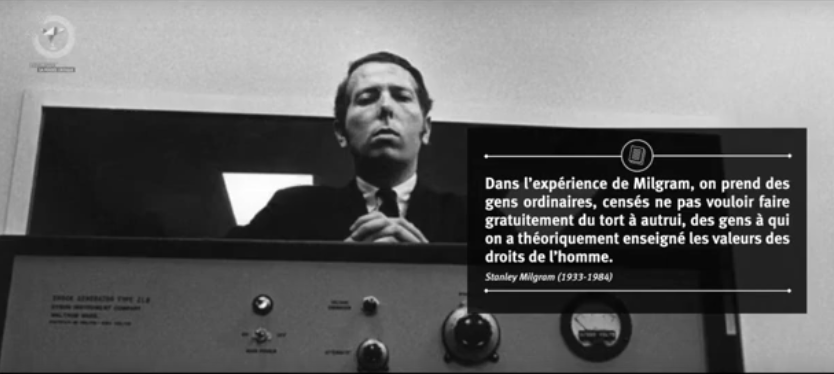
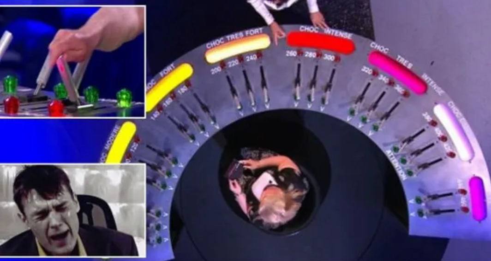

import React from 'react';
import ReactPlayer from 'react-player';

<ReactPlayer style={{ width: '100%', height: 'auto', aspectRatio: '16/9' }} controls src='https://www.youtube.com/watch?v=ct9plvDfjFw' />

&nbsp;

<!-- href="https://www.youtube.com/watch?v=ct9plvDfjFw"
  Pensée critique - Le jeu de la mort : 09 -->

## **1. De la soumission idéologique à l’obéissance ordinaire**

* **Différence entre nazisme et expérience de Milgram** :
  Le nazisme reposait sur une idéologie structurée (supériorité aryenne, antisémitisme) avec des sanctions extrêmes pour les désobéissants. À l’inverse, l’expérience de Milgram met en scène des individus ordinaires, sans motivation idéologique, et sans pression physique ni menace.

* **Eichmann et l’illusion de la bureaucratie** :
  Contrairement à ce qu’affirmait Hannah Arendt, Eichmann n’était pas qu’un simple exécutant bureaucratique ; des recherches ultérieures ont révélé une forte adhésion à l’idéologie nazie.

## **2. L’expérience de Milgram : obéissance sans contrainte**

* **Cadre de l’expérience** :
  Des participants croient infliger des chocs électriques à une autre personne. Le seul "pouvoir" du scientifique est son autorité morale et scientifique, sans coercition réelle.

* **Résultat troublant** :
  Malgré l’absence de menace, la majorité des participants obéissent aux ordres du scientifique, même lorsque la victime (complice) semble souffrir.

* **Renoncement à la pensée critique** :
  La soumission s’explique par la confiance aveugle envers la science. Le participant cesse de réfléchir de façon autonome.

## **3. La reproduction dans un jeu télévisé**

  
source: *[Le jeu de la mort - RTBF](https://www.rtbf.be/article/le-jeu-de-la-mort-un-docu-fiction-edifiant-5024583)*

* **Le "Jeu de la mort"** :
  Une variante de l’expérience est rejouée dans une émission de divertissement. Cette fois, ce n’est plus un scientifique mais une **animatrice télé (Tania Young)** qui dirige l’expérience, devant un public encourageant.

* **Résultat similaire** :
  La majorité des candidats vont jusqu’au bout, malgré les cris (simulés) de la victime.

* **Nature de l’autorité** :
  Il ne s’agit plus d’une autorité scientifique, mais d’une **pression sociale et médiatique**, sans fondement légitime. C’est la télévision et l’hystérie collective qui créent l’effet de conformité.

> "Le jeu de la mort" est un documentaire étonnant. Et inquiétant.  
> C'est un reportage sur les dangers de la télévision, en particulier dans le cadre de la téléréalité.  
> [rtbf.be](https://www.rtbf.be/article/le-jeu-de-la-mort-un-docu-fiction-edifiant-5024583)

## **4. Enjeux pour la pensée critique**

* **Soumission sans violence ni idéologie** :
  Contrairement au totalitarisme ou aux religions dogmatiques, ici l’autorité n’est ni violente ni sacralisée, mais **dérivée de la foule et de la culture médiatique**.

* **Pression intérieure et grégarité** :
  Le danger vient de l’intérieur de l’individu, de son désir de se conformer, même en l’absence de contrainte.

## **5. Conclusion : penser contre soi-même**

* **Leçons** :
  Même dans les sociétés démocratiques et dans des contextes légers (jeux, télévision), le **conformisme et la soumission à l’autorité** persistent.

* **Appel à la vigilance** :
  Il faut **"penser contre soi-même"**, c’est-à-dire cultiver une pensée critique capable de résister aux mécanismes de soumission, même les plus subtils.
