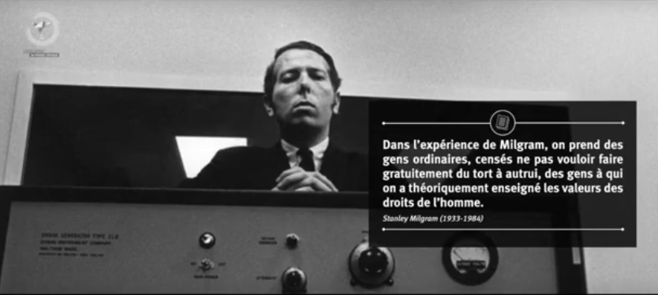
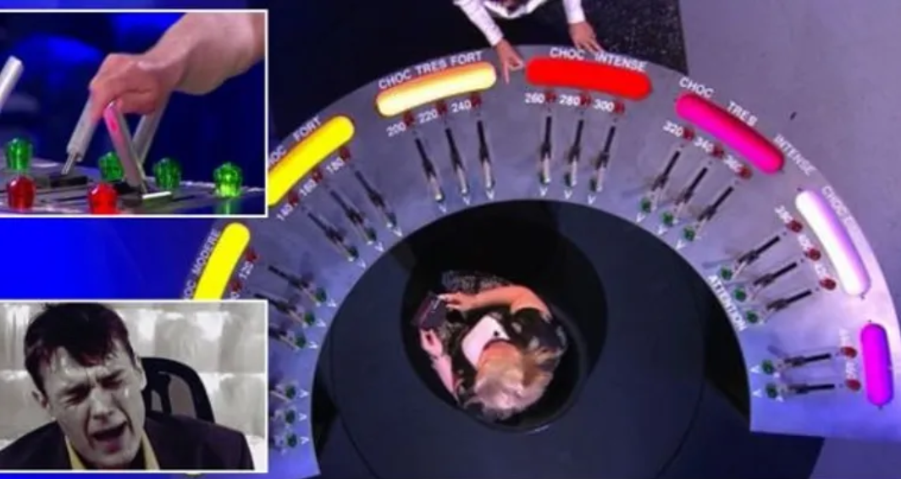

import React from 'react';
import ReactPlayer from 'react-player';

<ReactPlayer style={{ width: '100%', height: 'auto', aspectRatio: '16/9' }} controls src='https://www.youtube.com/watch?v=ct9plvDfjFw' />

&nbsp;

<!-- href="https://www.youtube.com/watch?v=ct9plvDfjFw"
  Pensée critique - Le jeu de la mort : 09 -->

## **1. De la soumission idéologique à l’obéissance ordinaire**

- **Différence entre nazisme et expérience de Milgram** :
  Le nazisme reposait sur une idéologie structurée (supériorité aryenne, antisémitisme) avec des sanctions extrêmes pour les désobéissants. À l’inverse, l’expérience de Milgram met en scène des individus ordinaires, sans motivation idéologique, et sans pression physique ni menace.

- **Eichmann et l’illusion de la bureaucratie** :
  Contrairement à ce qu’affirmait Hannah Arendt, Eichmann n’était pas qu’un simple exécutant bureaucratique ; des recherches ultérieures ont révélé une forte adhésion à l’idéologie nazie.

<h2>1. Von der ideologischen Unterwerfung zum gewöhnlichen Gehorsam</h2>

- **Unterschied zwischen Nationalsozialismus und Milgram-Experiment**:
  Der Nationalsozialismus beruhte auf einer strukturierten Ideologie (arische Überlegenheit, Antisemitismus) mit extremen Strafen für Ungehorsame. Umgekehrt inszeniert das Milgram-Experiment gewöhnliche Individuen, ohne ideologische Motivation und ohne körperlichen Druck oder Bedrohung.

- **Eichmann und die Illusion der Bürokratie**:
  Anders als Hannah Arendt behauptete, war Eichmann nicht bloß ein einfacher bürokratischer Vollstrecker; spätere Forschungen haben eine starke Anhängerschaft an die NS-Ideologie offenbart.

## **2. L’expérience de Milgram : obéissance sans contrainte**

<h2>2. Das Milgram-Experiment: Gehorsam ohne Zwang</h2>

- **Cadre de l’expérience** :
  Des participants croient infliger des chocs électriques à une autre personne. Le seul "pouvoir" du scientifique est son autorité morale et scientifique, sans coercition réelle.

- **Résultat troublant** :
  Malgré l’absence de menace, la majorité des participants obéissent aux ordres du scientifique, même lorsque la victime (complice) semble souffrir.

- **Renoncement à la pensée critique** :
  La soumission s’explique par la confiance aveugle envers la science. Le participant cesse de réfléchir de façon autonome.

- **Rahmen des Experiments**:
  Teilnehmer glauben, einer anderen Person Stromschläge zu versetzen. Die einzige „Macht" des Wissenschaftlers ist seine moralische und wissenschaftliche Autorität, ohne realen Zwang.

- **Verstörendes Ergebnis**:
  Trotz fehlender Bedrohung gehorcht die Mehrheit der Teilnehmer den Anweisungen des Wissenschaftlers, selbst wenn das Opfer (der Komplize) zu leiden scheint.

- **Verzicht auf das kritische Denken**:
  Die Unterwerfung erklärt sich durch das blinde Vertrauen in die Wissenschaft. Der Teilnehmer hört auf, eigenständig nachzudenken.

## **3. La reproduction dans un jeu télévisé**

<h2>3. Die Nachstellung in einer Fernsehshow</h2>

  
source: _[Le jeu de la mort - RTBF](https://www.rtbf.be/article/le-jeu-de-la-mort-un-docu-fiction-edifiant-5024583)_

- **Le "Jeu de la mort"** :
  Une variante de l’expérience est rejouée dans une émission de divertissement. Cette fois, ce n’est plus un scientifique mais une **animatrice télé (Tania Young)** qui dirige l’expérience, devant un public encourageant.

- **Résultat similaire** :
  La majorité des candidats vont jusqu’au bout, malgré les cris (simulés) de la victime.

- **Nature de l’autorité** :
  Il ne s’agit plus d’une autorité scientifique, mais d’une **pression sociale et médiatique**, sans fondement légitime. C’est la télévision et l’hystérie collective qui créent l’effet de conformité.

- **Das „Spiel des Todes"** (Le jeu de la mort):
  Eine Variante des Experiments wird in einer Unterhaltungssendung nachgestellt. Diesmal leitet nicht mehr ein Wissenschaftler, sondern eine **Fernsehmoderatorin (Tania Young)** das Experiment, vor einem anfeuernden Publikum.

- **Ähnliches Ergebnis**:
  Die Mehrheit der Kandidaten geht bis zum Ende, trotz der (gespielten) Schreie des Opfers.

- **Art der Autorität**:
  Es handelt sich nicht mehr um eine wissenschaftliche Autorität, sondern um einen **sozialen und medialen Druck**, ohne legitime Grundlage. Es sind das Fernsehen und die kollektive Hysterie, die den Konformitätseffekt erzeugen.

> "Le jeu de la mort" est un documentaire étonnant. Et inquiétant.  
> C'est un reportage sur les dangers de la télévision, en particulier dans le cadre de la téléréalité.  
> [rtbf.be](https://www.rtbf.be/article/le-jeu-de-la-mort-un-docu-fiction-edifiant-5024583)

> „Le jeu de la mort" ist ein erstaunliches Dokument. Und ein beunruhigendes.  
> Es ist eine Reportage über die Gefahren des Fernsehens, insbesondere im Rahmen des Reality-TV.  
> [rtbf.be](https://www.rtbf.be/article/le-jeu-de-la-mort-un-docu-fiction-edifiant-5024583)

## **4. Enjeux pour la pensée critique**

- **Soumission sans violence ni idéologie** :
  Contrairement au totalitarisme ou aux religions dogmatiques, ici l’autorité n’est ni violente ni sacralisée, mais **dérivée de la foule et de la culture médiatique**.

- **Pression intérieure et grégarité** :
  Le danger vient de l’intérieur de l’individu, de son désir de se conformer, même en l’absence de contrainte.

<h2>4. Herausforderungen für das kritische Denken</h2>

- **Unterwerfung ohne Gewalt und ohne Ideologie**:
  Anders als beim Totalitarismus oder bei dogmatischen Religionen ist die Autorität hier weder gewaltsam noch sakralisiert, sondern **aus der Masse und der Medienkultur abgeleitet**.

- **Innerer Druck und Herdentrieb**:
  Die Gefahr kommt aus dem Inneren des Individuums, aus seinem Wunsch, sich anzupassen, selbst ohne Zwang.

## **5. Conclusion : penser contre soi-même**

- **Leçons** :
  Même dans les sociétés démocratiques et dans des contextes légers (jeux, télévision), le **conformisme et la soumission à l’autorité** persistent.

- **Appel à la vigilance** :
  Il faut **"penser contre soi-même"**, c’est-à-dire cultiver une pensée critique capable de résister aux mécanismes de soumission, même les plus subtils.

<h2>5. Fazit: gegen sich selbst denken</h2>

- **Lehren**:
  Selbst in demokratischen Gesellschaften und in unbeschwerten Kontexten (Spiele, Fernsehen) bestehen **Konformismus und Unterwerfung unter die Autorität** fort.

- **Aufruf zur Wachsamkeit**:
  Man muss **„gegen sich selbst denken"**, das heißt, ein kritisches Denken pflegen, das den Mechanismen der Unterwerfung widerstehen kann, selbst den subtilsten.

