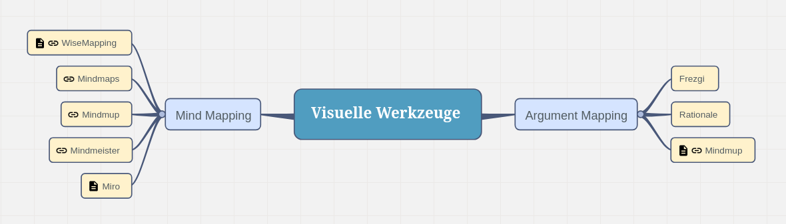
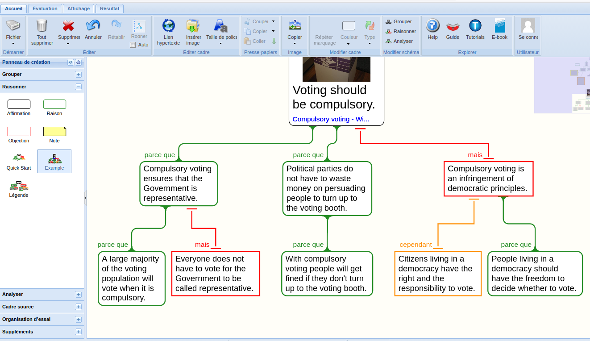

<!-- https://framindmap.org/c/maps/1573467/edit -->

Es gibt inzwischen digitale Werkzeuge zum analysieren, konstruieren und kartographieren von Argumenten.

Hier listen wir eine Auswahl von Werkzeugen zum Thema Kritisches Denken, Argumentation, Logik und Philosophie auf.\
Wir fügen immer wieder neue hinzu.

## Kritisches Denken und Argumentation

### Argument Map

**[Frezgi](https://frezgi.com/)**

<!--  -->

- Das ist die einfachste Argument-mapping App, die sie sich vorstellen können.
- Frei und **open-source** (MIT): https://github.com/Claritrie/Frezgi. Sie können mitmachen.

**[Rationale](https://rationaleonline.com/)**

<!--  -->

- Rationale ist eine kommerzielle funkionsreiche Web Applikation, die es erlaubt Argumentationen zu kartographieren.
- Sie können alles spreichern und exportieren.
- Mit einem [e-Buch](https://docs.rationaleonline.com/e-book/1-critical-thinking)

### Mindmap WebApps

**[Framindmap](https://framindmap.org/)**

- Framindmap ist eine **open-source** Web Anwendung basierend auf WiseMapping.
- Sie können beliebig viele Karten erstellen, teilen und zusammenarbeiten.
- Framindmap hat alle wichtigen Funktionen.

**[Mindmaps](https://www.mindmaps.app)**

- Mindmaps ist eine **einfache** gut aussehende Mindmap Webapplication.
- Die App ist kostenfrei und **open-source** (AGPL V3): https://github.com/drichard/mindmaps. Sie dürfen spenden.
- Sie können die Karten direkt auf ihrem Computer, im Browser, in der Clound (Dropbox, Google Drive) oder als Bilder abspeichern 
- Man kann Äste nicht verschieben oder neu anordnen.

**[Mindmup](https://www.mindmup.com/)**

- Mindmup ist eine kommerzielle App mit einem grosszügigem freien Tier.
- Hat beliebig viele Karten.

**[Mindmeister](https://www.mindmeister.com)**

- Gute Mindmapping App.
- Hat viele Funktionen, Themen und Vorlagen.
- Ist stark limitiert in der kostenlosen Version: hat nur 3 freie Karten.

**[Miro](https://miro.com)**

- Eine der besten kommerziellen Apps, wo sie richtig bezahlen dürfen.
- Hat viele Funktionen, Themen und Vorlagen, die sie als Privatperson wahrscheinlich nicht brauchen.

<!-- ## Logik
 -->

