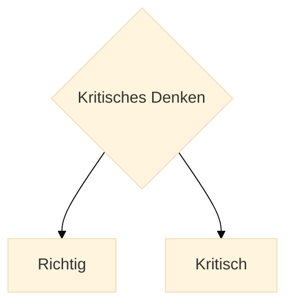

 Hier geben wir eine sehr kurze Zusammenfassung des gesamten Tutorials zum Kritischen Denken.

## Was ist Kritisches Denken ?

Als **kritisch denkender** Mensch **hinterfragst** du alle Behauptungen: von  Mitmenschen, Organisationen und von Firmen, die dir sagen wollen, was gut für dich ist.  

**Kritisches Denken hilft dir dabei**.
&nbsp;

:::info Zitat
 "_Aufklärung ist der Ausgang des Menschen aus seiner selbstverschuldeten Unmündigkeit._"

 &mdash; Immanuel Kant: *Was ist Aufklärung*[^1]
:::

[^1]: Einleitung in Kants berühmten Aufsatz ("[Was ist Aufklärung](https://de.wikisource.org/wiki/Beantwortung_der_Frage:_Was_ist_Aufkl%C3%A4rung%3F)")  
**Aufklärung ist der Ausgang des Menschen aus seiner selbst verschuldeten Unmündigkeit. Unmündigkeit** ist das Unvermögen, sich seines Verstandes ohne Leitung eines anderen zu bedienen. **Selbstverschuldet** ist diese Unmündigkeit, wenn die Ursache derselben nicht am Mangel des Verstandes, sondern der Entschließung und des Muthes liegt, sich seiner ohne Leitung eines andern zu bedienen. **Sapere aude!** Habe Muth dich deines **eigenen** Verstandes zu bedienen! ist also der Wahlspruch der Aufklärung. 

&nbsp;
Kritisches Denken hat zwei Hemisphären.

  

&nbsp;

Wir haben zwei grosse Fragen.  

1. Wie denkt man **richtig**?  
  Die Antwort darauf ist eine **Fähigkeit**, wie "Fahrrad fahren".

2. Wie denkt man **kritisch**?  
  Die Antwort darauf ist eine **Einstellung**, wie "auf der Hut sein", die wir bei Gelegenheit einnehmen.

Keine Sorge. Beides kann man lernen.

## Wie denkst Du richtig?

**Richtig** zu denken kannst Du lernen, indem du ein paar Fähigkeiten trainierst:

### Logisch denken

Was heisst "*logisch denken*"? Wir können doch alle immer schon denken.

:::tip
Logisch denken können heisst : von **wahren Voraussetzungen** auf **wahre Schlussfolgerungen** schliessen können.
:::

Die **Logik** ist eine riesiges Fach, aber zum Glück für uns Laien, brauchen wir im Alltag nur ganz wenig davon, die wesentlichen Grundlagen.

Die **wesentlichen Grundlagen** der Logik solltest Du aber beherrschen, sonst versteht du nur Bahnhof. 

### Argumentieren 

Argumentieren hat etwas mit Logik zu tun. Aber nicht alle guten Argumente sind formal logisch richtig.

Du musst lernen, wie Leute argumentieren und **wie man argumentieren sollte**.

Du musst verstehen, **wie gute Argumente funktionieren** und wie schlechte Argumente aussehen.

### Sprachverhexung

Um klar und kritisch zu denken, müssen wir lernen **Sprachfallen aufzudecken** und sie zu umgehen.

Sehr oft spielt uns die Sprache selbst einen Streich:

- **Geladene Sprache**, z. B.: "Unser unterbelichteter Präsident hat gesagt ..."
- **Unsinn**, z. B.: "Wie spät ist es eigentlich auf dem Mond gerade?"
- **Schiefe Definitionen**, z. B.: "Der Mensch ist ein federloser Zweibeiner"

Exakte Sprache brauchen wir im Recht, auf Arbeit, in der Wissenschaft und Technik, seltener aber auf Grill Parties oder beim Flirten.

### Quellenprüfung

Eine der wichtigsten Fähigkeit die wir lernen oder beherrschen sollten ist die, unsere **Quellen überprüfen** zu können. 
Alle unsere Überzeugungen stützen sich auf Quellen ganz verschiedener Art: Textquellen, Erzählungen, eigene Erfahrungen oder die Anderer.
Die Qualität unserer Quellen ist dabei sehr unterschiedlich.
Hier ein paar Beispiele: 
- "Die beste Art schnell reich zu werden ist, mein Buch zu kaufen" 
<!--  -->
- "Rauchen ist cool und nicht schädlich für die Gesundheit!", gezeichnet Dr. Marlboro 
  <!--   -->
- "Die Mehrheit der Amerikaner geht davon aus, dass Kennedy Opfer einer Verschwörung wurde". (Wikipedia) 
- "Der Einfluss des Menschen auf das Klima ist eindeutig“ Weltklimarat (IPCC) 

Ich lasse Dich entscheiden, wem Du lieber vertraust.

### Klassische Fehlschlüsse (Fallacy)

Eine weitere wichtige Fähigkeit, ist die, sich nicht von Fehlschlüssen verhexen lassen.
Einige der Besten Bücher zum Thema beschäftigen sich fast nur mit Fehlschlüssen oder Bias.
Bekannte Bespiele für klassische Fehlschlüsse sind:

- **Ad Hominem**: Angriff auf die Person statt auf das Argument.
- **Strohmann**: Das Argument des Gegners wird verzerrt, um es leichter angreifen zu können.
- **Falsches Dilemma**: Es werden nur zwei Möglichkeiten dargestellt, obwohl es mehr gibt.
- **Zirkelschluss**: Die Behauptung wird durch sich selbst begründet.
- **Autoritätsargument**: Etwas wird für wahr gehalten, weil eine Autorität es sagt.

Es gibt einen ganzen Zoo von bekannten Fehlschlüssen. Wir werden die wichtigsten im Detail besprechen.

### Kognitive Verzerrungen (Biases)

Nicht nur Fehlschlüsse, sondern auch kognitive Verzerrungen, stehen unserer Rationalität auf den Füßen. Diese Verzerrungen (Biases) sind oft tief in unserem Gehirn verankert und können uns blind für die Realität machen.
Bekannte Bespiele für kognitive Verzerrungen sind:

- **Konfirmationsbias**: Wir suchen nur nach Informationen, die unsere Meinung bestätigen.
- **Anker-Effekt**: Unsere Meinung wird durch den ersten Eindruck beeinflusst.
- **Halo-Effekt**: Ein gutes Gesamtbild führt zu positiven Urteilen in allen Bereichen.
- **Selbstüberbewertung**: Wir sind oft zu optimistisch über unsere Fähigkeiten und Leistungen.

Auch hier gibt es duzende Beispiele: lustige, überraschende, besorgniserregende und beinahe gefährliche, die wir später im Detail besprechen werden. 
Wir sehen als Menschen dabei so dumm und bemitleidenswert aus, dass wir uns fragen: wieso lernen wir das nicht in der Schule?

### Paradoxien und Dilemmas

Was richtiges Denken von fehlerhaftem Denken unterscheidet, kann man gut in Extremsituationen erkennen.  
Da, wo unser Denken an den Rand des Denkbaren gerät: an den Steilhängen der Paradoxien und Dilemmas, da wo die Widersprüche hausen.  
Da finden wir uns nicht mehr zurecht und  sind ratlos. Da müssen wir überlegen, ob wir unsere üblichen Denkweisen anwenden können, oder ob wir neue Denkweisen entwickeln müssen, um die Situation zu meistern.  
Typische Beispiele für Paradoxien und Dilemmas sind:

- **Paradoxien des Unendlichen**: das unendlich kleine und das unendlich große. Es gibt mächtigere Unendlichkeiten als die unendliche Menge der natürlichen Zahlen.
- **Zenonsche Paradoxien** der Bewegung (Achilles und die Schildkröte): Wenn Achilles schneller läuft als eine Schildkröte, wie kann er sie jemals einholen, wenn sie einen Vorsprung hat?
- **Paradoxon von Theseus**: Wenn man alle Planken eines alten Schiffes wechselt, ist es noch dasselbe Schiff?
- **Paradoxon des Epimenides**: Epimenides der Kreter sagt, dass alle Kreter lügen. Lügt er? 
- **Paradoxon von Russell**: Die Menge M aller Mengen, die sich nicht selbst enthalten. Enthält M sich selbst oder nicht?
- **Das Theodizee-Problem**: Warum gibt es so viel Leid in der Welt, wenn es einen allmächtigen, allwissenden und allgütigen Gott gibt?
- **Trolley-Problem**: Wenn du eine Schiene umlenkst, stirbt eine Person. Wenn du nichts tust, stirbt eine andere. Was tust du?
- **Das Dilemma der Meinungsfreiheit**: Wenn es absolute Meinungsfreiheit gibt, müssen wir dann Intoleranz tolerieren und in kauf nehmen, dass man uns der Meinungsfreiheit beraubt?

## Wie denkst du kritisch?

Jetzt kommen wir zum kritischen Teil. "Kritisch" ist hier eine unabdingbare Einstellung zu sich selbst, zu jeder Art von Behauptung, Hypothese, Theorie, zu Quellen aller Art, zur Wissenschaft und Kultur und selbst zu Werten.

- Das soll nicht heissen, dass wir immer überall und alles hinterfragen sollten. Oh nein, bitte nicht. Da würden wir schlicht verrückt werden.
- Etablierte Theorien oder in meiner Kultur verwurzelte Werte sollte man nur in Frage stellen, wenn sich **Widersprüche** mit meinem Leben oder meiner Forschung auftun. Widersprüche sind das Treibmittel des Fortschritts.

### Selbstkritik

Meistens wissen wir schon, wo wir hinwollen, wofür oder wogegen wir sind, weil wir eben immer schon **Teil einer Kultur** oder Subkultur sind. 

Wir sind voller **Überzeugungen**; wir sind uns **ganz sicher**. 
Die meiste Energie unseres Denken benutzen wir nicht, um ein angemessene oder "richtige" Lösungen auf gegebene Probleme zu finden, sondern um unsere **Vorurteile zu bestätigen**.  
Unsere Gesellschaft ist voller gegensätzlicher Überzeugungen:

- Es gibt a) nur einen Gott und dieser ist zufällig der, an den ich glaube. Gott sei Dank! Oder: b) an Gott kann man glauben wie man will, es ist nur kein wissenschaftlicher Ausdruck. 
- Die Erde ist a) ungefähr rund. Oder b) flach oder eckig.
- Nichts kann sich schneller als das Licht bewegen ausser schlechte Nachrichten.
- Corona19 war a) eine schwere Epidemie, b) eine Verschwörung der Weltregierung.
- Homosexualität ist a) ein natürliches Phänomen und moralisch neutral, b) eine Krankheit und Gott nicht gefällig.
- Wir konstatieren a) eine menschengemachte Klimakrise oder b) bestreiten dies.
- usw, usw.

Wir haben meistens **eine feste Meinung** und **öfter keine Ahnung**.
Bitte 50 mal nachsagen: 

**"Ich kann mich irren, ich habe mich geirrt, ich werde mich irren."**

Ist das schlimm? Nein. Wir müssen einfach offen sein für **Fehlersuche**, konstruktive Kritik, **Hinterfragung**.

- Bei Examen in der Schule sagte die Lehrerin: **überprüfe** deine Resultate bevor du abgibst.
- In der Technik nennen wir es **Testen**.
- In der Produktion heisst es **Qualitätskontrolle**.
- In der Wissenschaft fragen wir andere nach "**Peer-reviews**".

### Zuhören und Offenheit

- Wir sollten mehr zuhören ohne immer gleich zu urteilen. Das ist die Basis einer offenen Gesellschaft. 
- Nicht alle Rechten sind Nazis, nicht alle Linken sind Chaoten.
- Offen sein für die Erfahrung anderer.
- Oft hören wir nicht einmal den Satz zu ende und haben schon geurteilt.
- Andere Menschen haben andere Prioritäten und wir haben schräge Meinungen dazu:
  - das Kind will ein neues Spielzeug (was für ein Unsinn, braucht nicht noch eins)
  - der Jugentliche träumt davon, ein Musikstar zu sein (das wird ja eh nix, hast du dich mal singen gehört)
  - jemand will eine neuen Sportwagen (wozu das denn, das ist teuer und verpestet die Umwelt)
  - jemand isst seit Jahren kein Fleisch mehr (das ideologisch hirnverbrannt und gesundheitsschädlich)

- Hier brauchen wir eine Änderung der Einstellung. Wir sind offen für Gegenargumente, hören andere Meinungen.

### Zurückhaltung meines Urteils

Im kritischen Denken ist die **Zurückhaltung des Urteils** ein zentraler Punkt.  
Schon in der Antike ist die Zurückhaltung des Urteils, als Epoché bezeichnet, ein wichtiger Punkt in der Philosophie und wurde von Philosophen wie Pyrrhon und Sextus Empiricus verwendet.  
Auch im Zen-Buddhismus wird die Zurückhaltung des Urteils durch das Prinzip des **Nicht-Anhaftens** (Non-Attachment) verkörpert. Es bedeutet, sich nicht an festen Meinungen oder Überzeugungen festzuhalten.

- **Offenheit für neue Informationen**: Zurückhaltung des Urteils ermöglicht es, neue Informationen und Perspektiven zu berücksichtigen, ohne voreilige Schlüsse zu ziehen.
- **Vermeidung von Voreingenommenheit**: Durch das Zurückhalten des Urteils kann man vermeiden, dass vorgefasste Meinungen und Vorurteile die Analyse beeinflussen.
- **Gründliche Analyse**: Es erlaubt uns eine gründlichere und objektivere Analyse der vorliegenden Informationen und Argumente.
- **Flexibilität im Denken**: Zurückhaltung des Urteils fördert die Flexibilität im Denken und ermöglicht es, verschiedene Sichtweisen zu berücksichtigen.

