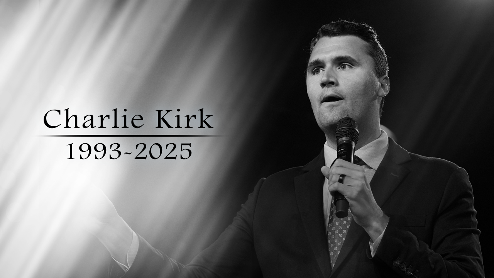

import Admonition from '@theme/Admonition';

## Wer war Charlie Kirk?

Charlie Kirk ist tot. Ruhe seine Seele in Frieden!

Neutral gesagt: Charlie Kirk war ein amerikanischer politischer Kommentator und Aktivist, der für seine konservativen Ansichten bekannt ist. 
Er hat sich in den sozialen Medien und auf verschiedenen Medienplattformen einen Namen gemacht, indem er kontroverse Themen anspricht 
und oft provokative Meinungen äußert.

Er wird für seine Äußerungen und die Produktion ultrakonservativer, rassistischer, frauenfeindlicher, klimaskeptischer, 
verschwörungstheoretischer, populistischer, christlich-nationalistischer Inhalte kritisiert und vertritt eine wörtliche Bibelauslegung. 
[Wikipedia, Charlie Kirk](https://en.wikipedia.org/wiki/Charlie_Kirk#Political_positions_and_activities)

Manche sagen mir, oh, Kirk hat aber nicht nur schlimme Sachen gesagt. Manches ist ja auch richtig.  
Er liebte seine Mutter und Pfannkuchen und wir lieben das auch.\
Tool, da sind wir uns ja einig. Nein! 
**Aber ich schreibe keinen Artikel darüber, wie toll Pfannkuchen sind, sondern über Kirk's manipulative Rhetorik.**

### Meine Meinung über den politischen Sophisten Charlie Kirk

- Kirk ist ein politischer Sophist. (In dem guten alten Sinne von Platon, als jemand, der _das schwächere Argument zum stärkeren macht_. Siehe: [Sophisten](https://de.wikipedia.org/wiki/Sophisten#Antike))
- Er benutzt oft, ohne rot zu werden, rhetorische Tricks und manipulative Argumentationstechniken.
- Er setzt diese ein, um seine Ziele zu erreichen, die oft einer Mehrheit von Amerikanern schaden.
- Er verdreht nicht nur die Wahrheit zugunsten seiner eigenen Agenda, sondern verwendet auch oft emotional aufgeladene Sprache, um seine Zuhörer zu beeinflussen.
- Er ist ein Meister darin, komplexe Themen zu vereinfachen und sie in einer Weise zu präsentieren, die seine Anhänger anspricht, 
während er gleichzeitig kritische Fragen und Gegenargumente ignoriert oder abtut.
- Er ist ein Paradebeispiel dafür, wie politische Sophisten die öffentliche Meinung manipulieren können, indem sie rhetorische Fähigkeiten einsetzen, 
um ihre eigenen Interessen zu fördern, oft auf Kosten der Wahrheit und des Gemeinwohls.
- Sein Stil ist reich an persuasiven Techniken (Pathos), aber oft arm an rigoroser, fairer und evidenzbasierter Argumentation (Logos). 
Für einen kritischen Zuhörer sind seine Argumente daher oft anfällig für Dekonstruktion, 
da sie auf logischen Fehlschlüssen und rhetorischen Verdrehungen beruhen.

- Er ist ein Beispiel dafür, **wie man nicht argumentieren sollte**, wenn man eine respektvolle und konstruktive Diskussion führen möchte.

- Kirk ist auch ein Beispiel dafür, **wie man viel Geld verdienen kann** mit populistischen, polarisierenden und oft irreführenden Inhalten.

## Wichtigste Themen / Thesen von Charlie Kirk

### Kritik an "Woke"-Kultur

- Kirk sieht eine aggressive linke / progressive Bewegung, die über Universitäten, Medien und Politik versucht, konservative Werte zu unterdrücken bzw. zu marginalisieren.
    - Es gibt natürlich absolut übertriebene Ausdrücke von "Woke"-Kultur, die manche Leute nerven.
    - Kirk aber greift diese Übertreibungen an (Strohmann-Argument) und tut so, als sei das die ganze Realität.

- Er fordert Gegenmaßnahmen: Redefreiheit, Ablehnung von Diversitäts- und Gleichstellungsprogrammen etc.
    - "Redefreiheit" in den USA wird oft ganz anders verstanden als in Europa.
    - In den USA darf man fast alles sagen, auch Hass, Hetze und offensichtlich falsche Theorien, Diskriminierung, solange man nicht direkt zu Gewalt aufruft.

### Unterstützung von MAGA und Trumpismus

- Kirk steht für konservative Politik, häufig verbunden mit Donald Trump und der MAGA-Bewegung. 
- Er betont Patriotismus, Souveränität, starken Staat gegen Globalismus. ([Wikipedia][1])

### Wirtschaftsliberalismus & Minimalstaat

- Kirk wirbt für geringe staatliche Regulierung, niedrige Steuern, weniger Einmischung, besonders in Bildung und Wirtschaft.
- Kirk argumentiert, dass Überregulierung Innovation und Freiheit hemmt.

### Soziale / religiöse konservative Werte 

- Viele seiner sozialen Positionen sind stark von einer einseitigen Auslegung der christlichen Religion geprägt. ([Wikipedia][1], [NEA][2])

- **Gegen Abtreibung** (Pro-Life)
    - Das ist kein Problem, er kann natürlich gegen Abtreibung sein. Da sind wir eben nicht einer Meinung.
    - Kirk wollte auch Abtreibung in Fällen von **Vergewaltigung** oder Inzest verbieten.
    - Kirk vertrat aber auch die (viel stärkere) Meinung, dass Abtreibung **schlimmer als der Holocaust** sei. (OMG!)

- Er wirbt für die **traditionelle Familie** und gegen alle anderen Formen von Familie.
    - Ja, sehr schön, niemand hat etwas gegen die traditionelle Familie als **eine Option** unter anderen.
    - Aber er ignoriert, dass viele Menschen andere Lebensmodelle wählen und dass Vielfalt bereichernd sein kann.
    - Kirk stellt seine Vorstellung der traditionellen Familie als die **einzig richtige** dar, was nicht nur engstirnig, sondern auch diskriminierend ist.
    - LGBTQ+-Befürworter sagen ja nicht, dass die traditionelle Familie abgeschafft werden soll, sondern dass es **mehrere** Familienmodelle geben kann.

- Er ist **gegen Einwanderung**.
    - Auch das ist sein gutes Recht, aber seine Argumente sind oft übertrieben und emotional aufgeladen.
    - Er stellt Einwanderer oft als Bedrohung für die nationale Sicherheit und die wirtschaftliche Stabilität dar, was nicht durch Fakten gedeckt ist.

- Er argumentiert **gegen Gleichberechtigung** der Frauen.
    - Er sieht Frauenrechte oft als Bedrohung für traditionelle Werte und die Familie.
    - Das ist Schrott aus der Geschichte: Alle Argumente, die er gegen Frauenrechte vorbringt, sind langweilige, alte Klischees. 
    - Er argumentiert gern mit "natürlichen" Geschlechterrollen, die wissenschaftlich nicht haltbar sind.
    - Oder er stützt sich auf religiöse Dogmen und auf _seine_ Auslegung der Bibel, die nicht für alle Menschen gelten.

- Er hat sich ganz klar **gegen LGBTQ+-Rechte** ausgesprochen.
    - Er ist homophob und transphob.
    - Er sieht LGBTQ+-Identitäten oft als Bedrohung für traditionelle Werte und die Familie.
    - Auch hier bringt er langweilige, alte Klischees und religiöse Dogmen vor.
    - Viele standard Heteros wie ich fühlen sich durch z. B. Transgender-Personen irritiert, in deren Anwesenheit unsicher und unwohl. 
    Aber das ist kein Grund, diese Menschen zu diskriminieren oder zu hassen.

- Er hat eine starke Bindung an **christliche Identität** / christlichen Nationalismus.
    - Er ist nicht nur Christ (behauptet er), sondern sieht Amerika als "christliche Nation".
    - Eine Religion zu haben, ist natürlich sein gutes Recht. 
    - Aber eine christliche Nation zu fordern, ist religiöser Absolutismus und ist daher gefährlich und ausschließend.
    - Es ist interessant, dass Kirk natürlich gegen alle anderen Arten von Absolutismus wettert,
     z. B. Islamismus, Marxismus, Feminismus, aber sein eigener Absolutismus ist natürlich der einzig wahre.

- Er hat öffentlich den **Civil Rights Act von 1964/65 kritisiert**.
    - Der _Civil Rights Act_ ist ein Gesetz, das Diskriminierung aufgrund von Rasse, Hautfarbe, Religion, Geschlecht oder nationaler Herkunft verbietet.
    - Kirk argumentiert, dass dieses Gesetz zu weit geht und die Rechte von Unternehmen und Einzelpersonen einschränkt.
    - Das ist eine gefährliche Position, die die Fortschritte der Bürgerrechtsbewegung in Frage stellt. 

- Er spricht sich gegen jede **Waffenkontrolle** aus.
    - Das ist natürlich sein gutes Recht, aber es ist eine gefährliche Position, die viele Menschenleben kostet.
    - Kirk: "Es lohnt sich, die Kosten für die leider jedes Jahr auftretenden Todesfälle durch 
    Schusswaffen in Kauf zu nehmen, damit wir das 2. Amendment haben können, um unsere anderen Rechte zu beschützen. 
    Das ist ein vernünftiger Deal. Es ist rational."
    - Er ignoriert die Tatsache, dass strengere Waffengesetze in anderen Ländern zu viel weniger Gewalt führen.
    - Es ist eine bittere Ironie des Schicksals, dass er in einem Land erschossen wurde, in dem so viele Menschen durch Schusswaffen sterben.
    - Man kann nur hoffen, dass nicht noch mehr Menschen ermordet werden, egal aus welchem politischen Lager sie kommen.

### Skepsis gegenüber Klimawandel-Konsens

- Er relativiert oft den wissenschaftlichen Konsens, kritisiert Maßnahmen gegen den Klimawandel als ideologisch motiviert oder als Gefahr für Freiheit, Wirtschaft und nationale Souveränität. ([Media Matters for America][2])
- Kirk: "There is no factual data to back up global warming; real scientists don't know whether CO2 , solar sunspots or natural activity cause global warming."
    - Das ist klarer Unsinn. Das wurde und wird immer wieder widerlegt. ([Science Feedback][7])
    - Er hat natürlich keine Ahnung von Klimawissenschaften, Physik, Chemie oder anderen relevanten Disziplinen.
    - Das hindert ihn nicht daran, sich als Experten aufzuspielen und die Meinung von echten Wissenschaftlern zu diskreditieren.

### These einer wahrgenommenen "Demokratie-Krise" und Wahlbetrug

- Kirk argumentiert regelmäßig, dass linke Kräfte – Medien, Bildung, Eliten – falsche Narrative fördern. 
z. B. über Rassismus oder Social Justice; Wahlbetrug etc. werden thematisiert. Er sieht Institutionen als parteiisch. ([Wikipedia][1])
- Vor allem das Thema Wahlbetrug wird immer wieder aufgegriffen.
    - Natürlich fördern linke Kräfte ihre Narrative, aber wenn wir über Wahlbetrug sprechen, dann ist das eine Lüge.
    - Es gibt keine Beweise für nennenswerten Wahlbetrug in den USA.
    - Das ist eine Verschwörungstheorie, die von Trump und seinen Anhängern verbreitet wird, um die Wahlergebnisse zu diskreditieren.
    - Dazu gab es öffentliche Untersuchungen, die keinen nennenswerten Wahlbetrug festgestellt haben, und trotzdem wird das immer wieder behauptet.

## Auffällige Argumentationsformen und rhetorische Kniffe von Kirk

### Polarisation / "Wir gegen die"-Reden
- **Beschreibung:** Er baut die Rede oft so auf, dass eine klare Trennung gemacht wird: 
Die "progressiven Linken", "Eliten", "Medien" stehen gegen das einfache Volk, die Jugend, konservative Werte. 
Das erzeugt emotionale Nähe zu seinem Publikum und steigert die Dringlichkeit.
- **Beispiel:** In Reden auf College-Campussen und bei TPUSA-Veranstaltungen wird oft gesagt, Universitäten seien "woke indoctrination camps" etc. ([Wikipedia][1])

### Appeal to Fear / Bedrohung
- **Beschreibung:** Er warnt vor Verlust von Freiheit, Kultur, Souveränität; vor dem scheinbar übermächtigen Einfluss linker Ideen. 
Diese Warnungen sind oft dramatisch formuliert.
- **Beispiel:** Z. B. er nennt Klimaschutz ein "Trojanisches Pferd" für Marxismus; die Behauptung, durch Diversitätseinrichtungen / DEI etc. 
werde die weiße Kultur oder die konservative Identität bedroht. ([Media Matters for America][2])
- Ja, natürlich. Einige konservative Ideen werden durch progressive Ideen bedroht (Diskriminierung, Ungleichheit, Ungerechtigkeit, religiöse Dogmen etc.).

### Übertreibung / Dramatisierung
- **Beschreibung:** Probleme werden oft als existenzielle Krisen dargestellt, auch wenn Evidenz fehlt oder divergierende Expertenmeinungen bestehen.
- **Beispiel:** Vergleich bestimmter linker Kampagnen mit totalitären Regimen (Universitäten als "Islands of totalitarianism"). ([Wikipedia][1])

### Framing und Umdeutung von Begriffen
- **Beschreibung:** Veränderung der Bedeutung/Assoziation von Begriffen ("woke", "Diversity", "Klimawandel") wird so eingesetzt, 
dass positive Begriffe umgedeutet werden als negativ. So gewinnt er rhetorisches Terrain.
- **Beispiel:** Er nennt Klimawandel-Aktivismus "pseudo-paganism", benutzt "Woke" als Schimpfwort, prägt Narrative wie "Wissenschaft ist politisch". ([Media Matters for America][2])
- Wissenschaft ist dann politisch, wenn sie klar zeigt, dass z. B. Klimawandel real und menschengemacht ist, und wenn deine Partei das leugnet, 
weil ihre Geldgeber zum Teil aus der fossilen Industrie kommen.

### Selektive Evidenz / Cherry-Picking
- **Beschreibung:** Er nimmt bestimmte Zahlen, Fälle oder Meinungen heraus, die seine These stützen, lässt widersprechende aus oder minimiert sie.
- **Beispiel:** Z. B. er betont, dass "eine Minderheit von Wissenschaftlern skeptisch ist", nutzt vereinzelte Kritikpunkte an Klimaberichten, ohne den breiten Konsens einzubeziehen. ([Media Matters for America][2])

### Provokation / Schockelemente
- **Beschreibung:** Bewusste provokante Aussagen, um Aufmerksamkeit zu erzeugen und Debatten zu forcieren. Oft emotional aufgeladen.
- **Beispiel:** Z. B. seine Bemerkung, man müsse "den Preis sterblicher Tote durch Schusswaffen akzeptieren, um das Recht auf Waffenbesitz zu verteidigen". ([Tribune de Genève][3])

### Wiederholung / Mantra-Technik
- **Beschreibung:** Kernthesen werden oft wiederholt, egal ob wahr oder falsch, um sie zu verankern.
- **Beispiel:** Wiederholte Behauptungen über Wahlbetrug, "woke indoctrination" an Universitäten, "Klimawandel als Trojanisches Pferd für Marxismus". ([Le Journal de Montréal][4])

## Häufige Fehlschlüsse, kognitive Verzerrungen und rhetorische Verdrehungen

### Er benutzt das Argumentum ad populum / Berufung auf Konsens, dann relativiert er es
- **Erläuterung:** Erstmals wird auf breite Meinung / viele Wissenschaftler verwiesen, dann aber gesagt: "Aber es gibt Ausnahmen", daher alles unsicher. ⇾ inkonsistente Anwendung.
- **Beispiel:** Bei Klimawandel: In manchen Fällen sagt er, "die Wissenschaft warnt", aber dann: "Wissenschaft ist nicht Demokratie … 
der Konsens ist nicht wie das zweite Newtonsche Gesetz". ([Media Matters for America][2])

### Strohmann-Argument
- **Erläuterung:** Eine gegnerische Position wird überzogen oder verfälscht, sodass sie leichter angreifbar ist.
- **Beispiel:** Wenn progressive Klimaschutzmaßnahmen oder DEI-Initiativen als totalitäre Unterdrückung dargestellt werden, 
oder Universitäten allgemein als Verbreiter falscher Ideologie. ([Wikipedia][1])

### False Dichotomy (falsche Alternative)
- **Erläuterung:** Er präsentiert oft nur zwei Optionen: Entweder man stimmt ihm zu (konservativ / frei / patriotisch) oder man ist Teil des Problems (woke, linke Tyrannei).
- **Beispiel:** Wenn er sagt, entweder schützt man das Haus (die konservativen Werte), oder man lässt es übernehmen durch Globalisten etc. Zwar rhetorisch wirkungsvoll, aber reduziert Komplexität. 
(Beispiel: beim Thema Einwanderung / Kultur vs. offene Grenzen bzw. Kulturverlust) ([Le Journal de Montréal][4])

### Übertreibung / Alarmismus
- **Erläuterung:** Probleme werden zum Katastrophenszenario stilisiert, oft mit wenig Rücksicht auf statistische Realität oder Gegenargumente.
- **Beispiel:** Klimaschutz sei existentielle Bedrohung; wissenschaftlicher Konsens werde heruntergespielt, Maßnahmen als gefährlicher Eingriff. ([Media Matters for America][2])

### Biases: Confirmation Bias, Selektive Wahrnehmung
- **Erläuterung:** Er neigt dazu, Informationen herauszugreifen, die sein Weltbild / seine Thesen stützen, und ignoriert Gegen-Evidenz oder alternative Perspektiven.
- **Beispiel:** Fälle, in denen er statistische Unsicherheiten bei Wissenschaft betont, aber konsistente empirische Daten ignoriert; auch Wählerbetrug-Behauptungen, oft ohne belastbare Beweise. ([Le Journal de Montréal][5])

### Appeal to Fear / Bedrohungsrhetorik
- **Erläuterung:** Appell an Angst oder Warnungen, um Zustimmung zu erhöhen.
- **Beispiel:** Z. B. Klimawandel-Aktivisten = "Trojanisches Pferd", Gefahr für Souveränität und Eigentum; Linke als Kulturfeinde. ([Media Matters for America][2])

### Unbelegte Behauptungen / Misinformation
- **Erläuterung:** Aussagen, die empirisch widerlegt sind oder für die belastbare Daten fehlen, oder Sprachgebrauch, der verzerrt.
- **Beispiel:** Falschbehauptungen über abgelehnte Wahlzettel (als Beleg für Wahlbetrug) in Pennsylvania. ([X (formerly Twitter)][6]) 
Ebenso falsche Darstellung "es gibt keine Beweise für global warming" (die so von der Wissenschaft nicht geteilt wird). ([Science Feedback][7])

## Fazit

Kirk ist ein Paradebeispiel für einen politischen Sophisten, der rhetorische Fähigkeiten einsetzt, um seine eigenen Interessen zu fördern, oft auf Kosten der Wahrheit und des Gemeinwohls.  
Und er hat viel Geld damit verdient.

## Absurdes Beispiel von Kirks Rhetorik

<Admonition type="note" icon="💬" title="Zitat">

    Climate change is the wrapper around Marxism.  
    You have Marxism at its core and you have climate change on the exterior.   
    Climate change activism, environmentalism, pseudo-paganism - we call it a Trojan horse, a wolf in sheep's clothing.

    Klimawandel ist die Verpackung um den Marxismus.  
    Im Kern hast du den Marxismus und außen herum den Klimawandel.  
    Klimawandelaktivismus, Umweltbewegung, Pseudo-Paganismus - wir nennen es ein trojanisches Pferd, einen Wolf im Schafspelz.

  
Charlie Kirk, [Media Matters for America][2]
 
</Admonition>

 

<iframe src="https://www.mediamatters.org/media/3992008/embed/embed" class="" height="360" width="480" scrolling="no" allowfullscreen=""></iframe>

 
 

Er scheint zu ignorieren, dass **die meisten Klimawissenschaftler keine Marxisten sind**, und dass viele von ihnen aus verschiedenen politischen Hintergründen kommen.

[1]: https://en.wikipedia.org/wiki/Charlie_Kirk "Charlie Kirk"
[2]: https://www.mediamatters.org/charlie-kirk/charlie-kirk-science-says-nothing-scientists-say-things-global-warming-does-not-have "Charlie Kirk: \"Science says nichts. Scientists say things. ... Global warming does not have consensus like the second law of thermodynamics.\" | Media Matters for America"
[3]: https://www.tdg.ch/charlie-kirk-retour-sur-ses-declarations-les-plus-controversees-283148141812 "Charlie Kirk: retour sur ses déclarations les plus controversées | Tribune de Genève"
[4]: https://www.journaldemontreal.com/2025/09/11/armes-a-feu-avortement-immigration-5-idees-controversees-que-defendait-charlie-kirk "Armes à feu, avortement, immigration: 7 idées controversées que défendait Charlie Kirk | JDM"
[5]: https://www.journaldemontreal.com/2025/09/10/qui-ist-charlie-kirk-le-controverse-influenceur-pro-trump-atteint-par-balle-au-cou "Qui ist Charlie Kirk, le controversé influenceur pro-Trump tué par balle? | JDM"
[6]: https://twitter.com/i/grok/share/08fPPyozhw8cpBmd8muw16KQU "X"
[7]: https://science.feedback.org/review/in-viral-turning-point-usa-video-candace-owens-and-charlie-kirk-falsely-claim-there-is-no-evidence-of-global-warming-and-scientists-dont-know-the-cause/ "In viral Turning Point USA video, Candace Owens and Charlie Kirk falsely claim there is no evidence of global warming and scientists don’t know the cause - Science Feedback"
