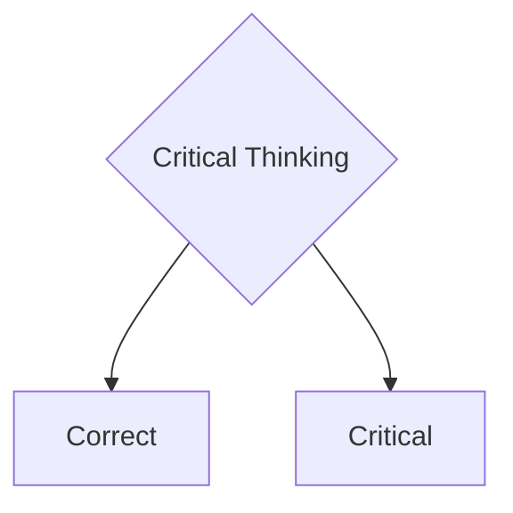

<!-- TODO: Add a summary for the entire chapter with cross-references -->
 Here we provide a very brief summary of the entire tutorial on Critical Thinking.

## What is Critical Thinking?

As a **critical thinker**, you **question** all claims: from fellow humans and from companies trying to tell you what's good for you.

**Critical thinking helps you with that**.
&nbsp;

:::info Quote
 "_Enlightenment is man's emergence from his self-incurred immaturity._"

 &mdash; Immanuel Kant: *What is Enlightenment*[^1]
:::

[^1]: Introduction to Kant's famous essay ("[What is Enlightenment](https://de.wikisource.org/wiki/Beantwortung_der_Frage:_Was_ist_Aufkl%C3%A4rung%3F)").
"Enlightenment is man's release from his self-incurred tutelage. Tutelage s man's inability to make use of his understanding without direction from another. Self-incurred is this tutelage when its cause lies not in lack of reason but in lack of resolution and courage to use it without direction from another. Sapere aude! "Have courage to use your own reason!"- that is the motto of enlightenment."

&nbsp;
Critical thinking has two hemispheres.

&nbsp;

We have two big questions.

1. How do you think **correctly**?
   The answer to this is a **skill**, like "riding a bike".

2. How do you think **critically**?
   The answer to this is an **attitude**, like "being on guard", which we adopt when necessary.

Don't worry. Both can be learned.

## How Do You Think Correctly?

You can learn to think **correctly** by training a few skills:

### Logical Thinking

What does "*logical thinking*" mean? We've all been able to think since we were born.

:::tip
Logical thinking means: being able to draw **true conclusions** from **true premises**.
:::

**Logic** is a vast field, but fortunately for us laypeople, we only need a tiny bit of it in everyday life, just the essential basics.

You should master the **essential basics** of logic; otherwise, you won't understand a thing.

### Argumentation

Argumentation has something to do with logic. But not all good arguments are formally logically correct.

You need to learn how people argue and **how one should argue**.

You need to understand **how good arguments work** and what bad arguments look like.

### Language Bewitchment

To think clearly and critically, we must learn to **uncover linguistic traps** and avoid them.

Very often, language itself plays a trick on us:

- **Loaded language**, e.g.: "Our dim-witted president said ..."
- **Nonsense**, e.g.: "What time is it on the moon right now?"
- **Slanted definitions**, e.g.: "Man is a featherless biped"

Precise language is needed in law, at work, in science and technology, but less so at barbecues or when flirting.

### Source Checking

One of the most important skills we should learn or master is the ability to **check our sources**.
All our beliefs are based on sources of various kinds: textual sources, narratives, our own experiences or those of others.
The quality of our sources varies greatly.
Here are a few examples:
- "The best way to get rich quickly is to buy my book" 
<!--  -->
- "Smoking is cool and not harmful to health!", signed Dr. Marlboro 
  <!--   -->
- "The majority of Americans believe that Kennedy was the victim of a conspiracy". (Wikipedia) 
- "The influence of humans on the climate is clear“ Intergovernmental Panel on Climate Change (IPCC) 

I'll let you decide who you trust more.

### Classical Fallacies (Fallacy)

Another important skill is not to be bewitched by fallacies.
Some of the best books on the subject deal almost exclusively with fallacies or biases.
Well-known examples of classical fallacies are:

- **Ad Hominem**: Attacking the person instead of the argument.
- **Strawman**: The opponent's argument is distorted to make it easier to attack.
- **False Dilemma**: Only two possibilities are presented when there are more.
- **Circular Reasoning**: The claim is justified by itself.
- **Appeal to Authority**: Something is considered true because an authority says so.

There is a whole zoo of known fallacies. We will discuss the most important ones in detail.

### Cognitive Biases (Biases)

Not only fallacies but also cognitive biases stand in the way of our rationality. These biases are often deeply rooted in our brains and can blind us to reality.  
Examples of well-known cognitive biases include:

- **Confirmation Bias**: We only seek information that confirms our opinion.  
- **Anchoring Effect**: Our opinion is influenced by the first impression.  
- **Halo Effect**: A good overall impression leads to positive judgments in all areas.  
- **Overconfidence**: We are often overly optimistic about our abilities and achievements.  

There are dozens of examples here: funny, surprising, worrying, and almost dangerous ones, which we will discuss in detail later.
As humans, we often appear so foolish and pitiful that we wonder: why don't we learn this in school?

### Paradoxes and Dilemmas

What distinguishes correct thinking from faulty thinking can often be recognized in extreme situations.  
Where our thinking reaches the edge of what is conceivable: on the steep slopes of paradoxes and dilemmas, where contradictions reside.  
There, we no longer find our way and are at a loss. We must consider whether we can apply our usual ways of thinking or whether we need to develop new ways of thinking to master the situation.  
Typical examples of paradoxes and dilemmas include:

- **Paradoxes of Infinity**: the infinitely small and the infinitely large. There are more powerful infinities than the infinite set of natural numbers.  
- **Zeno's Paradoxes** of motion (Achilles and the tortoise): If Achilles runs faster than a tortoise, how can he ever catch up if it has a head start?  
- **Paradox of Theseus**: If all the planks of an old ship are replaced, is it still the same ship?  
- **Epimenides' Paradox**: Epimenides the Cretan says that all Cretans are liars. Is he lying?  
- **Russell's Paradox**: The set M of all sets that do not contain themselves. Does M contain itself or not?  
- **The Problem of Theodicy**: Why is there so much suffering in the world if there is an omnipotent, omniscient, and all-good God?  
- **Trolley Problem**: If you divert a track, one person dies. If you do nothing, another person dies. What do you do?  
- **The Freedom of Speech Dilemma**: If there is absolute freedom of speech, must we tolerate intolerance and accept that we are deprived of freedom of speech?

## How Do You Think Critically?

- Now we come to the critical part. "Critical" here is an indispensable attitude towards oneself, towards any kind of claim, hypothesis, theory, towards sources of all kinds, towards science and culture, and even towards values.
- This does not mean that we should always question everything everywhere. Oh no, please don't. We would simply go crazy.
- Established theories or values rooted in my culture should only be questioned when **contradictions** arise in my life or research. Contradictions are the driving force of progress.

### Self-Criticism

Most of the time, we already know where we want to go, what we are for or against, because we are always part of a culture or subculture.

We are full of **convictions**; we are **very sure**.
Most of the energy of our thinking is not used to find appropriate or "correct" solutions to given problems, but to **confirm our prejudices**.
Our society is full of contradictory beliefs:

- There is a) only one God and this happens to be the one I believe in. Thank God! Or: b) you can believe in God however you want, it's just not a scientific expression.
- The Earth is a) approximately round. Or b) flat or square.
- Nothing can move faster than light except bad news.
- Corona19 was a) a severe epidemic, b) a conspiracy of the world government.
- Homosexuality is a) a natural phenomenon and morally neutral, b) a disease and not pleasing to God.
- We a) acknowledge a man-made climate crisis or b) deny it.
- etc., etc.

We usually have a **fixed opinion** and **often no clue**.
Please repeat 50 times:

**"I can be wrong, I have been wrong, I will be wrong."**

Is that bad? No. We just need to be open to **error searching**, constructive criticism, **questioning**.

- At school exams, the teacher said: **check** your results before you hand them in.
- In technology, we call it **testing**.
- In production, it's called **quality control**.
- In science, we ask others for **"peer reviews"**.

### Listening and Openness

- We should listen more without always judging immediately. This is the basis of an open society.
- Not all right-wingers are Nazis, not all left-wingers are chaotic.
- Be open to the experiences of others.
- Often we don't even listen to the end of a sentence and have already judged.
- Other people have different priorities and we have strange opinions about them:
  - the child wants a new toy (what nonsense, doesn't need another one)
  - the teenager dreams of being a music star (that won't amount to anything, have you heard yourself sing)
  - someone wants a new sports car (what for, that's expensive and pollutes the environment)
  - someone hasn't eaten meat for years (that's ideologically brain-dead and harmful to health)

- Here we need a change of attitude. We are open to counterarguments, listen to other opinions.

### Suspension of Judgment

In critical thinking, the **suspension of judgment** is a central point.
Even in antiquity, the suspension of judgment, known as epoché, is an important point in philosophy and was used by philosophers such as Pyrrhon and Sextus Empiricus.
In Zen Buddhism, the suspension of judgment is embodied by the principle of **non-attachment**. It means not clinging to fixed opinions or beliefs.

- **Openness to new information**: Suspension of judgment allows us to consider new information and perspectives without jumping to conclusions.
- **Avoiding bias**: By suspending judgment, we can avoid letting preconceived notions and biases influence our analysis.
- **Thorough analysis**: It allows us to conduct a more thorough and objective analysis of the information and arguments at hand.
- **Flexibility in thinking**: Suspension of judgment promotes flexibility in thinking and allows us to consider different viewpoints.

