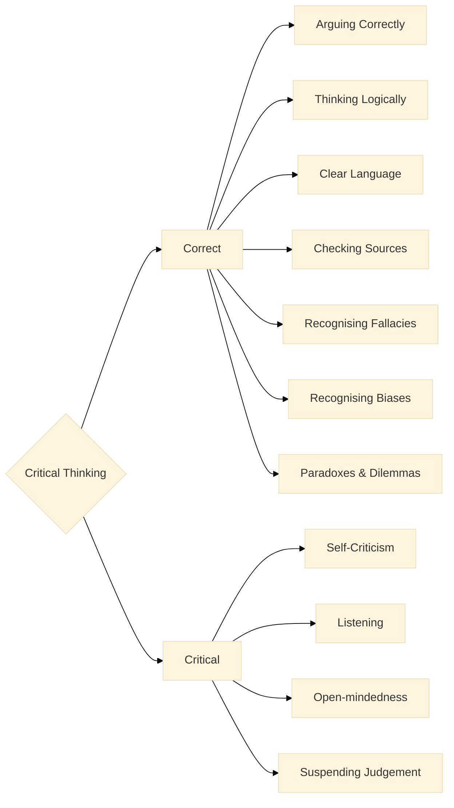

<!--t src=40b46313-->

<!--t src=1ea0afa2-->

Here we give a very short summary of the entire tutorial on critical thinking.

<!--t src=4c877c45-->

If you are wondering whether this book is right for you, then read on here.

<!--t src=81e80688-->
## What Is Critical Thinking?

<!--t src=cbcbff62-->
**Critical thinking** is a life insurance policy.

<!--t src=29db6db1-->
**Critical thinking** is a way of not driving blindly into a wall or leaping into the abyss.

<!--t src=3daf2849-->
**Critical thinking** helps us to make sure that we have good reasons for everything we believe or hold to be true, before we act.

<!--t src=28ae10ac-->
Or, somewhat more academically: **critical thinking** describes all the skills and attitudes that allow us to distinguish knowledge from opinion: to separate true from false, good reasons from bad ones, sound arguments from sham arguments, appearance from reality.

<!--t src=19bd8d06-->
## We Are Acting Beings and Have to Decide Constantly

<!--t src=789872c5-->
We are beings with goals, values and beliefs. In order to reach our **goals** and to live by our **values**, we act, and to do so we have to make **decisions**.

<!--t src=b1ec1456-->
Every day we decide, often automatically or unconsciously, for one thing or another on the basis of claims or opinions about the world.

<!--t src=5bc7caff-->
As a person who **thinks critically**, you **question** all claims, opinions and beliefs: your own, those of friends and fellow human beings, of the state, of organisations and of companies ... of everyone who wants to tell you what is good for you.

<!--t src=5e118ef1-->
In order to reach your short- or long-term goals, you have to make **well-informed decisions**, for yourself, your fellow human beings and your environment.

<!--t src=ed6e248e-->

We make decisions in order **to act**.

<!--t src=3ae79404-->

To make **the right decisions**, in order to **act 'rightly'**, is an art and a science at once.

<!--t src=0e9517fe-->
:::info Action

**Action** = **Desire** + **Knowledge**

&mdash; David Hume [^handeln]
:::

<!--t src=ec9c197c-->
[^handeln]: Hume explains that actions are motivated by our desires or goals, and that knowledge helps us to reach those goals. "A Treatise of Human Nature", Book II, Part 3, Section 3, "Of the Influencing Motives of the Will" (1739&mdash;40).

<!--t src=820e2c0b-->

Every action, every decision we make, rests on two fundamental questions:

<!--t src=229ce2f5-->
1. **Where do you want to go? = Goals / desires**.  
   These are the goals we strive for or desire. They depend, on the one hand, on our **human constitution**.
   We need food, warmth, safety, social contact, sexuality, and so on.  
   On the other hand, our goals are shaped by our family and **cultural values**, which we have learnt as social beings within our culture. These are values and norms such as freedom, justice, equality, tolerance, respect, compassion, solidarity, honesty, or their opposites.

<!--t src=3ced32ef-->
2. **How do you get there? = Knowledge**.  
   The second aspect is the knowledge we need in order to reach our goals. You need knowledge of the world.
   Good decisions are those based on **truth** (in a pragmatic sense) and not on **error**.

<!--t src=b0d6a555-->

## Criteria for "Right Decisions" and "Right" Action

<!--t src=390b8549-->
The question of all questions is, of course: How do I distinguish "right" decisions from "wrong" ones? This matters very concretely in many situations:

<!--t src=af5340cd-->

- Should I change jobs or not?
- Should I plan for the short term and heat with coal, or plan ecologically for the long term?
- Should I take the car or the bicycle?
- Should I buy a house or rent?

<!--t src=be8b818d-->
There is no universally valid answer to these questions, because they depend on your individual goals and values.
But philosophers have been thinking about it for thousands of years and have developed some criteria that can help you to make "right decisions".

<!--t src=86c80b54-->

We will discuss many of these criteria in more detail over the course of the tutorial. Here is a brief overview:

<!--t src=5fa22fd1-->
- **Truth**: Beliefs should agree with the facts (error = inefficient or harmful means).
- **Consistency and coherence**: Goals must not contradict one another, and means should fit all relevant goals.
- **Clarity**: It is better if you formulate your goals explicitly (making needs and desires conscious). And clarity is important for instrumental knowledge too (What exactly do I know, and what not?).
- **Proportionality**: We often have to decide in situations where we do not have all the information. Therefore the strength of your action should be proportional to the strength of the justified reasons.
- **Revisability**: You can and should occasionally question both your goals and basic convictions, and also adjust your instrumental knowledge to reality (in the light of new evidence). Become able to change your mind for good reasons.

<!--t src=4402a18f-->

## Why Is Critical Thinking Important?

<!--t src=f331800a-->
As we have just seen: **the method of critical thinking helps you to act rightly.**

<!--t src=04d9327e-->
One thing is certain: **without critical thinking**, if you cannot or will not think critically, you are exposed to the following dangers:

<!--t src=25eb6da6-->
- You **do not see** what is: you live in a world of appearances, you are deluded and refuse to face reality.
- You **do not know** where to go: you follow leaders like a sheep and do not know why.
- You **do not choose** for yourself: others set your goals for you (alienation) and tell you what you are to believe, eat and want.
- You **do not notice** who is steering you: you become an easy victim of manipulation and exploitation.

<!--t src=6757fc6a-->
You believe what you are told.  
You want what you are sold.  
You go where you are sent.

<!--t src=edb267f5-->
That sounds like violence, like totalitarianism, like alienation. Not like freedom. Not like self-determination.

<!--t src=d9898976-->
You are then living a life that is not your own: with other people's thoughts, other people's wishes, other people's goals. You do not live in your own head, you are merely a guest there.

<!--t src=dd81077d-->
Do we want that? No. We want to be of age, to think for ourselves.

<!--t src=a3abde8d-->
## Emancipation = Self-Determination

<!--t src=4d6e66bd-->
Literally, emancipation means: to be released from the hand [^emanzipation]. That is, to be a slave or a child under someone else's tutelage no longer.

<!--t src=79dc2f86-->
[^emanzipation]:
    **Emancipation** comes from the Latin _ēmancipāre_: _ē_ (out of, away) + _mancipium_ (ownership acquired by laying a hand on something), from _manus_ (hand) and _capere_ (to take, to seize). Whoever was _in mancipio_ therefore literally belonged to someone who had "laid a hand on" him; _mancipium_ could accordingly also mean simply "slave" ([DWDS: emanzipieren](https://www.dwds.de/wb/emanzipieren)).  
    In **Roman law**, _emancipatio_ denoted the release of a son from paternal authority (_patria potestas_): only through it did he become legally independent, and thus of age ([Wikipedia: Patria potestas](https://de.wikipedia.org/wiki/Patria_Potestas)). The Law of the Twelve Tables (c. 450 BC) already stipulated: "_Si pater filium ter venum duit, filius a patre liber esto_" ("If a father sells his son three times, let the son be free of his father"). The procedure therefore combined a threefold mock sale (_mancipatio_) with manumission (_manumissio_), that is, with the very same legal act by which slaves were set free (Gaius, _Institutiones_ I, 132; [VRoma: Gaius on Emancipation](http://vroma.org/vromans/bcassidy/g_1_132.html)). The freeing of a slave and a child's coming of age are thus closely related from the very beginning: both release a human being from the "hand" of another.  
    Since the 17th century the word has been used generally in the sense of "freeing oneself from constraint"; in the 19th century it became a political slogan (the emancipation of women, of Jews, of slaves) ([Wortgeschichte digital: Emanzipation](https://www.zdl.org/wb/wortgeschichten/Emanzipation)).

<!--t src=cdd82ee8-->
**Critical thinking allows** you to determine yourself:

<!--t src=5b436385-->
- You can **recognise** what is really good for you, and not merely what is sold to you as good.
- You can **choose** what you want, instead of wanting what others have chosen for you.
- You can **act** as you wish: within the law and with respect for others.
- You can **doubt** where everyone else is certain, and **trust** where you have good reasons.
- You can **change your mind** without losing face.

<!--t src=829c3d56-->
You see the world as it is, not as others paint it for you.  
You follow reasons, not leaders.  
You know where you are going, and why.

<!--t src=93eec829-->
:::info Quote
"_Enlightenment is man's emergence from his self-imposed immaturity._"

&mdash; Immanuel Kant: _What is Enlightenment_[^aufklärung]
:::

<!--t src=6af50bda-->
[^aufklärung]:
    Opening of Kant's famous essay ("[What is Enlightenment](https://en.wikisource.org/wiki/An_Answer_to_the_Question:_What_is_Enlightenment%3F)")  
    **Enlightenment is man's emergence from his self-imposed immaturity. Immaturity** is the inability to use one's own understanding without the guidance of another. This immaturity is **self-imposed** when its cause lies not in a lack of understanding, but in a lack of resolve and courage to use it without the guidance of another. **Sapere aude!** Have the courage to use your **own** understanding! is therefore the motto of the Enlightenment.

<!--t src=47c1f11e-->
&nbsp;

<!--t src=8ad86b1b-->
## Critical Thinking: Skills and Attitude

<!--t src=cfb01c29-->
Critical thinking has two hemispheres.

<!--t src=ad4051f4-->
:::tip

**Critical thinking** = **Correct** + **Critical** 

:::

<!--t src=157e619f-->
Critical thinking has two essential aspects:

<!--t src=495e6a66-->
1. How do you think **correctly**?  
   The answer to that is a **skill**, like "riding a bike" or "baking an apple strudel".

<!--t src=af856a8c-->
2. How do you think **critically**?  
   The answer to that is an **attitude**, like "being on your guard", which we adopt when the occasion calls for it.

<!--t src=68922741-->
If you are unsure whether you have mastered one or the other, don't worry: **both can be learned**.

<!--t src=9d0a23ca-->

We will briefly introduce both aspects in what follows.

<!--t src=eeefa661-->
## How Do You Think Correctly?

<!--t src=796c72ac-->
First of all, you can ask yourself: What is it to think **correctly**, and can I learn it?
You can of course learn it by training a few skills:
thinking logically, arguing, avoiding the bewitchment of language, checking sources, recognising fallacies and biases, and understanding paradoxes.

<!--t src=1f523705-->

### Thinking Logically

<!--t src=590bfc7f-->
What does "_thinking logically_" mean? Surely we can all already think.

<!--t src=110441cd-->
:::tip Definition
Being able to **think logically** means: being able to infer **true conclusions** from **true premises**.
:::

<!--t src=85031e37-->
**Logic** is a vast field, but fortunately for us laypeople, in everyday life we need only very little of it — the essential basics.

<!--t src=55a64fb7-->
You should, however, master the **essential basics** of logic, otherwise it will all be Greek to you.

<!--t src=ab30ba2c-->

### Arguing

<!--t src=80f3281e-->

Arguing has something to do with logic. But not all good arguments are formally logically valid.

<!--t src=d8afc3d5-->
So you have to learn to understand **how to argue correctly** and how people actually argue.

<!--t src=7c914084-->
You have to understand **how good arguments work** and why bad arguments are flawed.

<!--t src=3cd1c15f-->

### The Bewitchment of Language

<!--t src=8e60a9c8-->
In order to think clearly and critically, we have to learn to **uncover linguistic traps and bewitchments by language** and to get around them.

<!--t src=5db2c638-->

Language is not a rigid system; it lives, it changes and often eludes any control. Very often language itself plays a trick on us.
Here are a few examples:

<!--t src=8e621bea-->
- **Loaded language**, e.g.: "Our dim-witted president said ..."
  Someone there has an opinion about the president that they want to slip past us.
- **Nonsense**, e.g.: "What time is it on the Moon right now, actually?"
  An absurd question is raised, which can be funny, but which also fools us into thinking there is a meaningful answer to it.
- **Skewed definitions**, e.g.: "A human being is a featherless biped with flat fingernails and reason."
  That is a classic definition which may well be accurate, but is not exactly convincing.

<!--t src=881b5e3c-->

**Precise language** with exact terms is what we need in law, at work, in science and technology. In politics it would do some good as well.

<!--t src=2fbdebb5-->
In everyday life, on the other hand — in communication, in music, etc. — precise language also helps, but often we look for more play in language. At barbecues or when flirting, precision is not what's wanted. There it is better if language celebrates.

<!--t src=9fb296bd-->
### Checking Sources and Data

<!--t src=5fbda6ec-->
One of the most important skills we should learn or master is being able to **check our sources**.
All our beliefs rest on sources of very different kinds: textual sources, narratives, our own experiences or the accounts of others.
The quality of our sources varies greatly.
Here are a few examples:

<!--t src=a970dc44-->
- "The best way to get rich quick is to buy my book" 
<!--  -->
- "Smoking is cool and not harmful to your health!", signed Dr. Marlboro 
  <!--   -->
- "The majority of Americans assume that Kennedy was the victim of a conspiracy". (Wikipedia) 
- "Human influence on the climate is clear" Intergovernmental Panel on Climate Change (IPCC) 

<!--t src=431fa520-->
I'll let you decide whom you would rather trust.

<!--t src=389f1ded-->

### Classic Fallacies

<!--t src=049c572f-->
Another important skill is not letting yourself be led astray by fallacies.
Some of the best books on the topic of "critical thinking" deal almost exclusively with fallacies or the biases that influence our thinking.  
Well-known examples of classic fallacies are:

<!--t src=8d574360-->

- **Ad hominem**: An attack on the person instead of on the argument.
- **Straw man**: The opponent's argument is distorted in order to make it easier to attack.
- **False dilemma**: Only two possibilities are presented, even though there are more.
- **Circular reasoning**: The claim is justified by itself.
- **Appeal to authority**: Something is held to be true because an authority says so.

<!--t src=0991c3b2-->

There is a whole zoo of well-known fallacies. We will discuss the most important ones in detail.

<!--t src=a150137d-->

### Cognitive Biases

<!--t src=437f5544-->
Not only fallacies, but also cognitive biases, get in the way of our rationality.
These biases are often deeply anchored in our brains and can blind us to reality.
Well-known examples of cognitive biases are:

<!--t src=0512a72e-->
- **Confirmation bias**: We seek out, or accept, only information that confirms our opinion.
- **Anchoring effect**: Our opinion is influenced by the first impression.
- **Halo effect**: A good overall impression leads to positive judgements in all areas.
- **Overconfidence**: We are often too optimistic about our abilities and achievements.

<!--t src=30e9bccf-->

Here too there are dozens of examples: funny, surprising, worrying and almost dangerous ones, which we will discuss in detail later.
As human beings we end up looking so foolish and pitiable that we wonder: why don't we learn this at school?

<!--t src=4b91664c-->

### Paradoxes and Dilemmas

<!--t src=ce5d1584-->
What distinguishes correct thinking from flawed thinking can be seen well in extreme situations.  
**We learn to think where our thinking reaches the edge of the thinkable: on the steep slopes of paradoxes and dilemmas, where the contradictions dwell.**  
There we no longer find our way and are at a loss. There we have to consider whether we can apply our usual ways of thinking or whether we have to develop new ones in order to master the situation.

<!--t src=29aa0684-->

Typical examples of paradoxes and dilemmas are:

<!--t src=5b442650-->

#### Logical Paradoxes

<!--t src=2b3e7dd4-->
- **Paradoxes of the infinite**: the infinitely small and the infinitely large. There are more powerful infinities than the infinite set of the natural numbers.
- **Zeno's paradoxes** of motion (Achilles and the tortoise): If Achilles runs faster than a tortoise, how can he ever catch up with it if it has a head start?
- **The Ship of Theseus**: If you replace all the planks of an old ship, is it still the same ship?
- **The paradox of Epimenides**: Epimenides, the Cretan, says that all Cretans lie. Is he lying?
- **Russell's paradox**: The set M of all sets that do not contain themselves. Does M contain itself or not?

<!--t src=47fa81a3-->

#### Ethical Dilemmas

<!--t src=5ffc4d21-->
- **The problem of theodicy**: Why is there so much suffering in the world if there is an omnipotent, omniscient and all-good God?
- **The trolley problem**: If you switch a railway point, one person dies. If you do nothing, the train runs into a bus full of children. What do you do?
- **The prisoner's dilemma**: Two prisoners have to decide whether to confess or remain silent, to profit from betrayal or from solidarity. What is the best strategy?
- **The dilemma of freedom of speech**: If there is absolute freedom of speech, must we then tolerate intolerance and accept being robbed of our freedom of speech?

<!--t src=a9d014a9-->

All of this is part of correct thinking. But what is the "critical" in critical thinking?

<!--t src=3cdfa115-->
## How Do You Think Critically?

<!--t src=3d17e827-->

Now we come to the critical part. "**Critical**" here is **an indispensable attitude towards oneself**, towards every kind of claim, hypothesis and theory, towards sources of all kinds, towards science and culture, and even towards values.

<!--t src=0b447901-->
- **Not always**: this does not mean that we should always question everything everywhere. Oh no, please don't, you would go mad.
- **When it hurts**: you cannot constantly call into question established theories or the values rooted in your culture.
  Sometimes, though, you can. Precisely when **contradictions** open up with life or with the sciences. Contradictions are the raising agent of progress.

<!--t src=87b7fdf6-->

### Self-Criticism

<!--t src=a4009b9b-->

Most of us are total egocentrics. Usually we already know where we want to go, what we are for or against. We are, after all, always already **part of a culture** or subculture.

<!--t src=ee41524d-->

We are full of **convictions** and are often **quite certain**.

<!--t src=63a5eb82-->
We use most of the energy of our thinking not to find appropriate or "right" solutions to given problems, but to confirm our **prejudices**.

<!--t src=3bf94708-->

Our society is full of **opposing convictions**:

<!--t src=717d9c8f-->
- There is
  - a) only one God, and he happens to be the one I believe in. Thank God!
  - b) you can believe in God however you like, it's just not a scientific term.
- The Earth is
  - a) roughly round.
  - b) flat or angular.
- Covid-19 was
  - a) a serious epidemic,
  - b) a conspiracy of the world government.
- Homosexuality is
  - a) a natural phenomenon, occurs in animals and is morally neutral,
  - b) a disease and displeasing to God.
- We observe
  - a) a man-made climate crisis
  - b) or dispute this.

<!--t src=b1c961ce-->

On many topics we have:

<!--t src=6b163962-->
1. very often **no idea** about the subject matter
2. and yet, usually **a firm conviction**.

<!--t src=47c1f11e-->

&nbsp;

<!--t src=1703c675-->
:::tip Exercise
Please repeat ten times:

**"I can be wrong, I have often been wrong, I will be wrong again."**
:::

<!--t src=3817ea88-->

### Looking for Errors

<!--t src=b512002a-->

Is it a bad thing that we make mistakes?

<!--t src=cefb1e39-->

No. If we want to improve, then we have to be open to **looking for errors**, to constructive criticism, to **questioning**.

<!--t src=f5880b3a-->
As long as it does not hurt us personally, we are often willing to look for errors.

<!--t src=cf6486e3-->
- In exams at school the teacher would say: **check** your results before you hand them in.
- In engineering we call it **testing**.
- In production it is called **quality control**.
- In science we ask others for "**peer reviews**".

<!--t src=84e812bc-->

### Listening and Open-Mindedness

<!--t src=f0fdd745-->

Another important point of critical thinking is **listening** and being **open** to other opinions.

<!--t src=b67652f5-->
- We should **listen more** without always immediately judging. That is the basis of an open society.
- Be open to the experience of others.
- Often we don't even hear the sentence to the end and have already judged.
- Other people have other priorities, and we hold skewed opinions about them:

<!--t src=57786dce-->
- the child wants a new toy (what nonsense, doesn't need yet another one)
- the teenager dreams of being a music star (that'll come to nothing anyway, have you ever heard them sing?)
- someone wants a new sports car (what for, it's expensive and pollutes the environment)
- someone hasn't eaten meat for years (that's ideologically brain-dead and bad for your health)

<!--t src=bebf3811-->
Here we need a change of attitude. We should be more open to counter-arguments and to other opinions in general.

<!--t src=2ced6497-->

### Suspending My Judgement

<!--t src=7d7f9158-->

In critical thinking, the **suspension of judgement** is a central point. We have just touched on this.

<!--t src=d94bddd2-->

Not all those on the right are Nazis, not all those on the left are troublemakers.

<!--t src=c60d2aaf-->
Even in antiquity the suspension of judgement, known as [_epoché_ (ἐποχή)](https://en.wikipedia.org/wiki/Epoch%C3%A9), was an important point in philosophy and was emphasised by philosophers such as Pyrrho and Sextus Empiricus.  
In Zen Buddhism, too, the suspension of judgement is embodied in the principle of **non-attachment** (無執着, Mu-shūjaku)[^3]. It means not clinging to fixed opinions or convictions.

<!--t src=d2062cec-->
[^3]:
    Zen teaches us not to cling to views, emotions or perceptions. That corresponds to Pyrrhonian suspension, but with one decisive difference:  
    **Epoché** says: "I do not hold on, in order to find peace."  
    **Zen** says: "I do not hold on, because holding on is itself the cause of suffering."

<!--t src=b0652d72-->

#### Benefits of Suspending Judgement

<!--t src=44bd731f-->

- **Openness to new information**: Suspending judgement makes it possible to take new information and perspectives into account without jumping to conclusions.
- **Avoidance of bias**: By suspending judgement, one can avoid preconceived opinions and prejudices influencing the analysis.
- **Thorough analysis**: It allows us a more thorough and more objective analysis of the available information and arguments.
- **Flexibility in thinking**: Suspending judgement fosters flexibility in thinking and makes it possible to take various points of view into account.

<!--t src=fb5a95aa-->

## A Diagram to Summarise

<!--t src=c46926c0-->

  

```mermaid
---
config:
  theme: 'base'
---
flowchart LR
    C{Critical Thinking}
    C --> D[Correct]
    C --> E[Critical]
    D --> G[Arguing Correctly]
    D --> F[Thinking Logically]
    D --> H[Clear Language]
    D --> I[Checking Sources]
    D --> J[Recognising Fallacies]
    D --> K[Recognising Biases]
    D --> L[Paradoxes & Dilemmas]
    E --> M[Self-Criticism]
    E --> N[Listening]
    E --> N2[Open-mindedness]
    E --> O[Suspending Judgement]
```

<!--t src=93f64017-->

<!--t src=47c1f11e-->

&nbsp;

<!--t src=31c8926a-->
After this very condensed overview of critical thinking, we now come to the details!
