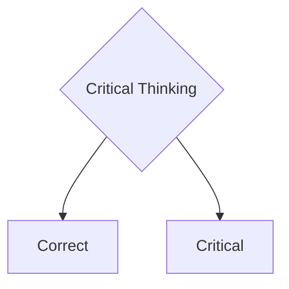

<!--t src=558547e7-->
import React from 'react';
import ReactPlayer from 'react-player';

<!--t src=318b6a02-->
Docusaurus supports **[Markdown](https://daringfireball.net/projects/markdown/syntax)** and a few **additional features**.

<!--t src=213220ca-->
## Front Matter

<!--t src=03b1c0b9-->
Markdown documents have metadata at the top called [Front Matter](https://jekyllrb.com/docs/front-matter/):

<!--t src=dbe7d8d3-->
```text title="my-doc.md"
// highlight-start
---
id: my-doc-id
title: My document title
description: My document description
slug: /my-custom-url
---
// highlight-end

## Markdown heading

Markdown text with [links](./hello.md)
```

<!--t src=78ddc2da-->
## Links

<!--t src=22c953b6-->
Regular Markdown links are supported, using url paths or relative file paths.

<!--t src=d995ec47-->
```md
Let's see how to [Create a page](/create-a-page).
```

<!--t src=cf37ad12-->
```md
Let's see how to [Create a page](./create-a-page.md).
```

<!--t src=988b5760-->
**Result:** Let's go to the [Introduction](./000-kritisches-denken-kurzgesagt.md).

<!--t src=0d8c43d8-->
## Images

<!--t src=f0d4ca0b-->
Regular Markdown images are supported.

<!--t src=75d0946a-->
You can use absolute paths to reference images in the static directory (`/static/img/docusaurus.png`):

<!--t src=f9cd794e-->
```md

```

<!--t src=b66adc12-->
You can reference images relative to the current file as well. This is particularly useful to colocate images close to the Markdown files using them:

<!--t src=f9cd794e-->
```md

```

<!--t src=df590720-->
You can also specify image dimensions ??:

<!--t src=5b80a229-->
```md

```

<!--t src=7895a0b0-->


<!--t src=df997e0a-->
You can use **img** tags

<!--t src=dc810b66-->
```html

```

<!--t src=dcd29a44-->


<!--t src=73e3b332-->
## Code Blocks

<!--t src=47977fb0-->
Markdown code blocks are **supported** with Syntax highlighting.

<!--t src=6cb2228d-->
````md
```text title="Example of a sample text"
Here comes my example
Two lines are good
```

<!--t src=6485c40e-->
````

```text title="Example of a sample text"
Here comes my example
Two lines are good
```

<!--t src=669a4a2f-->
````md
```jsx title="src/components/HelloDocusaurus.js"
function HelloDocusaurus() {
  return <h1>Hello, Docusaurus!</h1>;
}
```

<!--t src=8f1098df-->
````

```jsx title="src/components/HelloDocusaurus.js"
function HelloDocusaurus() {
  return <h1>Hello, Docusaurus!</h1>;
}
```

<!--t src=9e08894e-->
## Admonitions

<!--t src=e0881f6c-->
note, tip, info, warning, danger

<!--t src=7f76d726-->
Docusaurus has a special syntax to create admonitions and callouts:

<!--t src=1bbf4aa9-->
```md
:::note Note
Here is a note
:::

:::tip My tip
Here is a tip
:::

:::info Information
Here is some information
:::

:::warning Caution
Here is a warning
:::

:::danger Danger
This action is dangerous
:::
```

<!--t src=6736459b-->
:::note Note
Here is a note
:::

<!--t src=e8c76056-->
:::tip My tip
Here is a tip
:::

<!--t src=9508d3e1-->
:::info Information
Here is some information
:::

<!--t src=d7a2a546-->
:::warning Caution
Here is a warning
:::

<!--t src=2572e858-->
:::danger Danger
This action is dangerous
:::

<!--t src=62c186be-->
## MDX admonitions

<!--t src=89e05b4e-->
import Admonition from '@theme/Admonition';

<!--t src=dbc562cd-->
<Admonition type="tip" icon="💡" title="Did you know...">
  Use plugins to introduce shorter syntax for the most commonly used JSX
  elements in your project.
</Admonition>
<Admonition type="note" icon="💬" title="">
  Use plugins to introduce shorter syntax for the most commonly used JSX
  elements in your project.

  <p class="text--right">Socrates</p>
</Admonition>

<!--t src=b2f34bbe-->
<Admonition type="note" icon="🌊🌊🌊💭" title="">
  Use plugins to introduce shorter syntax for the most commonly used JSX
  elements in your project.
</Admonition>

<!--t src=09d87b11-->
<Admonition type="note" icon="💬" title="Quote">

"**I know that I know nothing**"  
 literally: "For I knew of myself that I know nothing at all ..."

  <p class="text--right">Socrates in Plato: _Apology of Socrates_ 22d</p>
</Admonition>

<!--t src=6ed32fa5-->
## Markdown Emoji

<!--t src=26d9eee5-->
You can use emojis

<!--t src=77cc64b7-->
```markdown
:heart:
```

<!--t src=2ef5bbcd-->
:heart: | :lion: | :spades:

<!--t src=39116809-->
## Checkboxes

<!--t src=4d3661d0-->
Adds support for Github's - [ ] and - [x] check box syntax to VS Code's built-in markdown preview.

<!--t src=7f4ef89d-->
- [ ]

<!--t src=ce27e128-->
## Footnotes

<!--t src=e72ad150-->
Footnotes let you add annotations ...

<!--t src=7910cc78-->
```md
Here's a sentence with a footnote[^1].

[^1]: This is the footnote.
```

<!--t src=5a5fff49-->
Here's a sentence with a footnote[^1].

<!--t src=ccdfc6bd-->
[^1]: This is the footnote.

<!--t src=41310c4c-->
You can also use named footnotes:

<!--t src=c6f20ca5-->
```md
Here's another sentence[^namedNote].

[^namedNote]: This is a named footnote.
```

<!--t src=112d5cb9-->
Here's another sentence[^namedNote].

<!--t src=6f494b82-->
[^namedNote]: This is a named footnote.

<!--t src=96b693e4-->
## Mermaid

<!--t src=b2d8d3f5-->


<!--t src=2ec102ca-->
## Shortcuts

<!--t src=ff2f1df3-->
Here is the github of [vscode-markdown-shortcuts](https://github.com/mdickin/vscode-markdown-shortcuts).

<!--t src=29261678-->
- Ctrl-B for **bold**
- Ctrl-I for _italic_
- Ctrl-L for toggle [link](www.example.org) to resource.

<!--t src=aa5de9b7-->
## Math

<!--t src=6fd64716-->
$$
I = \int_0^{2\pi} \sin(x)\,dx
$$

<!--t src=6ac5471d-->
## Details - Collapse

<!--t src=b9b365f5-->
```md
<details>
  <summary>Here you can find more sources</summary>

- Source 1
- Source 2
- Source 3
</details>
```

<!--t src=f289db1e-->
<details>
  <summary>Here you can find more sources</summary>

- Source 1
- Source 2
- Source 3

</details>

<!--t src=b7524760-->
## Browser window

<!--t src=8f83f5a0-->
<!-- import BrowserWindow from '@site/src/components/BrowserWindow'; -->

<!--t src=66070ba5-->
```md
<BrowserWindow>
toto
</BrowserWindow>
```

<!--t src=80ad93ba-->
<BrowserWindow>
toto
</BrowserWindow>

<!--t src=1987fdd3-->
<!-- ## Tooltip old
This is a <Tooltip type="subject-area" content="topic">Tooltip</Tooltip> and this is another
<Tooltip type="another-subject-area" content="different-topic">Tooltip</Tooltip>
-->

<!--t src=37ebd24c-->
## Html Tooltip

<!--t src=808a1162-->
```
<a title="This is a tooltip">Hover over me</a>
```

<!--t src=4139d519-->
<a title="This is a tooltip">Hover over me</a>

<!--t src=7cf41b3d-->
## Extended Tooltip

<!--t src=9f19cfc8-->
### Standard tooltip (closes on mouse leave)

<!--t src=bf44880d-->
```md
<Tooltip text="Text Tooltip" model="text">
  Brief explanation
</Tooltip>
```

<!--t src=3ad0c275-->
<Tooltip text="Text Tooltip" model="text">
  A text message in grey
</Tooltip>

<!--t src=424087a9-->
<Tooltip text="Info Tooltip" model="info">
  Brief explanation
</Tooltip>

<!--t src=00f9e78d-->
<Tooltip text="Success Tooltip" model="success">
  ## Success message.  
  That was a total success :heart: 
  Here comes a long line to see when it stops, or whether it just keeps going.
</Tooltip>

<!--t src=2de05d0d-->
<Tooltip text="Warning Tooltip" model="warning">
  Warning message
</Tooltip>

<!--t src=51021b34-->
<Tooltip text="Error Tooltip" model="error">
  Error message
</Tooltip>

<!--t src=9562d1cb-->
### Persistent tooltip (stays open until click outside/escape)

<!--t src=b7fc7a2d-->
```md
<Tooltip text="Complex Term" model="teacher" persistent={true}>
  This is a longer explanation that users might want to 
  keep open while reading other content on the page.
</Tooltip>
```

<!--t src=8c52056c-->
<Tooltip text="Complex Term" model="teacher" persistent={true}>
  This is a longer explanation that users might want to 
  keep open while reading other content on the page.
</Tooltip>

<!--t src=0ecdc293-->
### Persistent tooltip with Video

<!--t src=3804b56a-->
```
<Tooltip text="Here is a video" model="video" persistent={true} >
  ## How to sync files.
  <ReactPlayer style={{ maxWidth: '560px', width: 'calc(100vw - 60px)', height: 'auto', aspectRatio: '16/9' }} controls src='https://www.youtube.com/watch?v=Bse3QVU1yfY' />
</Tooltip>

```

<!--t src=35bf629f-->
<Tooltip text="Here is a video" model="video" persistent={true} >
  ## How to sync files.
  <ReactPlayer style={{ maxWidth: '560px', width: 'calc(100vw - 60px)', height: 'auto', aspectRatio: '16/9' }} controls src='https://www.youtube.com/watch?v=Bse3QVU1yfY' />
</Tooltip>

<!--t src=d37151b5-->
### Persistent tooltip with Video iframe

<!--t src=73bbccfb-->
```
<Tooltip text="Here is a video" model="video" persistent={true} >
  <iframe width="560" height="315"
    style={{ maxWidth: '560px', width: 'calc(100vw - 60px)', height: 'auto', aspectRatio: '16/9' }}
    src="https://www.youtube.com/embed/lHu02MWIPUY"
    frameborder="0" allow="autoplay; encrypted-media" allowfullscreen>
  </iframe>
</Tooltip>
```

<!--t src=f5a6b8a5-->
<Tooltip text="Here is a video" model="video" persistent={true} >
  <iframe width="560" height="315"
    style={{ maxWidth: '560px', width: 'calc(100vw - 60px)', height: 'auto', aspectRatio: '16/9' }}
    src="https://www.youtube.com/embed/lHu02MWIPUY"
    frameborder="0" allow="autoplay; encrypted-media" allowfullscreen>
  </iframe>
</Tooltip>

<!--t src=3671f634-->
## Cards

<!--t src=72a932cd-->
<Columns>
  <Column className="col--6">
    <Card shadow='md'>
      <CardHeader >
          <h3>Lorem Ipsum</h3>
      </CardHeader>
      <CardBody>
          Lorem ipsum dolor sit amet, consectetur adipiscing elit, sed do eiusmod tempor
          incididunt ut labore et dolore magna aliqua. Quis ipsum suspendisse ultrices
          gravida.
      </CardBody>
      <CardFooter>
        <button className="button button--secondary button--block">See All</button>
      </CardFooter>
    </Card>
  </Column>

  <Column className="col--6">
  ```html
  <!-- low (lw), medium (md), tall (tl) -->
  <Card shadow='md'>
    <CardHeader >
        <h3>Lorem Ipsum</h3>
    </CardHeader>
    <CardBody>
        Lorem ipsum dolor sit amet, consectetur adipiscing elit, sed do eiusmod tempor
        incididunt ut labore et dolore magna aliqua. Quis ipsum suspendisse ultrices
        gravida.
    </CardBody>
    <CardFooter>
      <button className="button button--secondary button--block">See All</button>
    </CardFooter>
  </Card>
  ```
  </Column>
</Columns>

<!--t src=0063a5c0-->
## Columns

<!--t src=a2cded85-->
Classnames can be: 'text--left', 'text--center', 'text--right', 'text-justify'
And column width as 1/12 : 'col--4', 'col--8', etc.

<!--t src=931920cb-->
```
<Columns>
  <Column className='col--4'>
    Here is the left-hand side
  </Column>
  <Column>
    Lorem ipsum dolor sit amet, consectetur adipiscing elit. Sed do eiusmod tempor incididunt ut labore et dolore magna aliqua.
  </Column>
</Columns>

```

<!--t src=14013597-->
<Columns>
  <Column className='col--4'>
    Here is the left-hand side
  </Column>
  <Column className='col--8'>
    Lorem ipsum dolor sit amet, consectetur adipiscing elit. Sed do eiusmod tempor incididunt ut labore et dolore magna aliqua.
  </Column>
</Columns>

<!--t src=2b8183fa-->
## Tabs

<!--t src=0d60d722-->
import Tabs from '@theme/Tabs';
import TabItem from '@theme/TabItem';

<!--t src=c34143ab-->
<Tabs>
  <TabItem value="apple" label="Apple" default>
    This is an apple 🍎
  </TabItem>
  <TabItem value="orange" label="Orange">
    This is an orange 🍊
  </TabItem>
  <TabItem value="banana" label="Banana">
    This is a banana 🍌
  </TabItem>
</Tabs>

<!--t src=df118dee-->
## highlight

<!--t src=89b77f55-->
<Highlight color="hsl(267, 100%, 81%)">Docusaurus purple</Highlight> option

<!--t src=7daf2865-->
## SVG

<!--t src=b1751dc9-->
<svg
  xmlns="http://www.w3.org/2000/svg"
  viewBox="0 0 48 48"
  width="48"
  height="48">
<path fill="#FF6D00" d="M42 42H6V6h36v36z" />
<path fill="#FFF" d="M8 8v32h32V8H8zm30 30H10V10h28v28z" />
<path
    fill="#FFF"
    d="M23 32h2v-6l5.5-10h-2.1L24 24.1 19.6 16h-2.1L23 26z"
  />
</svg>

<!--t src=d3d9c0a0-->
## React Video

<!--t src=d91c3801-->
https://www.npmjs.com/package/react-player

<!--t src=fbbe25e6-->
```
import React from 'react';
import ReactPlayer from 'react-player';
<ReactPlayer style={{ width: '100%', height: 'auto', aspectRatio: '16/9' }} controls src='https://www.youtube.com/watch?v=Bse3QVU1yfY' />

```

<!--t src=ddf3c763-->
<ReactPlayer style={{ width: '100%', height: 'auto', aspectRatio: '16/9' }} controls src='https://www.youtube.com/watch?v=Bse3QVU1yfY' />

<!--t src=3e41f796-->
## Iframe video

<!--t src=ab81e7ed-->
```
<iframe
  width="560" height="315"
  src="https://www.youtube.com/embed/lHu02MWIPUY"
  frameborder="0" allow="autoplay; encrypted-media" allowfullscreen>
</iframe>
```

<!--t src=8acfc778-->
<iframe
  width="560" height="315"
  src="https://www.youtube.com/embed/lHu02MWIPUY"
  frameborder="0" allow="autoplay; encrypted-media" allowfullscreen>
</iframe>
