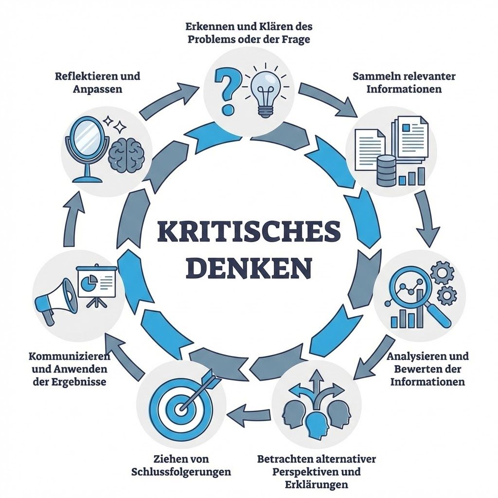

<!--t src=521ca08c-->

<!--t src=c66d842d-->
Critical thinking is a systematic process that can include the following steps:

<!--t src=a51f6974-->
## 1. Identifying and clarifying the problem or question

<!--t src=ed706027-->
- What exactly do I want to know or decide?
- Which aspects are relevant?

<!--t src=116de11d-->
## 2. Gathering relevant information

<!--t src=40c25aee-->
- What facts and data are available?
- Which sources are reliable?

<!--t src=66e827d0-->
## 3. Analyzing and evaluating the information

<!--t src=78757157-->
- Is the information accurate and complete?
- What assumptions underlie it?
- Are there biases or fallacies?

<!--t src=621bcd6c-->
## 4. Considering alternative perspectives and explanations

<!--t src=4ffcffd4-->
- What other viewpoints exist?
- What alternative explanations are possible?

<!--t src=82ce3330-->
## 5. Drawing conclusions

<!--t src=aa0db228-->
- What conclusions are supported by the evidence?
- How confident can we be in these conclusions?

<!--t src=57c2876b-->
## 6. Communicating and applying the results

<!--t src=4bbd9274-->
- How can the results be communicated clearly?
- How can they be implemented in decisions or actions?

<!--t src=0918c851-->
## 7. Reflecting and adjusting

<!--t src=5188da66-->
- What have we learned from the process?
- How can we improve our thinking process?
