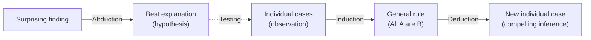

<!--t src=aa0e5d94-->
<!-- # Types of reasoning -->

<!--t src=50505bde-->
Before we look at individual argument patterns, it is worth taking a look at the **basic forms of inference**. Charles S. Peirce distinguished three of them, which differ in **what we presuppose and what we want to gain**: a rule, an individual case or an explanation.

<!--t src=23a8a2a2-->
## Deduction: from the rule to the case

<!--t src=29b75b93-->
In **deduction** we infer from a general rule to an individual case. If the premises are true, the conclusion is **necessarily true**: deduction is _truth-preserving_, but creates no new knowledge about the world; it only makes explicit what is already contained in the premises.

<!--t src=a58d3aad-->
1. **Rule:** All humans are mortal.
2. **Case:** Socrates is a human.
3. **Result:** Therefore Socrates is mortal.

<!--t src=43456bf9-->
## Induction: from the case to the rule

<!--t src=a1580ebe-->
In **induction** we generalize from observed individual cases to a rule. The inference is **not compelling**, but only more or less probable: a single exception can overturn the rule. In return, induction delivers _new_ knowledge that goes beyond the observations.

<!--t src=dc539005-->
1. **Case:** Socrates, Plato, Aristotle … have died.
2. **Result (rule):** Therefore presumably all humans are mortal.

<!--t src=93708148-->
## Abduction: from the finding to the best explanation

<!--t src=3ac78207-->
In **abduction** we seek the **most plausible explanation** (hypothesis) for a surprising observation. It too is not compelling, but a justified conjecture that can later be confirmed or refuted.

<!--t src=e97ff8f8-->
1. **Finding:** The lawn is wet.
2. **Rule:** If it has rained, the lawn is wet.
3. **Best explanation:** Presumably it has rained.

<!--t src=18bd875a-->
## How they interact

<!--t src=96446cf8-->
The three forms interlock. **Deduction lives on universal statements** ("All A are B"), yet, strictly speaking, we can never prove such universal sentences by observation. We mostly obtain them **inductively**, by generalizing from many individual cases. Deduction is therefore only as certain as the inductively acquired rules on which it is built: it inherits its rigor from premises that are themselves only probable. **Abduction**, in turn, generates the hypotheses that we subsequently test inductively and use further deductively.

<!--t src=a8acd714-->

<!--t src=fcd52424-->
:::note Key point
**Deduction** secures, **induction** generalizes, **abduction** explains. Only deduction is truth-preserving; induction and abduction extend our knowledge, but remain uncertain.
:::

<!--t src=605f8275-->
> Further reading: [Abduktion, Induktion, Deduktion (arbeitsblaetter.stangl-taller.at)](https://arbeitsblaetter.stangl-taller.at/DENKENTWICKLUNG/Abduktion-Induktion-Deduktion.shtml)
