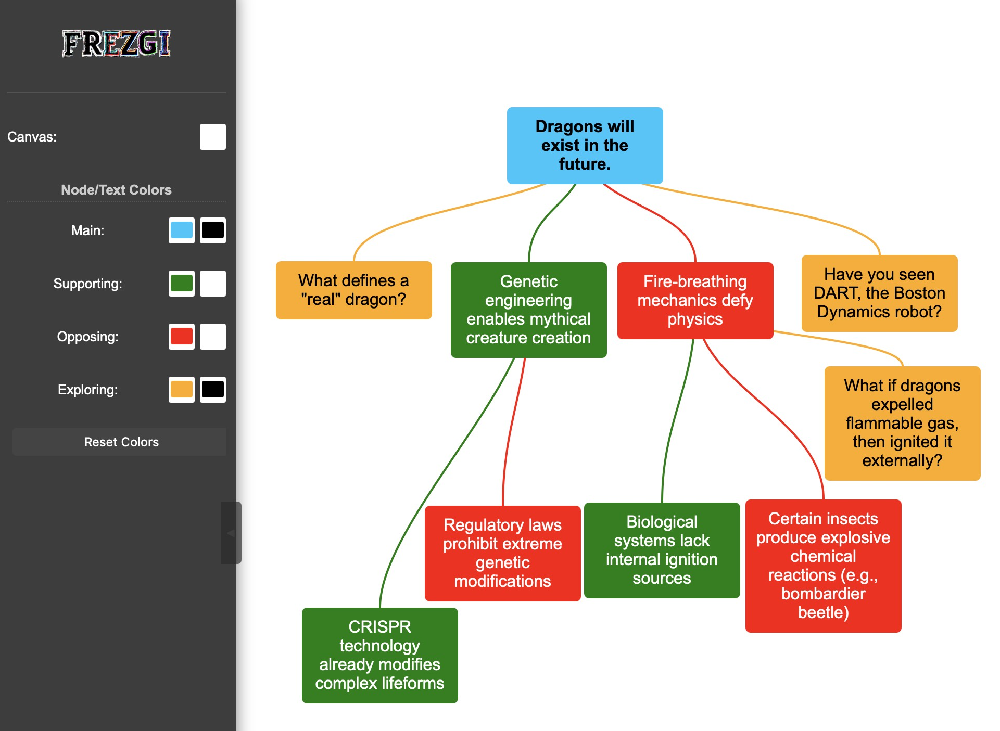

<!--t src=b0e66d51-->

<!-- https://framindmap.org/c/maps/1573467/edit -->

<!--t src=1898b76a-->

There are now digital tools for analysing, constructing and mapping arguments.

<!--t src=0a3fd434-->

Here we list a selection of tools on critical thinking, argumentation, logic and philosophy.\
We keep adding new ones.

<!--t src=f82f0a3c-->

## Critical Thinking and Argumentation

<!--t src=e4d1f42f-->

### Argument Map

<!--t src=98116322-->

**[Frezgi](https://frezgi.com/)**

<!--t src=be38f6b9-->
<!--  -->

<!--t src=acbb5cb5-->

- This is the simplest argument-mapping app you can imagine.
- Free and **open-source** (MIT): https://github.com/Claritrie/Frezgi. You can contribute.

<!--t src=6dd00060-->

**[Rationale](https://rationaleonline.com/)**

<!--t src=686dabda-->
<!--  -->

<!--t src=f638017a-->

- Rationale is a feature-rich commercial web application that lets you map arguments.
- You can save and export everything.
- With an [e-book](https://docs.rationaleonline.com/e-book/1-critical-thinking)

<!--t src=b482d8b1-->

**[Kialo](https://www.kialo.com/)**

<!--t src=72b826b3-->

- A platform for structured debates: pro and con arguments are laid out as a tree.
- Free to use, with an education version ([Kialo Edu](https://www.kialo-edu.com/)) for the classroom.

<!--t src=efac958d-->

**[Argdown](https://argdown.org/)**

<!--t src=b9ed0a29-->

- A simple markup language for writing arguments as text and rendering them automatically as a diagram.
- Free and **open-source**: https://github.com/christianvoigt/argdown

<!--t src=617b5f79-->

### Mindmap WebApps

<!--t src=a6b91364-->

**[Framindmap](https://framindmap.org/)**

<!--t src=9ccd0a3f-->

<!--t src=4d389f31-->

- Framindmap is an **open-source** web application based on WiseMapping.
- You can create, share and collaborate on as many maps as you like.
- Framindmap has all the important features.

<!--t src=4b546c09-->

**[Mindmaps](https://www.mindmaps.app)**

<!--t src=69123149-->

- Mindmaps is a **simple**, good-looking mind-map web application.
- The app is free and **open-source** (AGPL V3): https://github.com/drichard/mindmaps. You may donate.
- You can save the maps directly on your computer, in the browser, in the cloud (Dropbox, Google Drive) or as images
- You can't move or rearrange branches.

<!--t src=abbbb026-->

**[Mindmup](https://www.mindmup.com/)**

<!--t src=ed2f80bc-->

- Mindmup is a commercial app with a generous free tier.
- Has unlimited maps.

<!--t src=6db9c158-->

**[Mindmeister](https://www.mindmeister.com)**

<!--t src=3ba7de30-->

- Good mind-mapping app.
- Has many features, themes and templates.
- Heavily limited in the free version: only 3 free maps.

<!--t src=b866e6be-->

**[Miro](https://miro.com)**

<!--t src=3ff079a8-->

- One of the best commercial apps, where you get to pay properly.
- Has many features, themes and templates that you as a private individual probably won't need.

<!--t src=aef5e044-->
<!-- ## Logic
 -->
