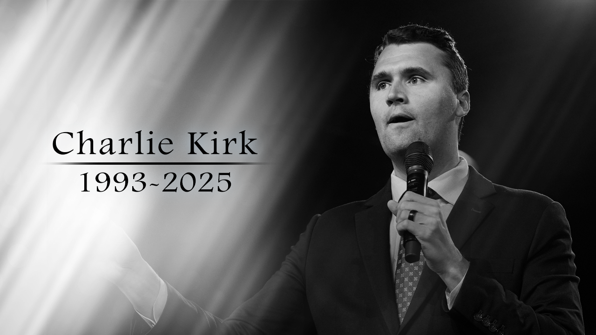

<!--t src=89e05b4e-->
import Admonition from '@theme/Admonition';

<!--t src=63fd331b-->
## Who was Charlie Kirk?

<!--t src=db072267-->

<!--t src=24795649-->
Charlie Kirk is dead. May his soul rest in peace!

<!--t src=a0d73ebf-->
Put neutrally: Charlie Kirk was an American political commentator and activist known for his conservative views.
He made a name for himself on social media and various media platforms by addressing controversial topics
and often voicing provocative opinions.

<!--t src=6b77aa2f-->
He is criticized for his statements and for producing ultra-conservative, racist, misogynistic, climate-skeptic,
conspiracy-theoretical, populist, Christian-nationalist content, and he holds to a literal reading of the Bible.
[Wikipedia, Charlie Kirk](https://en.wikipedia.org/wiki/Charlie_Kirk#Political_positions_and_activities)

<!--t src=1e681695-->
Some people tell me, oh, but Kirk didn't only say bad things. Some of it is right, too.  
He loved his mother and pancakes, and we love that too.\
Sure, on that we agree. No!
**But I am not writing an article about how great pancakes are, but about Kirk's manipulative rhetoric.**

<!--t src=3c659c67-->
### My opinion on the political sophist Charlie Kirk

<!--t src=00878e8a-->
- Kirk is a political sophist. (In the good old sense of Plato, as someone who _makes the weaker argument the stronger_. See: [Sophists](https://en.wikipedia.org/wiki/Sophist))
- He often uses, without blushing, rhetorical tricks and manipulative argumentation techniques.
- He deploys them to achieve his goals, which often harm a majority of Americans.
- He not only twists the truth in favour of his own agenda but also often uses emotionally charged language to influence his listeners.
- He is a master at oversimplifying complex topics and presenting them in a way that appeals to his followers,
  while at the same time ignoring or dismissing critical questions and counter-arguments.
- He is a prime example of how political sophists can manipulate public opinion by using rhetorical skills
  to advance their own interests, often at the expense of truth and the common good.
- His style is rich in persuasive techniques (pathos) but often poor in rigorous, fair and evidence-based argumentation (logos).
  For a critical listener his arguments are therefore often vulnerable to deconstruction,
  since they rest on logical fallacies and rhetorical distortions.

<!--t src=8e2641a8-->
- He is an example of **how one should not argue** if one wants to hold a respectful and constructive discussion.

<!--t src=532f708b-->
- Kirk is also an example of **how one can earn a lot of money** with populist, polarizing and often misleading content.

<!--t src=37e3ca0c-->
## Charlie Kirk's most important topics / theses

<!--t src=61ed3ec1-->
### Criticism of "woke" culture

<!--t src=5ba05b1f-->
- Kirk sees an aggressive left/progressive movement that, through universities, media and politics, tries to suppress or marginalize conservative values.
  - There are of course absolutely exaggerated expressions of "woke" culture that annoy some people.
  - But Kirk attacks these exaggerations (straw-man argument) and pretends that this is the whole reality.

<!--t src=21d88694-->
- He demands countermeasures: freedom of speech, rejection of diversity and equality programmes, etc.
  - "Freedom of speech" in the USA is often understood very differently than in Europe.
  - In the USA you may say almost anything, including hatred, agitation and obviously false theories, discrimination, as long as you do not directly call for violence.

<!--t src=b6e69632-->
### Support for MAGA and Trumpism

<!--t src=b2a18c15-->
- Kirk stands for conservative politics, often linked with Donald Trump and the MAGA movement.
- He emphasizes patriotism, sovereignty, a strong state against globalism. ([Wikipedia][1])

<!--t src=5a1d5280-->
### Economic liberalism & minimal state

<!--t src=78560867-->
- Kirk advocates for low state regulation, low taxes, less interference, especially in education and the economy.
- Kirk argues that over-regulation stifles innovation and freedom.

<!--t src=216c9c60-->
### Social / religious conservative values

<!--t src=9de9b087-->
- Many of his social positions are strongly shaped by a one-sided interpretation of the Christian religion. ([Wikipedia][1], [NEA][2])

<!--t src=6dfe0b17-->
- **Against abortion** (pro-life)
  - That is not a problem, he can of course be against abortion. On that we simply disagree.
  - Kirk also wanted to ban abortion in cases of **rape** or incest.
  - But Kirk also held the (much stronger) view that abortion is **worse than the Holocaust**. (OMG!)

<!--t src=3f498183-->
- He advocates for the **traditional family** and against all other forms of family.
  - Yes, very nice, no one has anything against the traditional family as **one option** among others.
  - But he ignores that many people choose other models of life and that diversity can be enriching.
  - Kirk presents his notion of the traditional family as the **only right one**, which is not only narrow-minded but also discriminatory.
  - LGBTQ+ advocates do not say that the traditional family should be abolished, but that there can be **several** family models.

<!--t src=8c774998-->
- He is **against immigration**.
  - That too is his good right, but his arguments are often exaggerated and emotionally charged.
  - He often portrays immigrants as a threat to national security and economic stability, which is not backed by facts.

<!--t src=79b5ba2f-->
- He argues **against equal rights** for women.
  - He often sees women's rights as a threat to traditional values and the family.
  - This is junk from history: all the arguments he brings against women's rights are boring, old clichés.
  - He likes to argue with "natural" gender roles, which are scientifically untenable.
  - Or he relies on religious dogmas and on _his_ interpretation of the Bible, which does not apply to all people.

<!--t src=fad664a2-->
- He has spoken out quite clearly **against LGBTQ+ rights**.
  - He is homophobic and transphobic.
  - He often sees LGBTQ+ identities as a threat to traditional values and the family.
  - Here too he brings boring, old clichés and religious dogmas.
  - Many standard heteros like me feel irritated by, for example, transgender people, insecure and uneasy in their presence.
    But that is no reason to discriminate against or hate these people.

<!--t src=609d04c2-->
- He has a strong attachment to **Christian identity** / Christian nationalism.
  - He is not only a Christian (he claims), but sees America as a "Christian nation".
  - Having a religion is of course his good right.
  - But demanding a Christian nation is religious absolutism and is therefore dangerous and exclusionary.
  - It is interesting that Kirk of course rails against all other kinds of absolutism,
    e.g. Islamism, Marxism, feminism, but his own absolutism is of course the only true one.

<!--t src=ee632839-->
- He has publicly **criticized the Civil Rights Act of 1964/65**.
  - The _Civil Rights Act_ is a law that prohibits discrimination on the basis of race, colour, religion, sex or national origin.
  - Kirk argues that this law goes too far and restricts the rights of companies and individuals.
  - That is a dangerous position that calls into question the achievements of the civil rights movement.

<!--t src=fb642dec-->
- He speaks out against any **gun control**.
  - That is of course his good right, but it is a dangerous position that costs many human lives.
  - Kirk: "It is worth taking on the cost of the sadly annual deaths from firearms
    so that we can have the 2nd Amendment to protect our other rights.
    That is a reasonable deal. It is rational."
  - He ignores the fact that stricter gun laws in other countries lead to far less violence.
  - It is a bitter irony of fate that he was shot in a country where so many people die from firearms.
  - One can only hope that no more people are murdered, no matter which political camp they come from.

<!--t src=281adee6-->
### Skepticism toward the climate change consensus

<!--t src=0de4cbe9-->
- He often relativizes the scientific consensus, criticizes measures against climate change as ideologically motivated or as a danger to freedom, the economy and national sovereignty. ([Media Matters for America][2])
- Kirk: "There is no factual data to back up global warming; real scientists don't know whether CO2 , solar sunspots or natural activity cause global warming."
  - That is clear nonsense. It has been and continues to be refuted again and again. ([Science Feedback][7])
  - He of course has no clue about climate science, physics, chemistry or other relevant disciplines.
  - That does not stop him from posing as an expert and discrediting the opinion of real scientists.

<!--t src=5645fea7-->
### The thesis of a perceived "crisis of democracy" and electoral fraud

<!--t src=759e704f-->
- Kirk regularly argues that left-wing forces &mdash; media, education, elites &mdash; promote false narratives.
  e.g. about racism or social justice; electoral fraud etc. are made an issue. He sees institutions as partisan. ([Wikipedia][1])
- Above all the topic of electoral fraud is brought up again and again.
  - Of course left-wing forces promote their narratives, but when we talk about electoral fraud, that is a lie.
  - There is no evidence of significant electoral fraud in the USA.
  - It is a conspiracy theory spread by Trump and his followers in order to discredit the election results.
  - There were public investigations into this that found no significant electoral fraud, and yet it is claimed again and again.

<!--t src=7596d65c-->
## Notable forms of argument and rhetorical tricks used by Kirk

<!--t src=55315803-->
### Polarization / "us vs. them" speeches

<!--t src=1fbb6efa-->
- **Description:** He often builds his speech so that a clear division is made:
  the "progressive left", "elites", "media" stand against the ordinary people, the youth, conservative values.
  This creates emotional closeness to his audience and heightens the sense of urgency.
- **Example:** In speeches on college campuses and at TPUSA events it is often said that universities are "woke indoctrination camps" etc. ([Wikipedia][1])

<!--t src=387625a7-->
### Appeal to fear / threat

<!--t src=eacf45a5-->
- **Description:** He warns of the loss of freedom, culture, sovereignty; of the seemingly overwhelming influence of left-wing ideas.
  These warnings are often dramatically phrased.
- **Example:** E.g. he calls climate protection a "Trojan horse" for Marxism; the claim that, through diversity institutions / DEI etc.,
  white culture or conservative identity is threatened. ([Media Matters for America][2])
- Yes, of course. Some conservative ideas are threatened by progressive ideas (discrimination, inequality, injustice, religious dogmas, etc.).

<!--t src=40bb384e-->
### Exaggeration / dramatization

<!--t src=94fd3940-->
- **Description:** Problems are often presented as existential crises, even when evidence is lacking or expert opinions diverge.
- **Example:** Comparing certain left-wing campaigns with totalitarian regimes (universities as "Islands of totalitarianism"). ([Wikipedia][1])

<!--t src=779e6f39-->
### Framing and reinterpretation of terms

<!--t src=d2de63e3-->
- **Description:** Changing the meaning/association of terms ("woke", "diversity", "climate change") is used
  so that positive terms are reinterpreted as negative. In this way he gains rhetorical ground.
- **Example:** He calls climate-change activism "pseudo-paganism", uses "woke" as a swear word, coins narratives like "science is political". ([Media Matters for America][2])
- Science is political when it clearly shows that, e.g., climate change is real and man-made, and when your party denies this
  because its funders come partly from the fossil-fuel industry.

<!--t src=91cecf58-->
### Selective evidence / cherry-picking

<!--t src=78443c6c-->
- **Description:** He picks out certain figures, cases or opinions that support his thesis, leaves out or minimizes contradictory ones.
- **Example:** E.g. he emphasizes that "a minority of scientists is skeptical", uses isolated criticisms of climate reports without including the broad consensus. ([Media Matters for America][2])

<!--t src=c74a82e3-->
### Provocation / shock elements

<!--t src=38dfe528-->
- **Description:** Deliberately provocative statements to generate attention and force debates. Often emotionally charged.
- **Example:** E.g. his remark that one must "accept the price of mortal deaths from firearms in order to defend the right to bear arms". ([Tribune de Genève][3])

<!--t src=ae4efe68-->
### Repetition / mantra technique

<!--t src=79c4c91b-->
- **Description:** Core theses are often repeated, whether true or false, in order to anchor them.
- **Example:** Repeated claims about electoral fraud, "woke indoctrination" at universities, "climate change as a Trojan horse for Marxism". ([Le Journal de Montréal][4])

<!--t src=dd7bf7d3-->
## Common fallacies, cognitive biases and rhetorical distortions

<!--t src=444bcea6-->
### He uses the argumentum ad populum / appeal to consensus, then relativizes it

<!--t src=818becd3-->
- **Explanation:** First he points to broad opinion / many scientists, but then says: "But there are exceptions", therefore everything is uncertain. ⇾ inconsistent application.
- **Example:** On climate change: in some cases he says, "science warns", but then: "Science is not democracy …
  the consensus is not like Newton's second law". ([Media Matters for America][2])

<!--t src=9dd95a49-->
### Straw-man argument

<!--t src=71526a45-->
- **Explanation:** An opposing position is overstated or falsified so that it is easier to attack.
- **Example:** When progressive climate-protection measures or DEI initiatives are portrayed as totalitarian oppression,
  or universities in general as spreaders of false ideology. ([Wikipedia][1])

<!--t src=714594bc-->
### False dichotomy (false alternative)

<!--t src=742e7cb4-->
- **Explanation:** He often presents only two options: either you agree with him (conservative / free / patriotic) or you are part of the problem (woke, left-wing tyranny).
- **Example:** When he says, either you protect the house (conservative values) or you let it be taken over by globalists etc. Rhetorically effective, but it reduces complexity.
  (Example: on the topic of immigration / culture vs. open borders or loss of culture) ([Le Journal de Montréal][4])

<!--t src=3ed581bb-->
### Exaggeration / alarmism

<!--t src=36ed40d6-->
- **Explanation:** Problems are styled into a catastrophe scenario, often with little regard for statistical reality or counter-arguments.
- **Example:** Climate protection is said to be an existential threat; scientific consensus is played down, measures presented as a dangerous intervention. ([Media Matters for America][2])

<!--t src=419a804f-->
### Biases: confirmation bias, selective perception

<!--t src=61cdad23-->
- **Explanation:** He tends to pick out information that supports his worldview / his theses, and ignores counter-evidence or alternative perspectives.
- **Example:** Cases in which he emphasizes statistical uncertainties in science but ignores consistent empirical data; also claims of voter fraud, often without solid evidence. ([Le Journal de Montréal][5])

<!--t src=1f0bb15e-->
### Appeal to fear / threat rhetoric

<!--t src=5e00b3b2-->
- **Explanation:** Appeal to fear or warnings in order to increase agreement.
- **Example:** E.g. climate-change activists = "Trojan horse", danger to sovereignty and property; the left as enemies of culture. ([Media Matters for America][2])

<!--t src=52b0ef26-->
### Unsupported claims / misinformation

<!--t src=1377937e-->
- **Explanation:** Statements that are empirically refuted or for which solid data are lacking, or usage that distorts.
- **Example:** False claims about rejected ballots (as evidence of electoral fraud) in Pennsylvania. ([X (formerly Twitter)][6])
  Likewise the false portrayal "there is no evidence of global warming" (which is not shared by science in this form). ([Science Feedback][7])

<!--t src=e1b8920f-->
## Conclusion

<!--t src=feba8d4d-->
Kirk is a prime example of a political sophist who uses rhetorical skills to advance his own interests, often at the expense of truth and the common good.  
And he earned a lot of money doing it.

<!--t src=7209c34d-->
## An absurd example of Kirk's rhetoric

<!--t src=1407e1c5-->
<Admonition type="note" icon="💬" title="Quote">

    Climate change is the wrapper around Marxism.
    You have Marxism at its core and you have climate change on the exterior.
    Climate change activism, environmentalism, pseudo-paganism - we call it a Trojan horse, a wolf in sheep's clothing.

  
Charlie Kirk, [Media Matters for America][2]
 
</Admonition>

<!--t src=3f5db5b7-->
 

<!--t src=4ce38542-->
<iframe src="https://www.mediamatters.org/media/3992008/embed/embed" class="" height="360" width="480" scrolling="no" allowfullscreen=""></iframe>

<!--t src=e145ef64-->
 
 

<!--t src=f1ebf3e8-->
He seems to ignore that **most climate scientists are not Marxists**, and that many of them come from different political backgrounds.

<!--t src=e414580f-->
[1]: https://en.wikipedia.org/wiki/Charlie_Kirk "Charlie Kirk"

<!--t src=2062bc90-->
[2]: https://www.mediamatters.org/charlie-kirk/charlie-kirk-science-says-nothing-scientists-say-things-global-warming-does-not-have "Charlie Kirk: \"Science says nichts. Scientists say things. ... Global warming does not have consensus like the second law of thermodynamics.\" | Media Matters for America"
[3]: https://www.tdg.ch/charlie-kirk-retour-sur-ses-declarations-les-plus-controversees-283148141812 "Charlie Kirk: retour sur ses déclarations les plus controversées | Tribune de Genève"
[4]: https://www.journaldemontreal.com/2025/09/11/armes-a-feu-avortement-immigration-5-idees-controversees-que-defendait-charlie-kirk "Armes à feu, avortement, immigration: 7 idées controversées que défendait Charlie Kirk | JDM"
[5]: https://www.journaldemontreal.com/2025/09/10/qui-ist-charlie-kirk-le-controverse-influenceur-pro-trump-atteint-par-balle-au-cou "Qui ist Charlie Kirk, le controversé influenceur pro-Trump tué par balle? | JDM"
[6]: https://twitter.com/i/grok/share/08fPPyozhw8cpBmd8muw16KQU "X"
[7]: https://science.feedback.org/review/in-viral-turning-point-usa-video-candace-owens-and-charlie-kirk-falsely-claim-there-is-no-evidence-of-global-warming-and-scientists-dont-know-the-cause/ "In viral Turning Point USA video, Candace Owens and Charlie Kirk falsely claim there is no evidence of global warming and scientists don’t know the cause - Science Feedback"
