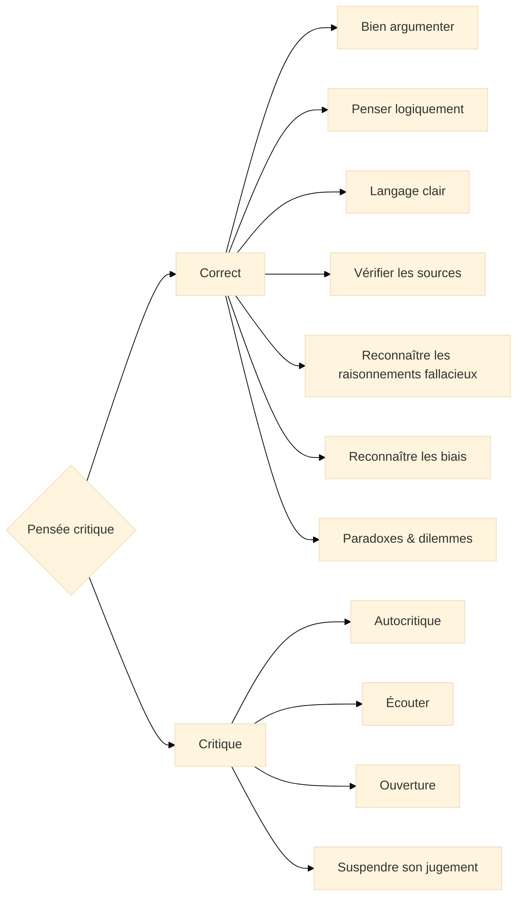

<!--t src=fd5f5a5c-->

<!--t src=1ea0afa2-->
Nous donnons ici un résumé très bref de l'ensemble du tutoriel sur la pensée critique.

<!--t src=4c877c45-->
Si vous vous demandez si ce livre vous convient, lisez la suite ici.

<!--t src=57249e75-->
## Qu'est-ce que la pensée critique ?

<!--t src=d1804150-->
Nous sommes des êtres dotés de buts, de valeurs et de convictions. Pour atteindre nos **buts** et vivre selon nos **valeurs**, nous agissons, et pour cela nous devons prendre des **décisions**.\
Chaque jour, souvent de façon automatique ou inconsciente, nous optons pour l'une ou l'autre chose sur la base d'affirmations ou d'opinions à propos du monde.

<!--t src=70f14658-->
En tant que personne qui **pense de façon critique**, tu **remets en question** toutes les affirmations, opinions et convictions : les tiennes, celles de tes amis et de ton entourage, celles des organisations et des entreprises qui veulent te dire ce qui est bon pour toi.\
Pour atteindre tes objectifs à court ou à long terme, tu dois prendre des **décisions bien informées**, pour toi, pour ton entourage et pour ton environnement.

<!--t src=ed6e248e-->
Nous prenons des décisions afin **d'agir**.

<!--t src=3ae79404-->
Prendre les **bonnes décisions** pour **« bien » agir** est à la fois un art et une science.

<!--t src=10955435-->
:::info Agir

**Agir** = **Désir** + **Savoir**

&mdash; David Hume [^1]
:::

<!--t src=3efd191e-->
[^1]: Hume explique que les actions sont motivées par nos désirs ou nos buts, et que le savoir nous aide à atteindre ces buts. « A Treatise of Human Nature », Livre II, partie 3, section 3, « Of the Influencing Motives of the Will » (1739&mdash;40).

<!--t src=820e2c0b-->
Chaque action, chaque décision que nous prenons repose sur deux questions fondamentales :

<!--t src=2999b2bd-->
1. **Où veux-tu aller ? = Buts / Désirs**.  
   Ce sont les buts que nous visons ou désirons. Ils dépendent d'une part de notre **constitution humaine**.
   Nous avons besoin de nourriture, de chaleur, de sécurité, de contacts sociaux, de sexualité, etc.  
   D'autre part, nos buts sont déterminés par nos **valeurs** familiales et **culturelles**, que nous avons apprises en tant qu'êtres sociaux dans notre culture. Ce sont des valeurs et des normes telles que : la liberté, la justice, l'égalité, la tolérance, le respect, la compassion, la solidarité, l'honnêteté, ou leur contraire.

<!--t src=9a144b00-->
2. **Comment y parviens-tu ? = Savoir**.  
   Le second aspect, c'est le savoir dont nous avons besoin pour atteindre nos buts. Tu as besoin de connaître le monde.
   Les bonnes décisions sont celles qui reposent sur la **vérité** (en un sens pragmatique) et non sur l'**erreur**.

<!--t src=b0d6a555-->
## Critères des « bonnes décisions » et du « bon » agir

<!--t src=b77ff2b3-->
La question des questions est bien sûr : comment distinguer les « bonnes » décisions des « mauvaises » ? C'est très concrètement important dans de nombreuses situations :

<!--t src=af5340cd-->
- Dois-je changer d'emploi ou non ?
- Dois-je planifier à court terme et chauffer au charbon, ou planifier à long terme de façon écologique ?
- Dois-je prendre la voiture ou le vélo ?
- Dois-je acheter une maison ou louer ?

<!--t src=ddf2d615-->
Il n'existe pas de réponse universelle à ces questions, car elles dépendent de tes buts et de tes valeurs individuels.
Mais les philosophes y réfléchissent depuis des milliers d'années et ont élaboré quelques critères qui peuvent t'aider à prendre de « bonnes décisions ».

<!--t src=86c80b54-->
Nous discuterons plus en détail de beaucoup de ces critères au fil du tutoriel. En voici un bref aperçu :

<!--t src=fd24d379-->
- **Vérité** : les convictions devraient concorder avec les faits (erreur = moyens inefficaces ou nuisibles).
- **Consistance et cohérence** : les buts ne doivent pas se contredire mutuellement et les moyens devraient être compatibles avec tous les buts pertinents.
- **Clarté** : il vaut mieux formuler tes buts de façon explicite (prendre conscience de ses besoins, de ses désirs). Et pour le savoir relatif aux moyens aussi, la clarté est importante (que sais-je exactement, et que ne sais-je pas ?).
- **Proportionnalité** : nous devons souvent décider dans des situations où nous ne disposons pas de toutes les informations. C'est pourquoi la force de ton action devrait être proportionnelle à la force des raisons justifiées.
- **Révisabilité** : tu peux et tu devrais, à l'occasion, remettre en question aussi bien tes buts et tes convictions fondamentales que le savoir relatif aux moyens (face à de nouvelles preuves), afin de l'adapter à la réalité. Deviens capable de changer d'avis pour de bonnes raisons.

<!--t src=4402a18f-->
## Pourquoi la pensée critique est-elle importante ?

<!--t src=678f9839-->
**La méthode de la pensée critique t'aide à bien agir.**
&nbsp;

<!--t src=10a9fe01-->
:::info Citation
"_Les Lumières, c'est la sortie de l'homme hors de l'état de minorité dont il est lui-même responsable._"

&mdash; Emmanuel Kant : _Qu'est-ce que les Lumières ?_[^2]
:::

<!--t src=b912ae58-->
[^2]:
    Le début du célèbre essai de Kant (« [Qu'est-ce que les Lumières ?](https://de.wikisource.org/wiki/Beantwortung_der_Frage:_Was_ist_Aufkl%C3%A4rung%3F) »)  
    **Les Lumières, c'est la sortie de l'homme hors de l'état de minorité dont il est lui-même responsable. La minorité** est l'incapacité de se servir de son entendement sans la direction d'autrui. Cette minorité est **due à soi-même** lorsque sa cause ne réside pas dans un manque d'entendement, mais dans un manque de résolution et de courage pour s'en servir sans la direction d'autrui. **Sapere aude !** Aie le courage de te servir de ton **propre** entendement ! Telle est donc la devise des Lumières.

<!--t src=6dbf2566-->
&nbsp;
La pensée critique a deux hémisphères.

<!--t src=ad4051f4-->
:::tip

**Pensée critique** = **Correct** + **Critique** 

:::

<!--t src=89514ea8-->
La pensée critique a deux aspects essentiels :

<!--t src=495e6a66-->
1. Comment pense-t-on **correctement** ?  
   La réponse à cette question est une **compétence**, comme « faire du vélo » ou « préparer un strudel aux pommes ».

<!--t src=af856a8c-->
2. Comment pense-t-on de manière **critique** ?  
   La réponse à cette question est une **attitude**, comme « être sur ses gardes », que nous adoptons à l'occasion.

<!--t src=9a13da3f-->
Si tu n'es pas sûr de maîtriser l'un ou l'autre, pas d'inquiétude : **les deux s'apprennent**.

<!--t src=9d0a23ca-->
Nous allons présenter brièvement ces deux aspects ci-dessous.

<!--t src=280f653c-->
## Comment penses-tu correctement ?

<!--t src=92adf701-->
Pour commencer, tu peux te demander : qu'est-ce que penser **correctement**, et puis-je l'apprendre ?
Tu peux bien sûr l'apprendre en t'entraînant à quelques compétences :
penser logiquement, argumenter, éviter l'ensorcellement du langage, vérifier les sources, reconnaître les raisonnements fallacieux et les biais, et comprendre les paradoxes.

<!--t src=1f523705-->
### Penser logiquement

<!--t src=c342ee27-->
Que signifie « _penser logiquement_ » ? Nous savons pourtant tous déjà penser depuis toujours.

<!--t src=7427e8b9-->
:::tip Définition
**Penser logiquement**, c'est : pouvoir conclure de **prémisses vraies** à des **conclusions vraies**.
:::

<!--t src=728d2c16-->
La **logique** est une discipline immense, mais heureusement pour nous, profanes, nous n'en avons besoin au quotidien que de très peu : les bases essentielles.

<!--t src=98df3d28-->
Mais tu devrais maîtriser les **bases essentielles** de la logique, sinon, pour toi, ce sera du chinois.

<!--t src=ab30ba2c-->
### Argumenter

<!--t src=80f3281e-->
Argumenter a un rapport avec la logique. Mais tous les bons arguments ne sont pas formellement valides du point de vue logique.

<!--t src=6d87929f-->
Tu dois donc apprendre à comprendre **comment on argumente correctement** et comment les gens argumentent réellement.

<!--t src=492d2a7f-->
Tu dois comprendre **comment fonctionnent les bons arguments** et pourquoi les mauvais arguments sont défectueux.

<!--t src=3cd1c15f-->
### L'ensorcellement du langage

<!--t src=d15d1cf9-->
Pour penser clairement et de façon critique, nous devons apprendre à **déceler les pièges et les sortilèges du langage** et à les contourner.

<!--t src=5db2c638-->
Le langage n'est pas un système rigide : il vit, se transforme et échappe souvent à tout contrôle. Très souvent, le langage lui-même nous joue un tour.
Voici quelques exemples :

<!--t src=8e621bea-->
- **Langage chargé**, p. ex. : « Notre président, ce demeuré, a déclaré… »
  Là, quelqu'un a sur le président une opinion qu'il veut nous refiler.
- **Non-sens**, p. ex. : « Au fait, quelle heure est-il en ce moment sur la Lune ? »
  Là, on soulève une question absurde, qui peut être amusante, mais qui nous fait aussi croire qu'il existe une réponse sensée.
- **Définitions bancales**, p. ex. : « L'homme est un bipède sans plumes, aux ongles plats et doué de raison. »
  C'est une définition classique, qui s'applique peut-être, mais qui n'est pas vraiment convaincante.

<!--t src=881b5e3c-->
Une **langue exacte**, aux concepts précis, voilà ce dont nous avons besoin en droit, au travail, dans la science et la technique. En politique aussi, ce serait parfois une bonne chose.

<!--t src=1d76b97c-->
Au quotidien en revanche, dans la communication, dans la musique, etc., une langue exacte aide aussi, mais souvent nous cherchons davantage de jeu dans la langue. Lors d'un barbecue ou en flirtant, la précision n'est pas de mise. Là, il vaut mieux que la langue fasse la fête.

<!--t src=e2a72f86-->
### Vérification des sources et des données

<!--t src=de9be51c-->
L'une des compétences les plus importantes que nous devrions apprendre ou maîtriser est celle de pouvoir **vérifier nos sources**.
Toutes nos convictions s'appuient sur des sources de natures très diverses : sources textuelles, récits, expériences personnelles ou récits d'autrui.
La qualité de nos sources est à cet égard très variable.
Voici quelques exemples :

<!--t src=39dff084-->
- « La meilleure façon de devenir riche rapidement, c'est d'acheter mon livre » 
<!--  -->
- « Fumer, c'est cool et ce n'est pas mauvais pour la santé ! », signé Dr Marlboro 
  <!--   -->
- « La majorité des Américains partent du principe que Kennedy a été victime d'un complot ». (Wikipedia) 
- « L'influence de l'homme sur le climat est sans équivoque » Groupe d'experts intergouvernemental sur l'évolution du climat (GIEC) 

<!--t src=ce52e579-->
Je te laisse décider à qui tu préfères faire confiance.

<!--t src=389f1ded-->
### Les erreurs de raisonnement classiques (fallacies)

<!--t src=e5194cc2-->
Une autre compétence importante consiste à ne pas se laisser égarer par des raisonnements fallacieux.
Certains des meilleurs livres sur le thème de la « pensée critique » traitent presque exclusivement des raisonnements fallacieux ou des biais qui influencent notre pensée.  
Des exemples connus de raisonnements fallacieux classiques sont :

<!--t src=8d574360-->
- **Ad hominem** : attaquer la personne plutôt que l'argument.
- **L'homme de paille** : on déforme l'argument de l'adversaire pour pouvoir l'attaquer plus facilement.
- **Le faux dilemme** : on ne présente que deux possibilités, alors qu'il en existe davantage.
- **Le raisonnement circulaire** : l'affirmation se justifie par elle-même.
- **L'argument d'autorité** : on tient quelque chose pour vrai parce qu'une autorité le dit.

<!--t src=0991c3b2-->
Il existe tout un zoo de raisonnements fallacieux connus. Nous discuterons des plus importants en détail.

<!--t src=a150137d-->
### Les biais cognitifs

<!--t src=bb5adca6-->
Ce ne sont pas seulement les raisonnements fallacieux, mais aussi les biais cognitifs qui font obstacle à notre rationalité.
Ces biais sont souvent profondément ancrés dans notre cerveau et peuvent nous rendre aveugles à la réalité.
Des exemples connus de biais cognitifs sont :

<!--t src=c40010a4-->
- **Le biais de confirmation** : nous ne recherchons, ou n'acceptons, que les informations qui confirment notre opinion.
- **L'effet d'ancrage** : notre opinion est influencée par la première impression.
- **L'effet de halo** : une bonne impression d'ensemble conduit à des jugements positifs dans tous les domaines.
- **La surestimation de soi** : nous sommes souvent trop optimistes quant à nos capacités et à nos performances.

<!--t src=30e9bccf-->
Là aussi, il existe des dizaines d'exemples : amusants, surprenants, préoccupants et presque dangereux, que nous discuterons plus tard en détail.
En tant qu'êtres humains, nous y apparaissons si bêtes et si pitoyables que nous nous demandons : pourquoi n'apprend-on pas cela à l'école ?

<!--t src=4b91664c-->
### Paradoxes et dilemmes

<!--t src=e532c38f-->
Ce qui distingue la pensée correcte de la pensée défectueuse se reconnaît bien dans les situations extrêmes.  
**Nous apprenons à penser là où notre pensée atteint les limites du pensable : sur les pentes abruptes des paradoxes et des dilemmes, là où logent les contradictions.**  
Là, nous ne nous y retrouvons plus et restons désemparés. Là, nous devons réfléchir pour savoir si nous pouvons appliquer nos manières habituelles de penser, ou si nous devons développer de nouvelles manières de penser pour maîtriser la situation.

<!--t src=29aa0684-->
Des exemples typiques de paradoxes et de dilemmes sont :

<!--t src=5b442650-->
#### Paradoxes logiques

<!--t src=68f5b492-->
- **Les paradoxes de l'infini** : l'infiniment petit et l'infiniment grand. Il existe des infinis plus puissants que l'ensemble infini des nombres naturels.
- **Les paradoxes de Zénon** sur le mouvement (Achille et la tortue) : si Achille court plus vite qu'une tortue, comment peut-il jamais la rattraper si elle a de l'avance ?
- **Le paradoxe de Thésée** : si l'on remplace toutes les planches d'un vieux navire, est-ce encore le même navire ?
- **Le paradoxe d'Épiménide** : Épiménide le Crétois dit que tous les Crétois mentent. Ment-il ?
- **Le paradoxe de Russell** : l'ensemble M de tous les ensembles qui ne se contiennent pas eux-mêmes. M se contient-il lui-même ou non ?

<!--t src=47fa81a3-->
#### Dilemmes éthiques

<!--t src=20d0f4cf-->
- **Le problème de la théodicée** : pourquoi y a-t-il tant de souffrance dans le monde s'il existe un Dieu tout-puissant, omniscient et infiniment bon ?
- **Le dilemme du tramway** : si tu actionnes un aiguillage, une personne meurt. Si tu ne fais rien, le train fonce dans un bus rempli d'enfants. Que fais-tu ?
- **Le dilemme du prisonnier** : deux prisonniers doivent décider s'ils avouent ou se taisent, s'ils profitent de la trahison ou de la solidarité. Quelle est la meilleure stratégie ?
- **Le dilemme de la liberté d'expression** : s'il existe une liberté d'expression absolue, devons-nous alors tolérer l'intolérance et accepter qu'on nous prive de la liberté d'expression ?

<!--t src=a9d014a9-->
Tout cela fait partie de la pensée correcte. Mais qu'est-ce que le « critique » de la pensée critique ?

<!--t src=a1248a3a-->
## Comment penses-tu de manière critique ?

<!--t src=3d17e827-->
Nous en arrivons maintenant à la partie critique. « **Critique** » désigne ici **une attitude indispensable envers soi-même**, envers toute sorte d'affirmation, d'hypothèse, de théorie, envers les sources de toute nature, envers la science et la culture, et même envers les valeurs.

<!--t src=999e4b57-->
- **Pas toujours** : cela ne veut pas dire que nous devrions toujours, partout et tout remettre en question. Oh non, surtout pas, tu en deviendrais fou.
- **Quand ça fait mal** : on ne peut pas remettre constamment en question des théories établies ou des valeurs enracinées dans ta culture.
  Mais parfois, si. Justement lorsque des **contradictions** apparaissent avec la vie ou avec les sciences. Les contradictions sont le moteur du progrès.

<!--t src=87b7fdf6-->
### L'autocritique

<!--t src=a4009b9b-->
La plupart d'entre nous sont de parfaits égocentriques. La plupart du temps, nous savons déjà où nous voulons aller, pour quoi ou contre quoi nous sommes. Nous faisons en effet toujours déjà **partie d'une culture** ou d'une sous-culture.

<!--t src=ee41524d-->
Nous sommes pleins de **convictions** et nous en sommes souvent **tout à fait sûrs**.

<!--t src=a65db3c1-->
Nous utilisons la plus grande partie de l'énergie de notre pensée non pas pour trouver des solutions appropriées ou « justes » à des problèmes donnés, mais pour **confirmer nos préjugés**.

<!--t src=3bf94708-->
Notre société est pleine de **convictions opposées** :

<!--t src=feceef49-->
- Il existe
  - a) un seul Dieu, et c'est justement celui auquel je crois. Dieu merci !
  - b) on peut croire en Dieu comme on veut, ce n'est simplement pas une notion scientifique.
- La Terre est
  - a) à peu près ronde.
  - b) plate ou anguleuse.
- La Covid-19 était
  - a) une grave épidémie,
  - b) un complot du gouvernement mondial.
- L'homosexualité est
  - a) un phénomène naturel, qui existe chez les animaux et qui est moralement neutre,
  - b) une maladie qui déplaît à Dieu.
- Nous constatons
  - a) une crise climatique d'origine humaine
  - b) ou bien nous la contestons.

<!--t src=b1c961ce-->
Sur de nombreux sujets, nous avons :

<!--t src=6b163962-->
1. très souvent **aucune idée** du sujet
2. et pourtant, le plus souvent, **une conviction bien arrêtée**.

<!--t src=47c1f11e-->
&nbsp;

<!--t src=de9c513e-->
:::tip Exercice
Veuillez répéter 10 fois :

**« Je peux me tromper, je me suis déjà souvent trompé, je me tromperai encore. »**
:::

<!--t src=3817ea88-->
### La recherche d'erreurs

<!--t src=b512002a-->
Est-ce grave de se tromper ?

<!--t src=cefb1e39-->
Non. Si nous voulons nous améliorer, alors nous devons être ouverts à la **recherche d'erreurs**, à la critique constructive, à la **remise en question**.

<!--t src=28bd0a98-->
Tant que cela ne nous fait pas personnellement mal, nous sommes souvent prêts à chercher les erreurs.

<!--t src=96835879-->
- Lors des examens à l'école, l'enseignante disait : **vérifie** tes résultats avant de rendre ta copie.
- Dans la technique, nous appelons cela **tester**.
- Dans la production, cela s'appelle le **contrôle qualité**.
- Dans la science, nous demandons à d'autres des « **évaluations par les pairs** » (peer reviews).

<!--t src=84e812bc-->
### Écouter et l'ouverture

<!--t src=f0fdd745-->
Un autre point important de la pensée critique est l'**écoute** et l'**ouverture** aux opinions des autres.

<!--t src=ae2125c0-->
- Nous devrions **écouter davantage** sans toujours juger immédiatement. C'est la base d'une société ouverte.
- Être ouvert à l'expérience des autres.
- Souvent, nous n'écoutons même pas la phrase jusqu'au bout que nous avons déjà jugé.
- Les autres ont d'autres priorités, et nous avons à ce propos des opinions saugrenues :

<!--t src=dc1c7a99-->
- l'enfant veut un nouveau jouet (quelle absurdité, il n'en a pas besoin d'un de plus)
- l'adolescent rêve de devenir une star de la musique (de toute façon ça ne donnera rien, tu l'as déjà entendu chanter ?)
- quelqu'un veut une nouvelle voiture de sport (à quoi bon, c'est cher et ça pollue l'environnement)
- quelqu'un ne mange plus de viande depuis des années (c'est idéologiquement absurde et mauvais pour la santé)

<!--t src=ebb7c119-->
Ici, nous avons besoin d'un changement d'attitude. Nous devrions être plus ouverts aux contre-arguments et aux opinions différentes en général.

<!--t src=2ced6497-->
### La suspension de mon jugement

<!--t src=7d7f9158-->
Dans la pensée critique, la **suspension du jugement** est un point central. Nous venons déjà de l'évoquer.

<!--t src=d94bddd2-->
Tous les gens de droite ne sont pas des nazis, tous les gens de gauche ne sont pas des fauteurs de troubles.

<!--t src=c60d2aaf-->
Dès l'Antiquité, la suspension du jugement, désignée par le terme d'[_épochè_ (ἐποχή)](<https://fr.wikipedia.org/wiki/%C3%89poch%C3%A8>), est un point important de la philosophie et a été mise en avant par des philosophes comme Pyrrhon et Sextus Empiricus.  
Dans le bouddhisme zen aussi, la suspension du jugement est incarnée par le principe du **non-attachement** (non-attachment, 無執着, mu-shūjaku)[^3]. Il signifie ne pas se cramponner à des opinions ou à des convictions figées.

<!--t src=d2062cec-->
[^3]:
    Le zen enseigne à ne pas se cramponner aux opinions, aux émotions ou aux perceptions. Cela correspond à la suspension pyrrhonienne, mais avec une différence décisive :  
    **L'épochè** dit : « Je ne me cramponne pas, afin de trouver la quiétude. »  
    **Le zen** dit : « Je ne me cramponne pas, parce que le fait même de se cramponner est la cause de la souffrance. »

<!--t src=b0652d72-->
#### Les avantages de la suspension du jugement

<!--t src=44bd731f-->
- **Ouverture à de nouvelles informations** : la suspension du jugement permet de prendre en compte de nouvelles informations et perspectives sans tirer de conclusions hâtives.
- **Éviter les partis pris** : en suspendant son jugement, on peut éviter que des opinions préconçues et des préjugés n'influencent l'analyse.
- **Analyse approfondie** : elle nous permet une analyse plus approfondie et plus objective des informations et des arguments présentés.
- **Souplesse de la pensée** : la suspension du jugement favorise la souplesse de la pensée et permet de prendre en compte différents points de vue.

<!--t src=fb5a95aa-->
## Un schéma en guise de résumé

<!--t src=c46926c0-->

  

<!--t src=93f64017-->

<!--t src=47c1f11e-->
&nbsp;

<!--t src=7e4f300b-->
Après cet aperçu très condensé de la pensée critique, nous passons maintenant aux détails !
