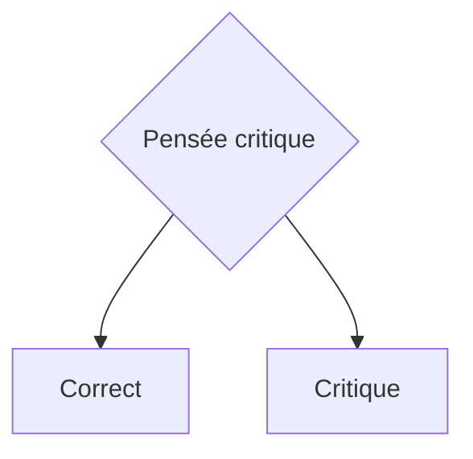

<!--t src=558547e7-->
import React from 'react';
import ReactPlayer from 'react-player';

<!--t src=318b6a02-->
Docusaurus prend en charge le **[Markdown](https://daringfireball.net/projects/markdown/syntax)** ainsi que quelques **fonctionnalités supplémentaires**.

<!--t src=213220ca-->
## Front Matter

<!--t src=03b1c0b9-->
Les documents Markdown comportent en tête des métadonnées appelées [Front Matter](https://jekyllrb.com/docs/front-matter/) :

<!--t src=dbe7d8d3-->
```text title="my-doc.md"
// highlight-start
---
id: my-doc-id
title: My document title
description: My document description
slug: /my-custom-url
---
// highlight-end

## Markdown heading

Markdown text with [links](./hello.md)
```

<!--t src=78ddc2da-->
## Liens

<!--t src=22c953b6-->
Les liens Markdown classiques sont pris en charge, via des chemins d'URL ou des chemins de fichiers relatifs.

<!--t src=d995ec47-->
```md
Let's see how to [Create a page](/create-a-page).
```

<!--t src=cf37ad12-->
```md
Let's see how to [Create a page](./create-a-page.md).
```

<!--t src=988b5760-->
**Résultat :** Allons à l'[Introduction](./000-kritisches-denken-kurzgesagt.md).

<!--t src=0d8c43d8-->
## Images

<!--t src=f0d4ca0b-->
Les images Markdown classiques sont prises en charge.

<!--t src=75d0946a-->
Vous pouvez utiliser des chemins absolus pour référencer les images du répertoire statique (`/static/img/docusaurus.png`) :

<!--t src=f9cd794e-->
```md

```

<!--t src=b66adc12-->
Vous pouvez également référencer les images relativement au fichier courant. C'est particulièrement utile pour placer les images à côté des fichiers Markdown qui les utilisent :

<!--t src=f9cd794e-->
```md

```

<!--t src=df590720-->
Vous pouvez aussi préciser les dimensions de l'image ?? :

<!--t src=5b80a229-->
```md

```

<!--t src=7895a0b0-->


<!--t src=df997e0a-->
Vous pouvez utiliser des balises **img**

<!--t src=dc810b66-->
```html

```

<!--t src=dcd29a44-->


<!--t src=73e3b332-->
## Blocs de code

<!--t src=47977fb0-->
Les blocs de code Markdown sont **pris en charge**, avec coloration syntaxique.

<!--t src=6cb2228d-->
````md
```text title="Exemple de texte d'exemple"
Voici mon exemple
Deux lignes, c'est bien
```

<!--t src=6485c40e-->
````

```text title="Exemple de texte d'exemple"
Voici mon exemple
Deux lignes, c'est bien
```

<!--t src=669a4a2f-->
````md
```jsx title="src/components/HelloDocusaurus.js"
function HelloDocusaurus() {
  return <h1>Hello, Docusaurus!</h1>;
}
```

<!--t src=8f1098df-->
````

```jsx title="src/components/HelloDocusaurus.js"
function HelloDocusaurus() {
  return <h1>Hello, Docusaurus!</h1>;
}
```

<!--t src=9e08894e-->
## Admonitions

<!--t src=e0881f6c-->
note, tip, info, warning, danger

<!--t src=7f76d726-->
Docusaurus dispose d'une syntaxe spéciale pour créer des admonitions et des encadrés :

<!--t src=1bbf4aa9-->
```md
:::note Note
Voici une note
:::

:::tip Mon conseil
Voici un conseil
:::

:::info Information
Voici une information
:::

:::warning Attention
Voici un avertissement
:::

:::danger Danger
Cette action est dangereuse
:::
```

<!--t src=6736459b-->
:::note Note
Voici une note
:::

<!--t src=e8c76056-->
:::tip Mon conseil
Voici un conseil
:::

<!--t src=9508d3e1-->
:::info Information
Voici une information
:::

<!--t src=d7a2a546-->
:::warning Attention
Voici un avertissement
:::

<!--t src=2572e858-->
:::danger Danger
Cette action est dangereuse
:::

<!--t src=62c186be-->
## Admonitions MDX

<!--t src=89e05b4e-->
import Admonition from '@theme/Admonition';

<!--t src=dbc562cd-->
<Admonition type="tip" icon="💡" title="Le saviez-vous...">
  Utilisez des plugins pour introduire une syntaxe plus courte pour les éléments
  JSX les plus utilisés dans votre projet.
</Admonition>
<Admonition type="note" icon="💬" title="">
  Utilisez des plugins pour introduire une syntaxe plus courte pour les éléments
  JSX les plus utilisés dans votre projet.

  <p class="text--right">Socrate</p>
</Admonition>

<!--t src=b2f34bbe-->
<Admonition type="note" icon="🌊🌊🌊💭" title="">
  Utilisez des plugins pour introduire une syntaxe plus courte pour les éléments
  JSX les plus utilisés dans votre projet.
</Admonition>

<!--t src=09d87b11-->
<Admonition type="note" icon="💬" title="Citation">

« **Je sais que je ne sais rien** »  
 littéralement : « Car je savais de moi-même que je ne sais absolument rien ... »

  <p class="text--right">Socrate dans Platon : _Apologie de Socrate_ 22d</p>
</Admonition>

<!--t src=6ed32fa5-->
## Emojis Markdown

<!--t src=26d9eee5-->
Vous pouvez utiliser des emojis

<!--t src=77cc64b7-->
```markdown
:heart:
```

<!--t src=2ef5bbcd-->
:heart: | :lion: | :spades:

<!--t src=39116809-->
## Cases à cocher

<!--t src=4d3661d0-->
Ajoute la prise en charge de la syntaxe de cases à cocher - [ ] et - [x] de Github à l'aperçu markdown intégré de VS Code.

<!--t src=7f4ef89d-->
- [ ]

<!--t src=ce27e128-->
## Notes de bas de page

<!--t src=e72ad150-->
Les notes de bas de page permettent d'ajouter des remarques ...

<!--t src=7910cc78-->
```md
Here's a sentence with a footnote[^1].

[^1]: This is the footnote.
```

<!--t src=5a5fff49-->
Voici une phrase avec une note de bas de page[^1].

<!--t src=ccdfc6bd-->
[^1]: Ceci est la note de bas de page.

<!--t src=41310c4c-->
Vous pouvez aussi utiliser des notes nommées :

<!--t src=c6f20ca5-->
```md
Here's another sentence[^namedNote].

[^namedNote]: This is a named footnote.
```

<!--t src=112d5cb9-->
Voici une autre phrase[^namedNote].

<!--t src=6f494b82-->
[^namedNote]: Ceci est une note nommée.

<!--t src=96b693e4-->
## Mermaid

<!--t src=b2d8d3f5-->


<!--t src=2ec102ca-->
## Raccourcis

<!--t src=ff2f1df3-->
Voici le dépôt github de [vscode-markdown-shortcuts](https://github.com/mdickin/vscode-markdown-shortcuts).

<!--t src=29261678-->
- Ctrl-B pour le **gras**
- Ctrl-I pour l'_italique_
- Ctrl-L pour basculer un [lien](www.example.org) vers une ressource.

<!--t src=aa5de9b7-->
## Mathématiques

<!--t src=6fd64716-->
$$
I = \int_0^{2\pi} \sin(x)\,dx
$$

<!--t src=6ac5471d-->
## Details - Repli

<!--t src=b9b365f5-->
```md
<details>
  <summary>Vous trouverez ici d'autres sources</summary>

- Source 1
- Source 2
- Source 3
</details>
```

<!--t src=f289db1e-->
<details>
  <summary>Vous trouverez ici d'autres sources</summary>

- Source 1
- Source 2
- Source 3

</details>

<!--t src=b7524760-->
## Fenêtre de navigateur

<!--t src=8f83f5a0-->
<!-- import BrowserWindow from '@site/src/components/BrowserWindow'; -->

<!--t src=66070ba5-->
```md
<BrowserWindow>
toto
</BrowserWindow>
```

<!--t src=80ad93ba-->
<BrowserWindow>
toto
</BrowserWindow>

<!--t src=1987fdd3-->
<!-- ## Tooltip old
This is a <Tooltip type="subject-area" content="topic">Tooltip</Tooltip> and this is another
<Tooltip type="another-subject-area" content="different-topic">Tooltip</Tooltip>
-->

<!--t src=37ebd24c-->
## Infobulle HTML

<!--t src=808a1162-->
```
<a title="Ceci est une infobulle">Survolez-moi</a>
```

<!--t src=4139d519-->
<a title="Ceci est une infobulle">Survolez-moi</a>

<!--t src=7cf41b3d-->
## Infobulle étendue

<!--t src=9f19cfc8-->
### Infobulle standard (se ferme lorsque la souris la quitte)

<!--t src=bf44880d-->
```md
<Tooltip text="Infobulle texte" model="text">
  Explication brève
</Tooltip>
```

<!--t src=3ad0c275-->
<Tooltip text="Infobulle texte" model="text">
  Un message texte en gris
</Tooltip>

<!--t src=424087a9-->
<Tooltip text="Infobulle info" model="info">
  Explication brève
</Tooltip>

<!--t src=00f9e78d-->
<Tooltip text="Infobulle succès" model="success">
  ## Message de succès.  
  C'était un succès total :heart: 
  Voici une longue ligne pour voir quand cela s'arrête, ou si cela continue indéfiniment.
</Tooltip>

<!--t src=2de05d0d-->
<Tooltip text="Infobulle avertissement" model="warning">
  Message d'avertissement
</Tooltip>

<!--t src=51021b34-->
<Tooltip text="Infobulle erreur" model="error">
  Message d'erreur
</Tooltip>

<!--t src=9562d1cb-->
### Infobulle persistante (reste ouverte jusqu'à un clic à l'extérieur ou la touche Échap)

<!--t src=b7fc7a2d-->
```md
<Tooltip text="Terme complexe" model="teacher" persistent={true}>
  Voici une explication plus longue que les lecteurs peuvent vouloir 
  garder ouverte pendant qu'ils lisent le reste de la page.
</Tooltip>
```

<!--t src=8c52056c-->
<Tooltip text="Terme complexe" model="teacher" persistent={true}>
  Voici une explication plus longue que les lecteurs peuvent vouloir 
  garder ouverte pendant qu'ils lisent le reste de la page.
</Tooltip>

<!--t src=0ecdc293-->
### Infobulle persistante avec vidéo

<!--t src=3804b56a-->
```
<Tooltip text="Voici une vidéo" model="video" persistent={true} >
  ## Comment synchroniser des fichiers.
  <ReactPlayer style={{ maxWidth: '560px', width: 'calc(100vw - 60px)', height: 'auto', aspectRatio: '16/9' }} controls src='https://www.youtube.com/watch?v=Bse3QVU1yfY' />
</Tooltip>

```

<!--t src=35bf629f-->
<Tooltip text="Voici une vidéo" model="video" persistent={true} >
  ## Comment synchroniser des fichiers.
  <ReactPlayer style={{ maxWidth: '560px', width: 'calc(100vw - 60px)', height: 'auto', aspectRatio: '16/9' }} controls src='https://www.youtube.com/watch?v=Bse3QVU1yfY' />
</Tooltip>

<!--t src=d37151b5-->
### Infobulle persistante avec vidéo en iframe

<!--t src=73bbccfb-->
```
<Tooltip text="Voici une vidéo" model="video" persistent={true} >
  <iframe width="560" height="315"
    style={{ maxWidth: '560px', width: 'calc(100vw - 60px)', height: 'auto', aspectRatio: '16/9' }}
    src="https://www.youtube.com/embed/lHu02MWIPUY"
    frameborder="0" allow="autoplay; encrypted-media" allowfullscreen>
  </iframe>
</Tooltip>
```

<!--t src=f5a6b8a5-->
<Tooltip text="Voici une vidéo" model="video" persistent={true} >
  <iframe width="560" height="315"
    style={{ maxWidth: '560px', width: 'calc(100vw - 60px)', height: 'auto', aspectRatio: '16/9' }}
    src="https://www.youtube.com/embed/lHu02MWIPUY"
    frameborder="0" allow="autoplay; encrypted-media" allowfullscreen>
  </iframe>
</Tooltip>

<!--t src=3671f634-->
## Cartes

<!--t src=72a932cd-->
<Columns>
  <Column className="col--6">
    <Card shadow='md'>
      <CardHeader >
          <h3>Lorem Ipsum</h3>
      </CardHeader>
      <CardBody>
          Lorem ipsum dolor sit amet, consectetur adipiscing elit, sed do eiusmod tempor
          incididunt ut labore et dolore magna aliqua. Quis ipsum suspendisse ultrices
          gravida.
      </CardBody>
      <CardFooter>
        <button className="button button--secondary button--block">Tout voir</button>
      </CardFooter>
    </Card>
  </Column>

  <Column className="col--6">
  ```html
  <!-- low (lw), medium (md), tall (tl) -->
  <Card shadow='md'>
    <CardHeader >
        <h3>Lorem Ipsum</h3>
    </CardHeader>
    <CardBody>
        Lorem ipsum dolor sit amet, consectetur adipiscing elit, sed do eiusmod tempor
        incididunt ut labore et dolore magna aliqua. Quis ipsum suspendisse ultrices
        gravida.
    </CardBody>
    <CardFooter>
      <button className="button button--secondary button--block">Tout voir</button>
    </CardFooter>
  </Card>
  ```
  </Column>
</Columns>

<!--t src=0063a5c0-->
## Colonnes

<!--t src=a2cded85-->
Les classes possibles sont : 'text--left', 'text--center', 'text--right', 'text-justify'
Et la largeur de colonne en douzièmes : 'col--4', 'col--8', etc.

<!--t src=931920cb-->
```
<Columns>
  <Column className='col--4'>
    Voici le côté gauche
  </Column>
  <Column>
    Lorem ipsum dolor sit amet, consectetur adipiscing elit. Sed do eiusmod tempor incididunt ut labore et dolore magna aliqua.
  </Column>
</Columns>

```

<!--t src=14013597-->
<Columns>
  <Column className='col--4'>
    Voici le côté gauche
  </Column>
  <Column className='col--8'>
    Lorem ipsum dolor sit amet, consectetur adipiscing elit. Sed do eiusmod tempor incididunt ut labore et dolore magna aliqua.
  </Column>
</Columns>

<!--t src=2b8183fa-->
## Onglets

<!--t src=0d60d722-->
import Tabs from '@theme/Tabs';
import TabItem from '@theme/TabItem';

<!--t src=c34143ab-->
<Tabs>
  <TabItem value="apple" label="Pomme" default>
    Ceci est une pomme 🍎
  </TabItem>
  <TabItem value="orange" label="Orange">
    Ceci est une orange 🍊
  </TabItem>
  <TabItem value="banana" label="Banane">
    Ceci est une banane 🍌
  </TabItem>
</Tabs>

<!--t src=df118dee-->
## highlight

<!--t src=89b77f55-->
<Highlight color="hsl(267, 100%, 81%)">Docusaurus violet</Highlight> option

<!--t src=7daf2865-->
## SVG

<!--t src=b1751dc9-->
<svg
  xmlns="http://www.w3.org/2000/svg"
  viewBox="0 0 48 48"
  width="48"
  height="48">
<path fill="#FF6D00" d="M42 42H6V6h36v36z" />
<path fill="#FFF" d="M8 8v32h32V8H8zm30 30H10V10h28v28z" />
<path
    fill="#FFF"
    d="M23 32h2v-6l5.5-10h-2.1L24 24.1 19.6 16h-2.1L23 26z"
  />
</svg>

<!--t src=d3d9c0a0-->
## Vidéo React

<!--t src=d91c3801-->
https://www.npmjs.com/package/react-player

<!--t src=fbbe25e6-->
```
import React from 'react';
import ReactPlayer from 'react-player';
<ReactPlayer style={{ width: '100%', height: 'auto', aspectRatio: '16/9' }} controls src='https://www.youtube.com/watch?v=Bse3QVU1yfY' />

```

<!--t src=ddf3c763-->
<ReactPlayer style={{ width: '100%', height: 'auto', aspectRatio: '16/9' }} controls src='https://www.youtube.com/watch?v=Bse3QVU1yfY' />

<!--t src=3e41f796-->
## Vidéo en iframe

<!--t src=ab81e7ed-->
```
<iframe
  width="560" height="315"
  src="https://www.youtube.com/embed/lHu02MWIPUY"
  frameborder="0" allow="autoplay; encrypted-media" allowfullscreen>
</iframe>
```

<!--t src=8acfc778-->
<iframe
  width="560" height="315"
  src="https://www.youtube.com/embed/lHu02MWIPUY"
  frameborder="0" allow="autoplay; encrypted-media" allowfullscreen>
</iframe>
