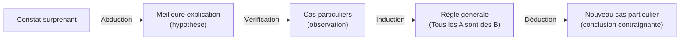

<!--t src=aa0e5d94-->
<!-- # Arten des Schließens -->

<!--t src=50505bde-->
Avant d'examiner les schémas d'arguments particuliers, il vaut la peine de jeter un coup d'œil aux **formes d'inférence fondamentales**. Charles S. Peirce en a distingué trois, qui diffèrent par **ce que nous présupposons et ce que nous voulons obtenir** : une règle, un cas particulier ou une explication.

<!--t src=23a8a2a2-->
## Déduction : de la règle au cas

<!--t src=29b75b93-->
Dans la **déduction**, nous concluons d'une règle générale à un cas particulier. Si les prémisses sont vraies, la conclusion est **nécessairement vraie** : la déduction _préserve la vérité_, mais ne crée pas de savoir nouveau sur le monde ; elle ne fait qu'expliciter ce qui est déjà contenu dans les prémisses.

<!--t src=a58d3aad-->
1. **Règle :** Tous les hommes sont mortels.
2. **Cas :** Socrate est un homme.
3. **Résultat :** Donc Socrate est mortel.

<!--t src=43456bf9-->
## Induction : du cas à la règle

<!--t src=a1580ebe-->
Dans l'**induction**, nous généralisons à partir de cas particuliers observés vers une règle. La conclusion n'est **pas contraignante**, mais seulement plus ou moins probable : une seule exception peut faire tomber la règle. En revanche, l'induction fournit un savoir _nouveau_, qui va au-delà des observations.

<!--t src=dc539005-->
1. **Cas :** Socrate, Platon, Aristote… sont morts.
2. **Résultat (règle) :** Donc, vraisemblablement, tous les hommes sont mortels.

<!--t src=93708148-->
## Abduction : du constat à la meilleure explication

<!--t src=3ac78207-->
Dans l'**abduction**, nous cherchons, pour une observation surprenante, l'explication **la plus plausible** (une hypothèse). Elle non plus n'est pas contraignante, mais constitue une conjecture fondée, qui pourra ensuite être confirmée ou réfutée.

<!--t src=e97ff8f8-->
1. **Constat :** La pelouse est mouillée.
2. **Règle :** S'il a plu, la pelouse est mouillée.
3. **Meilleure explication :** Il a vraisemblablement plu.

<!--t src=18bd875a-->
## Comment elles s'articulent

<!--t src=96446cf8-->
Les trois formes s'imbriquent. La **déduction vit d'énoncés universels** (« Tous les A sont des B »), mais de tels énoncés universels, à strictement parler, ne peuvent jamais être prouvés par l'observation. Nous les obtenons le plus souvent de manière **inductive**, en généralisant à partir de nombreux cas particuliers. La déduction n'est donc jamais plus sûre que les règles acquises par induction sur lesquelles elle s'appuie : sa rigueur, elle l'hérite de prémisses qui ne sont elles-mêmes que probables. L'**abduction**, quant à elle, engendre les hypothèses que nous éprouvons ensuite par induction et que nous réutilisons par déduction.

<!--t src=a8acd714-->

<!--t src=fcd52424-->
:::note À retenir
La **déduction** garantit, l'**induction** généralise, l'**abduction** explique. Seule la déduction préserve la vérité ; l'induction et l'abduction élargissent notre savoir, mais restent incertaines.
:::

<!--t src=605f8275-->
> Pour aller plus loin : [Abduction, induction, déduction (arbeitsblaetter.stangl-taller.at, en allemand)](https://arbeitsblaetter.stangl-taller.at/DENKENTWICKLUNG/Abduktion-Induktion-Deduktion.shtml)
